## 认识Web框架

前面我们已经学习了使用http内置模块来搭建Web服务器，为什么还要使用框架？

- 原生http在进行很多处理时，会较为复杂；
- 有URL判断、Method判断、参数处理、逻辑代码处理等，都需要我们自己来处理和封装；
- 并且所有的内容都放在一起，会非常的混乱；

目前在Node中比较流行的Web服务器框架是express、koa；

- 我们先来学习express，后面再学习koa，并且对他们进行对比；

express早于koa出现，并且在Node社区中迅速流行起来：

- 我们可以基于express快速、方便的开发自己的Web服务器；
- 并且可以通过一些实用工具和中间件来扩展自己功能；

Express整个框架的核心就是中间件，理解了中间件其他一切都非常简单！


## Express脚手架安装

express的使用过程有两种方式：

- 方式一：通过express提供的脚手架，直接创建一个应用的骨架；
- 方式二：从零搭建自己的express应用结构；

方式一：安装express-generator

```
安装脚手架
npm install -g express-generator
创建项目
express express-demo
安装依赖
npm install
启动项目
node bin/www
```

方式二：从零搭建自己的express应用结构；

```js
npm init -y
```


## Express脚手架的基本使用

### 创建第一个express项目：

```js
// 1、创建一个文件夹,进入文件夹
// 创建express项目
express express-demo	// wxpress 项目名称

// 2，进入这个目录,下载依赖
cd express-demo
npm install

//启动项目
node bin/www
// 虽然没有任何提示，但是项目实际上已经跑起来了，默认跑在了3000端口
```

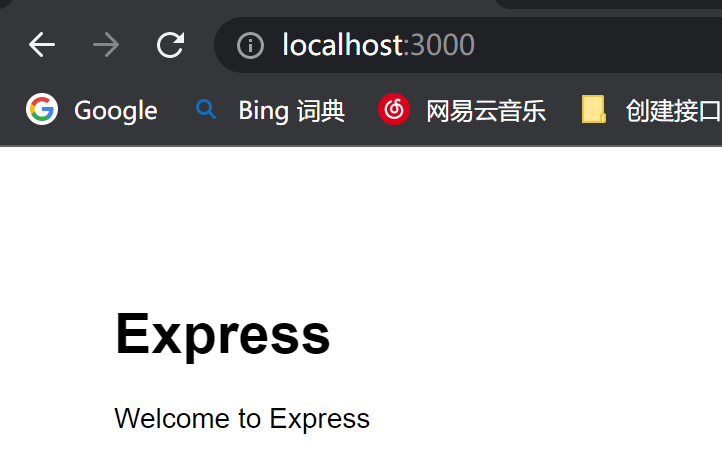


## express的初体验

```js
// 换一个文件夹安装express
npm init -y
npm install express
```


```js

// 这个express实际上是一个函数，这个函数叫做createApplication
const express = require('express');

// app其实也是一个函数
const app = express();

// 监听端口号
app.listen(8000, () => {
  console.log('express服务器启动成功');
})
```

依然通过 nodemon index.js

```js
express服务器启动成功
```

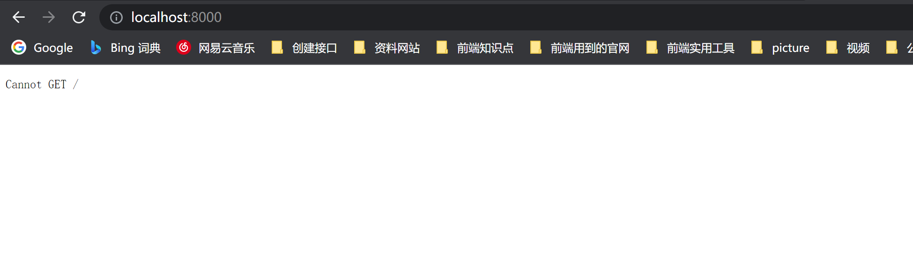


### 启动这个服务器

发现上面并没有响应，那么需要给客户端进行响应

#### get请求

```js

// 这个express实际上是一个函数，这个函数叫做createApplication
const express = require('express');

// app其实也是一个函数
const app = express();

// 监听 / 这个url 并返回字符串
app.get('/', (req, res, next) => {
  res.end('hello express')
})

// 监听端口号
app.listen(8000, () => {
  console.log('express服务器启动成功');
})
```

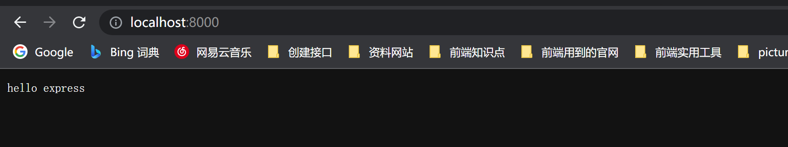

这样客户端就能获取到服务端响应的内容


#### post请求

```js

// 这个express实际上是一个函数，这个函数叫做createApplication
const express = require('express');

// app其实也是一个函数
const app = express();

app.post('/', (req, res, next) => {
  res.end('hello world');
})

// 监听端口号
app.listen(8000, () => {
  console.log('express服务器启动成功');
})
```

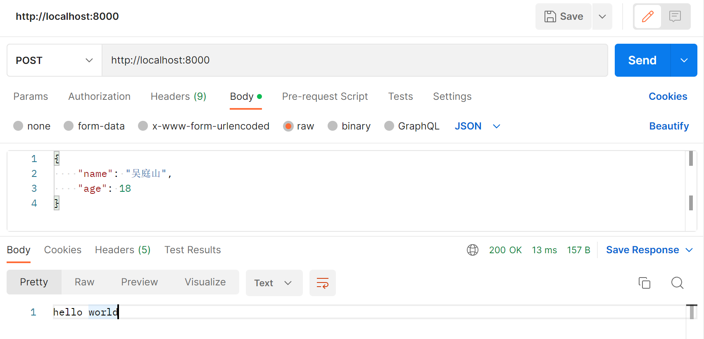


#### 监听固定的路径

也可以监听固定的路径

```js

// 这个express实际上是一个函数，这个函数叫做createApplication
const express = require('express');

// app其实也是一个函数
const app = express();

app.post('/login', (req, res, next) => {
  res.end('hello world');
})

// 监听端口号
app.listen(8000, () => {
  console.log('express服务器启动成功');
})
```

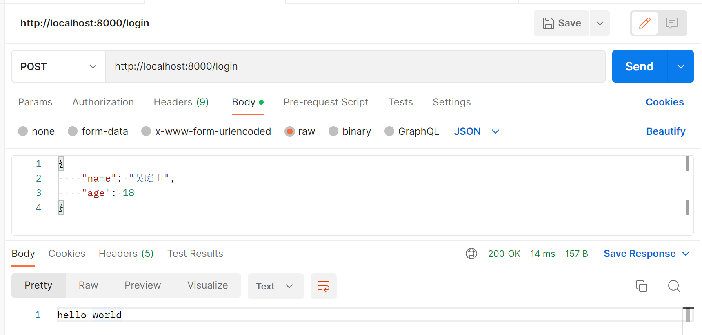


我们会发现，之前的开发过程中，可以方便的将请求进行分离： 

无论是不同的URL，还是get、post等请求方式； 

这样的方式非常方便我们已经进行维护、扩展； 

当然，这只是初体验，接下来我们来探索更多的用法；


请求的路径中如果有一些参数，可以这样表达：

- /users/:userId；

- 在request对象中要获取可以通过 req.params.userId;

  ```js
  
  // 这个express实际上是一个函数，这个函数叫做createApplication
  const express = require('express');
  
  // app其实也是一个函数
  const app = express();
  
  app.post('/login/:id', (req, res, next) => {
    console.log(req.params); // { id: '123' }
    res.end('hello world');
  })
  
  // 监听端口号
  app.listen(8000, () => {
    console.log('express服务器启动成功');
  })
  ```

  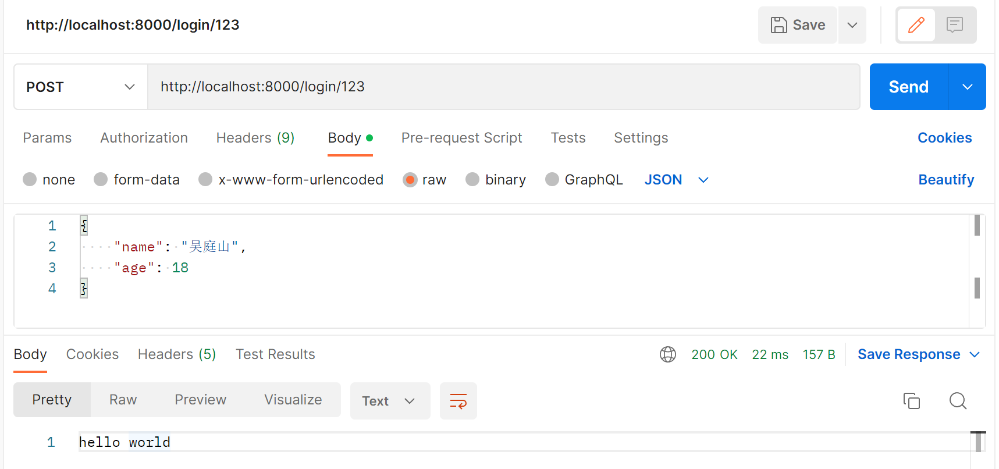

返回数据，我们可以方便的使用json：

- res.json(数据)方式； 

- 可以支持其他的方式，可以自行查看文档； 

- https://www.expressjs.com.cn/guide/routing.html

  ```js
  
  // 这个express实际上是一个函数，这个函数叫做createApplication
  const express = require('express');
  
  // app其实也是一个函数
  const app = express();
  
  app.post('/login/:id', (req, res, next) => {
    res.json({"name": "123"})
  })
  
  // 监听端口号
  app.listen(8000, () => {
    console.log('express服务器启动成功');
  })
  ```

  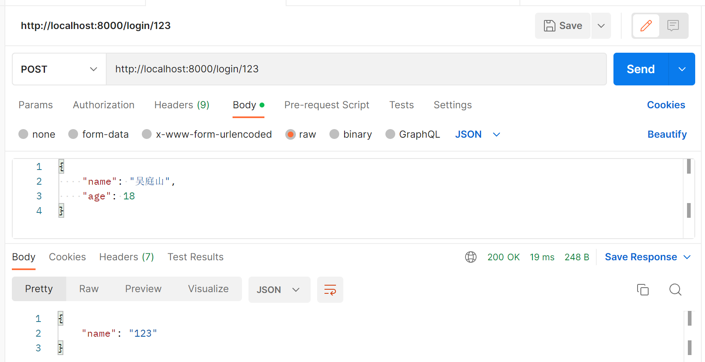

  可以看到，响应的是对象，也是json数据
  
  如果相应的是字符串，name可以用res.end，其他的类型都需要使用res.json()来相应数据


## 认识中间件

Express是一个路由和中间件的Web框架，它本身的功能非常少：

- **Express应用程序本质上是一系列中间件函数的调用；**

中间件是什么呢？

- 中间件的本质是传递给express的一个回调函数（你传给express一个函数，就是你传给他一个中间件了）；
- 这个回调函数接受三个参数：
  - 请求对象（request对象）； 
  - 响应对象（response对象）； 
  - next函数（在express中定义的用于执行下一个中间件的函数）；


## 认识中间件

中间件中可以执行哪些任务呢？

- 执行任何代码； 
- 更改请求（request）和响应（response）对象； 
- 结束请求-响应周期（返回数据，res.end()）； 
- 调用栈中的下一个中间件；
  - 所有的中间件都是放在一个stack中的，调用next（）的时候就是调用stack中下一个中间件

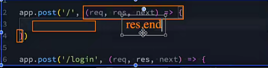

这个回调函数就是中间件

假如在这个函数中没有调用end，那么一定要调用next，如果都没有调，就意味着，当前这个请求生命周期，他一直没有结束，一直不会结束就意味着发送完网络请求之后，就一直在请求，一直在请求

如果当前中间件功能没有结束请求-响应周期，则必须调用next()将控制权传递给下一个中间件功能，否则，请求 将被挂起（挂起就意味着一直在请求，一直在请求）。

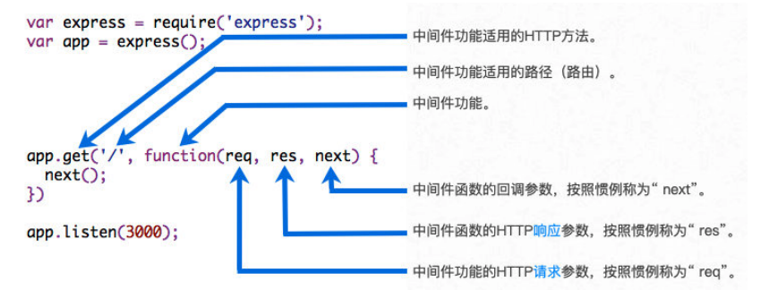


## 应用中间件 – 自己编写

那么，如何将一个中间件应用到我们的应用程序中呢？

- express主要提供了两种方式：app/router .use和app/router .methods； 
- 可以是 app，也可以是router，router我们后续再学习: 
- methods指的是常用的请求方式，比如： app.get或app.post等；

我们先来学习use的用法，因为methods的方式本质是use的特殊情况；


### 案例一：最普通的中间件 

```js
const express = require('express');
const app = express();

// 编写普通的中间件
// use 注册一个中间件（回调函数）
// 没有写 /, 也没有写/login， 就说明你这个中间件可以被任意的请求执行
app.use((req, res, next) => {
    console.log('注册了第一个普通的中间件')
})
app.listen(8000, () => {
    console.log('服务器启动成功')
})

/**
  服务器启动成功
  注册了第一个普通的中间件
  请求依然进行中...(因为我们没有调res.end)
 */
```

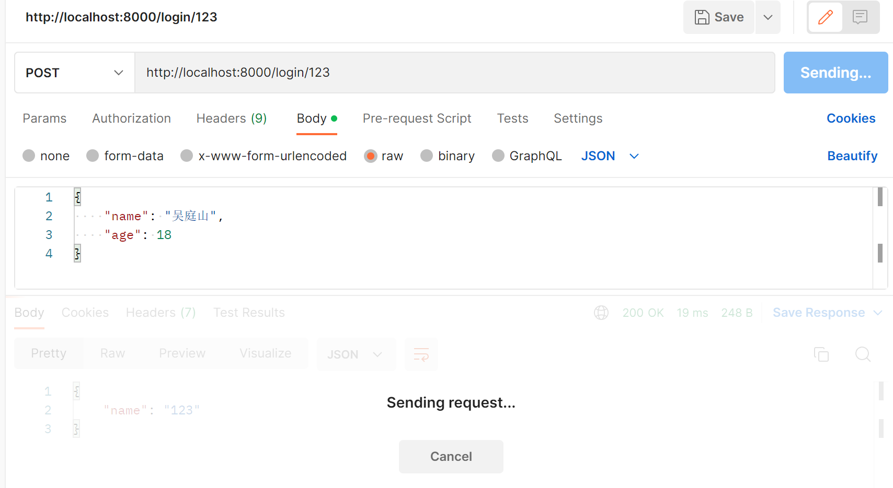


普通的中间件可以注册很多个的，注册多个中间件，哪一个会响应呢？

```js
const express = require('express');

const app = express();

app.use((req, res, next) => {
  console.log('第一个普通的中间件')
  res.end('hello world');
})


app.use((req, res, next) => {
  console.log('第二个普通的中间件');
  res.end('hello world');
})


app.use((req, res, next) => {
  console.log('第三个普通的中间件');
  res.end('hello world');
})


app.listen('8000', '127.0.0.1', () => {
  console.log('服务器启动成功')
})

/**
 * 打印
 * 第一个普通的中间件
 */
```

可以发现是第一个中间件在响应，第二个中间件和第三个中间件并不会响应

- 默认情况下，后面的中间件不会响应，因为虽然这些中间件都匹配上了（因为这些中间件监听任何网络请求，所以它会全都匹配上）
- 但是第一个中间件响应了，所以后面的中间件不会再来响应

如果希望这些中间件都响应要怎么办

res.end只是结束了响应周期（针对客户端的响应），但是不妨碍服务器代码的执行，也不妨碍next的执行

所以可以写（虽然一般把end放在最后）

```js
const express = require('express');

const app = express();

app.use((req, res, next) => {
  console.log('第一个普通的中间件')
  res.end('hello world');
  next();
})


app.use((req, res, next) => {
  console.log('第二个普通的中间件');
  next();
})


app.use((req, res, next) => {
  console.log('第三个普通的中间件');
  next();
})


app.listen('8000', '127.0.0.1', () => {
  console.log('服务器启动成功')
})

/**
 * 打印
 * 第一个普通的中间件
 * 第二个普通的中间件
 * 第三个普通的中间件
 */
```

可以发现，调用next之后，后面的中间件也执行了，如果希望后面的中间件也执行，也需要调用next

注意：

​		因为一个处理请求，只能有一个响应结果，所以一个请求中，只能有一个end

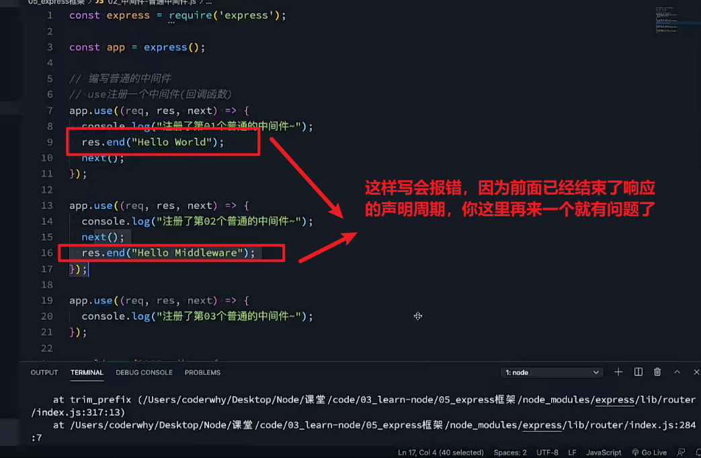

所以一般是这样写

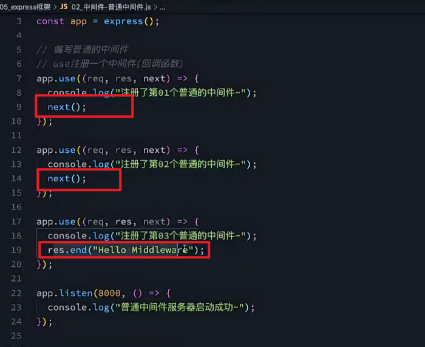

只能有一个end。


### 案例二：path匹配中间件 

```js
const express = require('express');

const app = express();

// 只会匹配路径是/home的请求
app.use('/home', (req, res, next) => {
  console.log('home middleware 01')
  res.end('home middleware')
})

app.listen('8000', '127.0.0.1', () => {
  console.log('服务器启动成功')
})
```

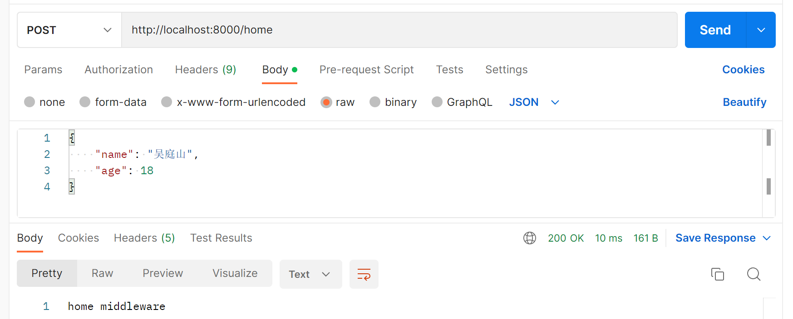

or

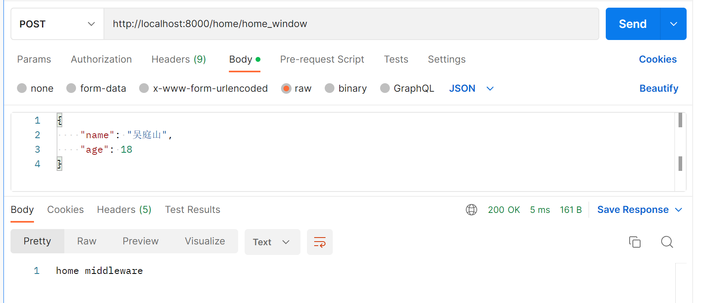

如果是其他的请求，就不行

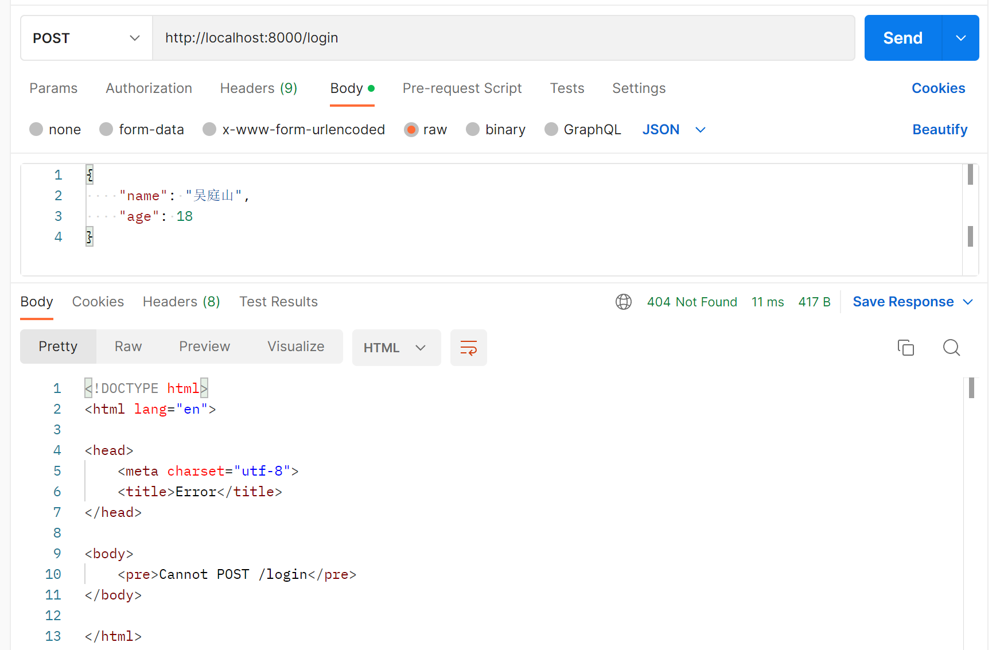

注意：

- 不管是post还是get还是其他的请求，都可以匹配上

- 假如路径相同的中间件有多个

  ```js
  const express = require('express');
  
  const app = express();
  
  // 只会匹配路径是/home的请求
  app.use('/home', (req, res, next) => {
    console.log('home middleware 01')
  })
  app.use('/home', (req, res, next) => {
    console.log('home middleware 02');
  })
  
  app.listen('8000', '127.0.0.1', () => {
    console.log('服务器启动成功')
  })
  
  /** 打印
   * home middleware 01
   */
  ```

​		找到的永远是第一个中间件，如果不调next，第二个是不会执行的

```js
const express = require('express');

const app = express();

// 只会匹配路径是/home的请求
app.use('/home', (req, res, next) => {
  console.log('home middleware 01')
  next();
})
app.use('/home', (req, res, next) => {
  console.log('home middleware 02');
  res.end('response');
})

app.listen('8000', '127.0.0.1', () => {
  console.log('服务器启动成功')
})

/** 打印
 * home middleware 01
 * home middleware 02
 */
```

这样两个中间件就都会执行了

还有一种情况

```js
const express = require('express');

const app = express();

app.use((req, res, next) => {
  console.log('home middleware 00');
  next();
})

// 只会匹配路径是/home的请求
app.use('/home', (req, res, next) => {
  console.log('home middleware 01')
  next();
})
app.use('/home', (req, res, next) => {
  console.log('home middleware 02');
  res.end('response');
})

app.listen('8000', '127.0.0.1', () => {
  console.log('服务器启动成功')
})

/**
 * home middleware 00
 * home middleware 01
 * home middleware 02
 */
```

会发现如果不写路径，他也是会匹配上的

或者是这样

```js
const express = require('express');

const app = express();

// 只会匹配路径是/home的请求
app.use('/home', (req, res, next) => {
  console.log('home middleware 01')
  next();
})
app.use((req, res, next) => {
  console.log('home middleware 00');
  next();
})；
app.use('/home', (req, res, next) => {
  console.log('home middleware 02');
  res.end('response');
})；

app.listen('8000', '127.0.0.1', () => {
  console.log('服务器启动成功')
})；

/**
 * home middleware 01
 * home middleware 00
 * home middleware 02
 */
```


查找所有匹配的中间件，并一个一个执行，如果中间有一个没有调next，后面的都不会执行了

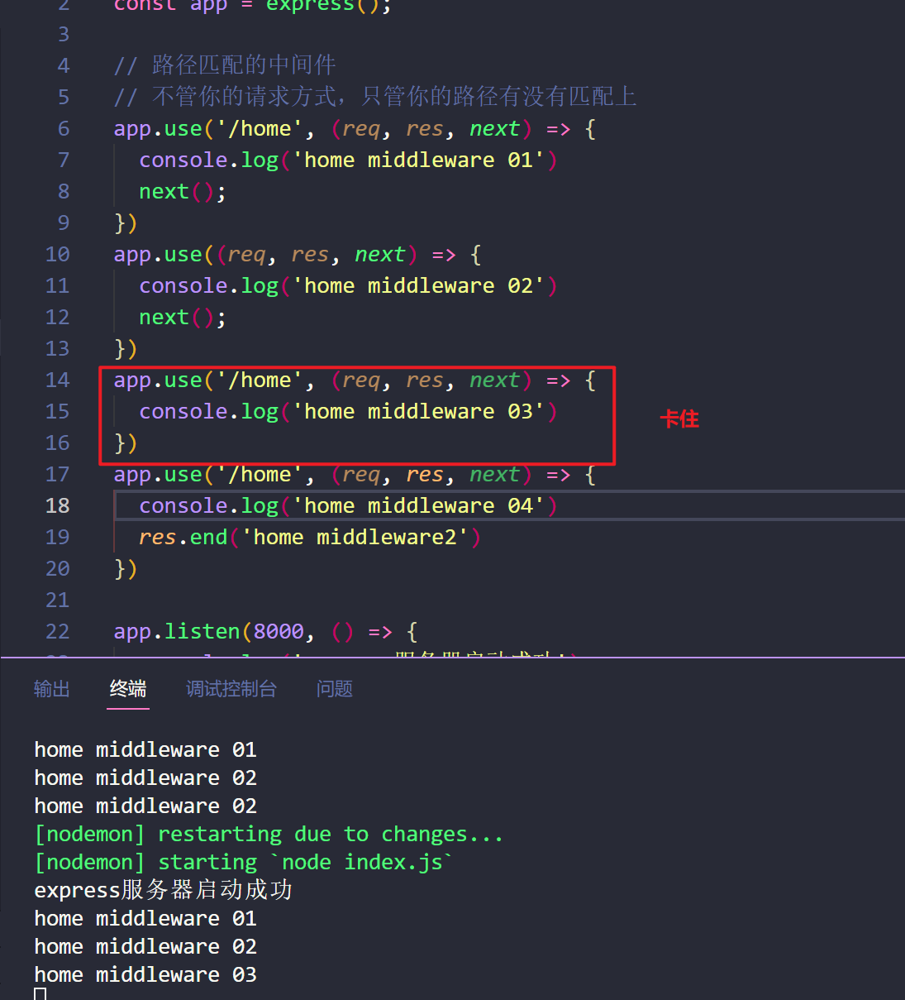


### 案例三：path和method匹配中间件 

```js
const express = require('express');
const app = express();

// 必须是get请求，并且请求的路径是/home
app.get('/home', (req, res, next) => {
  console.log('home path and method middleware')
  res.end('请求完成')
})


app.listen('8000', '127.0.0.1', () => {
  console.log('服务器启动成功')
})
```

请求方法和请求路径都相同，才能匹配上

这样的话，两个中间件都可以匹配上

```js
const express = require('express');

const app = express();

app.use((req, res, next) => {
  console.log('第一个中间件');
  next();
})

// 必须是get请求，并且请求的路径是/home
app.get('/home', (req, res, next) => {
  console.log('第二个中间件');
  res.end('请求完成')
})


app.listen('8000', '127.0.0.1', () => {
  console.log('服务器启动成功')
})

/**
 * 打印
 * 第一个中间件
 * 第二个中间件
 */
```

可以发现这两个中间件都执行了，也就是说这两个中间件都匹配上了

```js
app.use((req, res, next) => {
  console.log('第一个中间件');
  next();
})
```

不管是什么请求方式，不管你是什么请求路径，都会匹配上这个中间件

post请求

```js

const express = require('express');

const app = express();

app.use((req, res, next) => {
  console.log('第一个中间件');
  next();
})

// 必须是get请求，并且请求的路径是/home
app.post('/login', (req, res, next) => {
  console.log('第二个中间件');
  res.end('请求完成')
})


app.listen('8000', '127.0.0.1', () => {
  console.log('服务器启动成功')
})

/**
 * 打印
 * 第一个中间件
 * 第二个中间件
 */
```

post请求和get请求的规则是一样的


### 案例四：注册多个中间件

就是说，只要匹配上的中间件，就都会执行

```js

const express = require('express');

const app = express();

app.use((req, res, next) => {
  console.log('第一个中间件');
  next();
})
app.use((req, res, next) => {
  console.log('第二个中间件');
  next();
})
app.use((req, res, next) => {
  console.log('第三个中间件');
  next();
})

// 必须是get请求，并且请求的路径是/home
app.get('/home', (req, res, next) => {
  console.log('第四个中间件');
  res.end('请求完成')
})


app.listen('8000', '127.0.0.1', () => {
  console.log('服务器启动成功')
})

/**
 * 打印
 * 第一个中间件
 * 第二个中间件
 * 第三个中间件
 * 第四个中间件
 */
```

注意：

​		中间件匹配执行完了以后一定要执行next(),否则就会一直卡在某一个中间件

​		并且，所有的中间件完成了以后要执行res.end(),这样这个请求才算完成

​		当然，也可以在前面执行res.end(),最后再执行中间件

​		需要看具体的场景

​		如果想在某一个操作的前面做一些事情，就可以在他的前面插入一些中间件


### 案例五：连续注册中间件

中间件注册函数中可以连续写中间件，和上面普通注册中间件一样，如果想每一个中间件都执行的话，那么上一个中间件也需要调用next函数

```js

const express = require('express');

const app = express();


// 必须是get请求，并且请求的路径是/home
app.get('/home', (req, res, next) => {
  console.log('第一个中间件')
  next();
}, (req, res, next) => {
  console.log('第二个中间件')
  next();
}, (req, res, next) => {
  console.log('第三个中间件')
  next();
}, (req, res, next) => {
  console.log('第四个中间件')
  res.end('所有的中间件都执行完了')
})


app.listen('8000', '127.0.0.1', () => {
  console.log('服务器启动成功')
})

/**
 * 打印
 * 第一个中间件
 * 第二个中间件
 * 第三个中间件
 * 第四个中间件
 */
```


上面的中间件也是可以这样写的

```js

const express = require('express');

const app = express();

// 可以多个同时监听/home这个路径，来注册多个中间件，多个中间件都会执行
app.get('/home', (req, res, next) => {
  console.log('第一个中间件');
  next();
})


app.get('/home', (req, res, next) => {
  console.log('第二个中间件')
  next();
}, (req, res, next) => {
  console.log('第三个中间件')
  next();
}, (req, res, next) => {
  console.log('第四个中间件')
  res.end('所有的中间件都执行完了')
})


app.listen('8000', '127.0.0.1', () => {
  console.log('服务器启动成功')
})

/**
 * 打印
 * 第一个中间件
 * 第二个中间件
 * 第三个中间件
 * 第四个中间件
 */
```


## 应用中间件 – body解析

并非所有的中间件都需要我们从零去编写：

- express有内置一些帮助我们完成对request解析的中间件；
- registry仓库中也有很多可以辅助我们开发的中间件；

在客户端发送post请求时，会将数据放到body中：

- 客户端可以通过json的方式传递；
- 也可以通过form表单的方式传递；

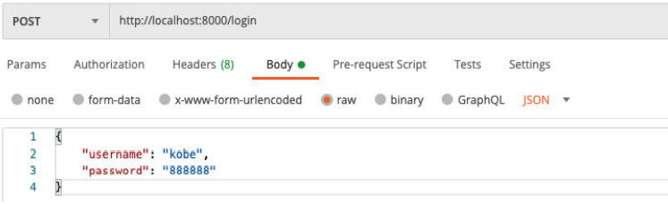


## 解析req数据


### 解析json

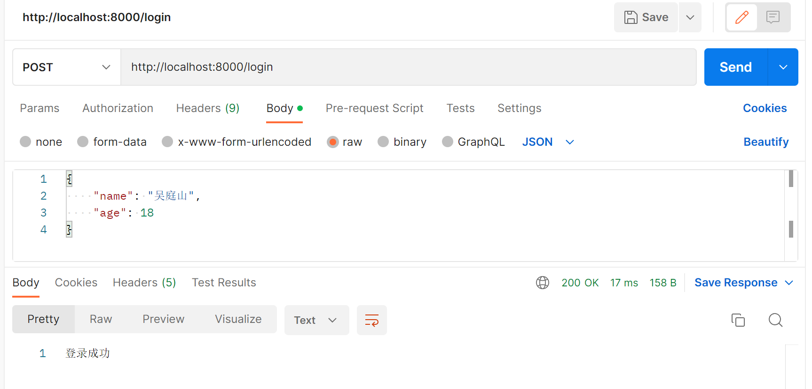

login接口，我们一般会这样写

```js

const express = require('express');
const app = express();

app.post('/login', (req, res, next) => {
  req.on('data', (data) => {
    console.log(data);	// buffer
    console.log(data.toString());	// {"name": "吴庭山", "age": 18}
  })
  req.on('end', () => {
    res.end('已经接收到请求了1');
  })
})；

app.listen('8000', '127.0.0.1', () => {
  console.log('服务器启动成功')
})
```

那如果还需要加上products这个接口呢？我们可能要这样写

```js

const express = require('express');
const app = express();

app.post('/login', (req, res, next) => {
  req.on('data', (data) => {
    console.log(data);	// buffer
    console.log(data.toString()); // {"name": "吴庭山", "age": 18}
  })
  req.on('end', () => {
    res.end('已经接收到请求了1');
  })
})
app.post('/products', (req, res, next) => {
  req.on('data', (data) => {
    console.log(data)
  })
  req.on('end', () => {
    res.end('已经接收到请求了2');
  })
})
app.listen('8000', '127.0.0.1', () => {
  console.log('服务器启动成功')
})
```

注意：

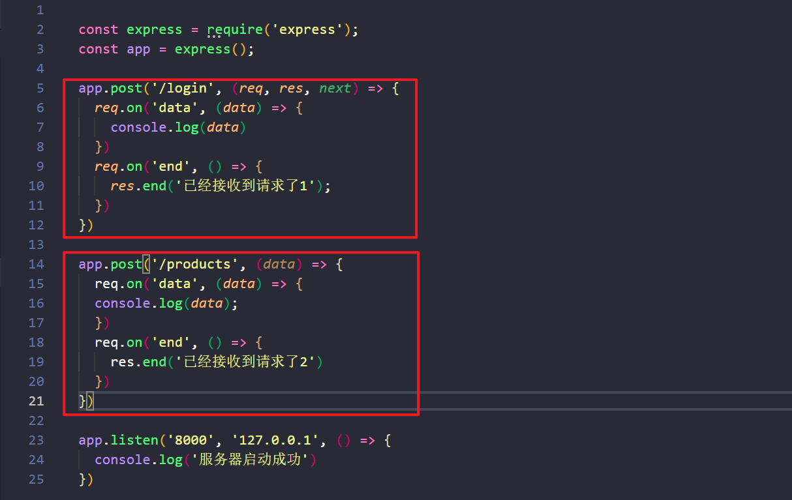


### 冗余代码优化

我们可以发现，这两个中间件的代码几乎是一样的，那这两个就很冗余了

那么有什么办法解决吗？

```js

const express = require('express');

const app = express();

app.use((req, res, next) => {
  if (req.headers['content-type'] === 'application/json') {
    req.on('data', (data) => {
      const userInfo = JSON.parse(data.toString());
      // 给req添加一个属性，下一个中间件能拿到这个body
      req.body = userInfo;
    })

    // 当所有的数据都收到了以后就走下一个中间件
    req.on('end', () => {
      // next函数不能传参数
      next();
    })
  } else {
    next();
  }
})

app.post('/login', (req, res, next) => {
  console.log(req.body);  // { name: '吴庭山', age: 18 }
  res.end('已经接收到请求了1');
})

app.post('/products', (req, res, next) => {
    console.log(res.body);
    res.end('已经接收到请求了2')
})

app.listen('8000', '127.0.0.1', () => {
  console.log('服务器启动成功')
})
```

这样就能解决冗余代码的问题了，可以发现，我们统一把数据解析了，然后再根据不同的路径匹配不同的中间件，并且执行各自的代码


上面是解析一些json的数据，但是只解析json的数据就完了吗？

看一下这个请求

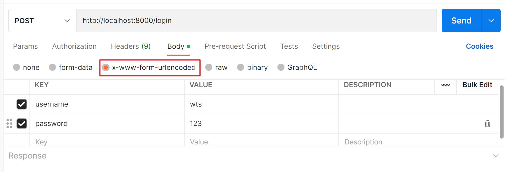

这个请求在执行的时候，其实上面的代码就不行了，因为在上面的 if 中*content-type*等于 application/json的时候才会进入，所以req.body是undefined

那么这个时候的content-type

```js

const express = require('express');
const app = express();

app.use((req, res, next) => {
  console.log(req.headers); // 'content-type': 'application/x-www-form-urlencoded'
})

app.listen('8000', '127.0.0.1', () => {
  console.log('服务器启动成功')
})
```


所以该怎么办呢？

在编写另外一个中间件就行，专门处理上面这种请求类型的中间件就行了

```js

const express = require('express');

const app = express();

app.use((req, res, next) => {
  if (req.headers['content-type'] === 'application/x-www-form-urlencoded') {
    req.on('data', (data) => {
      const userInfo = data.toString();
      req.body = userInfo;
    })

    // 当所有的数据都收到了以后就走下一个中间件
    req.on('end', () => {
      next();
    })
  } else {
    next();
  }
})

app.post('/login', (req, res, next) => {
  console.log(req.body);  // username=wts&password=123
  res.end('已经接收到请求了1');
})

app.post('/products', (req, res, next) => {
    console.log(res.body);
    res.end('已经接收到请求了2')
})

app.listen('8000', '127.0.0.1', () => {
  console.log('服务器启动成功')
})
```

如果还有其他格式，也和这个一样,但是这样不免有些麻烦，有没有其他的方式呢？

那么有没有编写好的呢？

有的，比如body-parse


## body-parse解析参数

### 解析 json

但是，事实上我们可以使用expres内置的中间件或者使用body-parser来完成：

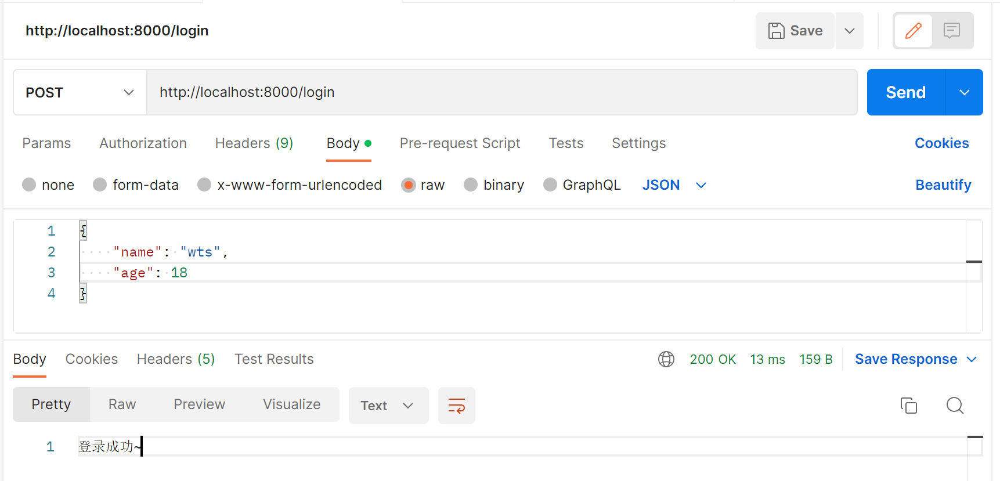

这么一个请求，如果没有使用express.json，那么会是这样

```js

const express = require('express');
const app = express();
app.post('/login', (req, res, next) => {
  console.log(req.body);  // undefined
  res.end('登录成功~')
})

app.listen('8000', '127.0.0.1', () => {
   console.log('服务器启动成功');
})
```

当我们通过express.json() 之后，就可以发现，我们现在可以解析了

```js
const express = require('express');
const app = express();
app.use(express.json());  // 解析json格式的数据
app.post('/login', (req, res, next) => {
  console.log(req.body);  // { name: 'wts', age: 18 }
  res.end('登录成功~')
})
app.listen('8000', '127.0.0.1', () => {
   console.log('服务器启动成功');
})
```


### 解析 application/x-www-form-urlencoded：

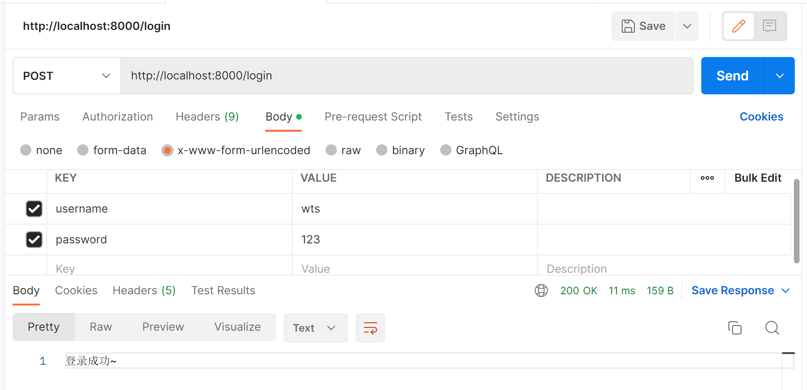

如果不使用express.urlencoded，那么会这样

```js
const express = require('express');
const app = express();
app.post('/login', (req, res, next) => {
  console.log(req.body);  // undefined
  res.end('登录成功~')
})

app.listen('8000', '127.0.0.1', () => {
   console.log('服务器启动成功');
})
```

可以发现，req.body等于undefined

所以我们可以使用这样

```js
const express = require('express');
const app = express();
app.use(express.urlencoded()) // 解析 x-www-form-urlencoded
app.post('/login', (req, res, next) => {
  console.log(req.body);  // {username: 'wts', password: '123' }
  res.end('登录成功~')
})

app.listen('8000', '127.0.0.1', () => {
   console.log('服务器启动成功');
})
```

但是这样写有一个问题

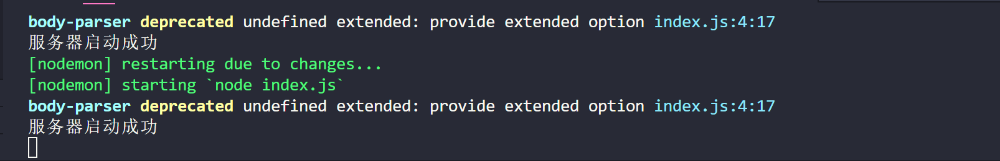

上面的意思是本来应该有扩展属性，但是发现是undefined

路过这个的时候他会解析上面那种结果，如果没有urlencoded的话就是空对象

所以一般会这样写

```js
const express = require('express');
const app = express();
app.use(express.urlencoded({ extended: true })) // 解析 x-www-form-urlencoded
app.post('/login', (req, res, next) => {
  console.log(req.body);  // {username: 'wts', password: '123' }
  res.end('登录成功~')
})

app.listen('8000', '127.0.0.1', () => {
  console.log('服务器启动成功');
})
```

这样写完之后，就不会有上面那个警告了，那么extended是什么意思呢？

```js
/**
 * extended
 * true: 那么对urlencoded进行解析时，它使用的是第三方库：qs
 * false: 那么对urlencoded进行解析时，它使用的是Node内置模块：querystring
 */
app.use(express.urlencoded({ extended: true })) // 解析 x-www-form-urlencoded
```


### 解析form-data

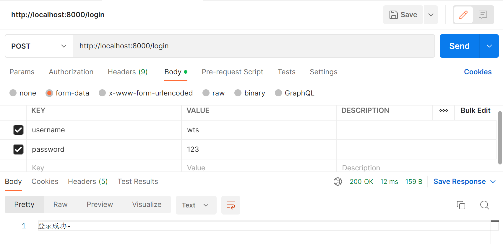


使用这种请求类型，前面两种(json/x-www-form-urlencoded)都是解析不了的

那应该怎么办呢？

手动解析：就跟前面解析图片的时候一样

看下express有没有给我们提供这种解析功能

express没有提供，所以我们需要用第三方库：multer（express官方开发的）

用第三方库来进行form-data类型的数据

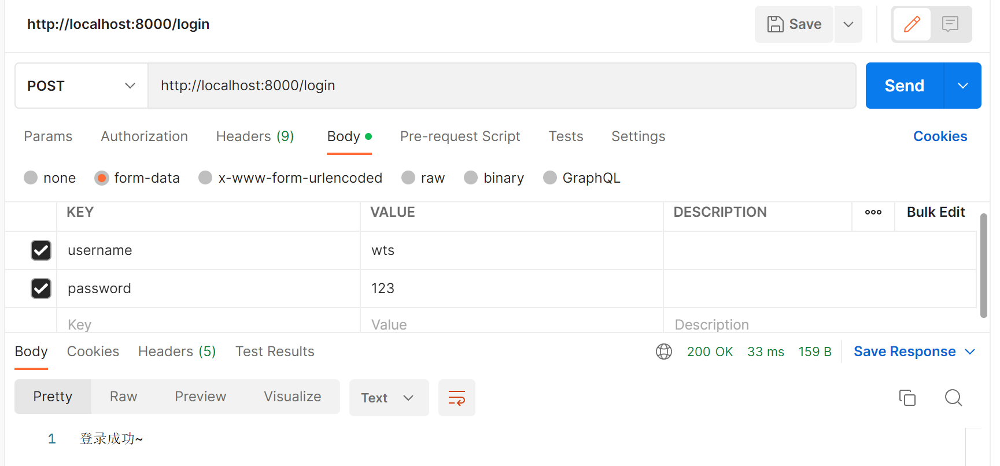

```js

const express = require('express');
const multer = require('multer');
const app = express();
const upload = multer();

// 如果传的是非文件的类型，那么可以用any来进行解析
app.use(upload.any());
app.post('/login', (req, res, next) => {
  console.log(req.body);  // [Object: null prototype] { username: 'wts', password: '123' }
  res.end('登录成功~')
})

app.listen('8000', '127.0.0.1', () => {
  console.log('服务器启动成功');
})
```


那么如果是文件上传呢？

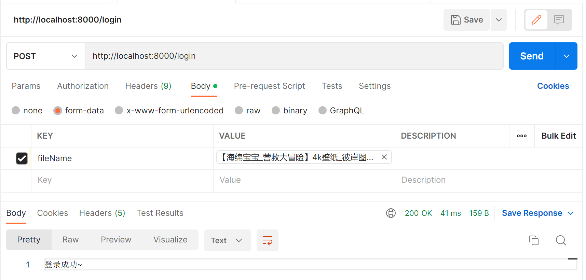

**注意：**

- 上传文件的时候不能用upload.any()
- 并且不能将upload.any()放入到全局，下面会有正确代码
- 使用any会让服务端报错


multer配置一：

```js

const path = require('path');
const express = require('express');
const multer = require('multer');
const app = express();

const upload = multer({
  // 上传后我们保存的位置,不知道为什么使用这个会报错
  dest: './uploads/'
});

// 注意，不能将这个中间件在全局注册
// app.use(upload.any('file'));

app.post('/login', upload.any(), (req, res, next) => {
  console.log(req.body);
  res.end('登录成功~')
})

app.listen('8000', '127.0.0.1', () => {
  console.log('服务器启动成功');
})
```

可以看到：

- any是不能全局注册的

- any是注册到对应接口的中间件中的

- multer配置的dest获取到的数据会有问题

  

- 可以看到这样配置获取不到正确的图片


multer配置二

```js

const path = require('path');
const express = require('express');
const multer = require('multer');
const app = express();

// diskStorage表示存在硬盘中，memoryStorage表示存在内存中
const storage = multer.diskStorage({
  // 文件保存信息配置
  destination: (req, file, cb) => {
    // 第一个参数是错误，第二个参数是保存路径
    cb(null, './uploads');
  },
  // 文件名字
  filename: (req, file, cb) => {
    // 第一个参数是错误，第二个参数是名字
    cb(null, Date.now() + path.extname(file.originalname));
  }
})

const upload = multer({
  storage
});

// 注意，不能将这个中间件在全局注册,要放在upload.any() 这个位置
// app.use(upload.single('file'));

// 第二个参数获取上传的文件，这里可以上传多个文件
app.post('/login', upload.any(), (req, res, next) => {
  console.log(req.body);
  res.end('登录成功~')
})

app.listen('8000', '127.0.0.1', () => {
  console.log('服务器启动成功');
})
```


可以看到，这样就可以拿到正确的图片了

当然，也可以获取单独的图片

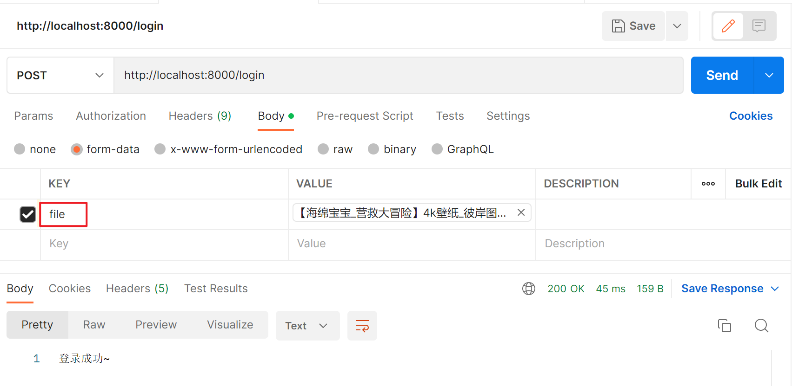

```js

const path = require('path');
const express = require('express');
const multer = require('multer');
const app = express();

// diskStorage表示存在硬盘中，memoryStorage表示存在内存中
const storage = multer.diskStorage({
  // 文件保存信息配置
  destination: (req, file, cb) => {
    // 第一个参数是有没有一些错误，第二个参数是文件夹
    cb(null, './uploads');
  },
  // 文件名字
  filename: (req, file, cb) => {
    // 第一个参数是错误，第二个参数是名字
    cb(null, Date.now() + path.extname(file.originalname));
  }
})

const upload = multer({
  storage
});

// 第二个参数获取上传的文件，通过avater获取到上传的文件的名字
app.post('/login', upload.single('avater'), (req, res, next) => {
  console.log(req.body);
  res.end('登录成功~')
})

app.listen('8000', '127.0.0.1', () => {
  console.log('服务器启动成功');
})
```

这样配置也是可以获取到的，但是

- any可以上传多个图片

- single每次只能上传一个图片

- 还有另一种上传多个图片的方式

  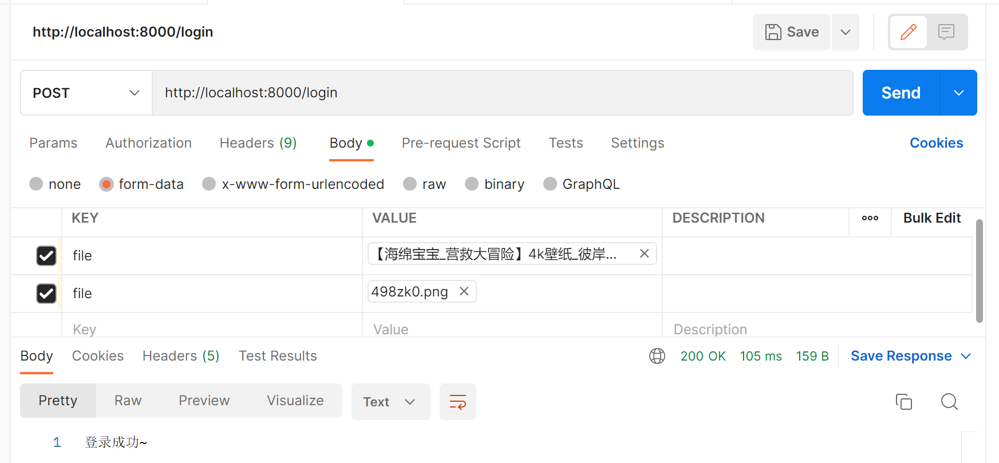

  ```js
  
  const path = require('path');
  const express = require('express');
  const multer = require('multer');
  const app = express();
  
  // diskStorage表示存在硬盘中，memoryStorage表示存在内存中
  const storage = multer.diskStorage({
    // 文件保存信息配置
    destination: (req, file, cb) => {
      cb(null, './uploads');
    },
    // 文件名字
    filename: (req, file, cb) => {
      cb(null, Date.now() + path.extname(file.originalname));
    }
  })
  
  const upload = multer({
    storage
  });
  
  // 拿到file名称的文件
  app.post('/login', upload.array('file'), (req, res, next) => {
    console.log(req.files);
    res.end('登录成功~')
  })
  
  app.listen('8000', '127.0.0.1', () => {
    console.log('服务器启动成功');
  })
  ```

  可以看一下req.files打印的是什么

  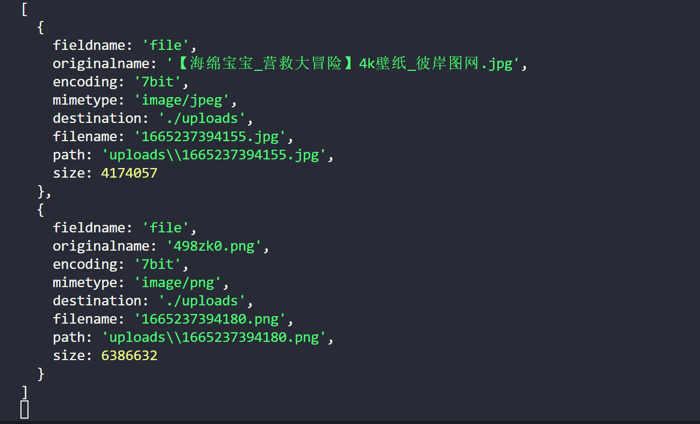

  可以看到，files拿到上传的文件

- 注意：multer有一个很重要的地方

  


## 应用中间件 – 第三方中间件

### 日志记录

如果我们希望将请求日志记录下来，那么可以使用express官网开发的第三方库：morgan

- 注意：需要单独安装

  ```js
  npm install morgan
  ```

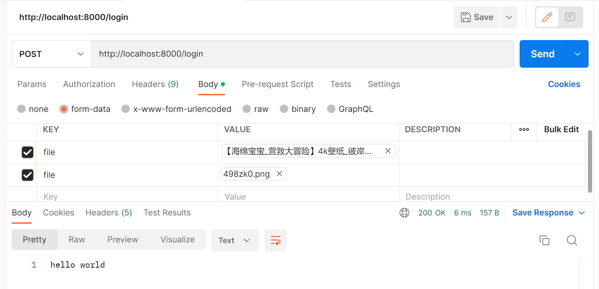

```js

const fs = require('fs');
const path = require('path');
const express = require('express');
const morgan = require('morgan');

const app = express();

/**
 * 经过测试a+在window电脑会报错，并且morgan官网用的也是a
 * 注意：这里需要先建一个log的文件夹
 */
const loggerWriter = fs.createWriteStream('./log/access.log', { flags: 'a' });

// combined:打印的格式
app.use(morgan('combined', {
  stream: loggerWriter
}))

app.post('/login', (req, res, next) => {
  res.end('hello world');
})
app.listen('8000', '127.0.0.1', () => {
  console.log('服务器启动~');
})
```

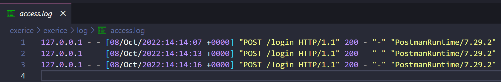

这样就有打印的日志了

```js

const fs = require('fs');
const path = require('path');
const express = require('express');
const morgan = require('morgan');

const app = express();

/**
 * 经过测试a+在window电脑会报错，并且morgan官网用的也是a
 * 注意：这里需要先建一个log的文件夹
 */
const loggerWriter = fs.createWriteStream('./log/access.log', { flags: 'a' });

// combined:打印的格式
app.use(morgan('combined', {
  stream: loggerWriter
}))

app.post('/login', (req, res, next) => {
  res.end('hello world');
})
app.listen('8000', '127.0.0.1', () => {
  console.log('服务器启动~');
})
```


## 客户端发送请求的方式

客户端传递到服务器参数的方法常见的是5种：

- 方式一：通过get请求中的URL的params； 
- 方式二：通过get请求中的URL的query； 
- 方式三：通过post请求中的body的json格式（中间件中已经使用过）； 
- 方式四：通过post请求中的body的x-www-form-urlencoded格式（中间件使用过）； 
- 方式五：通过post请求中的form-data格式（中间件中使用过）；

目前我们主要有两种方式没有讲。


## 传递参数params和query

### 获取params

请求信息

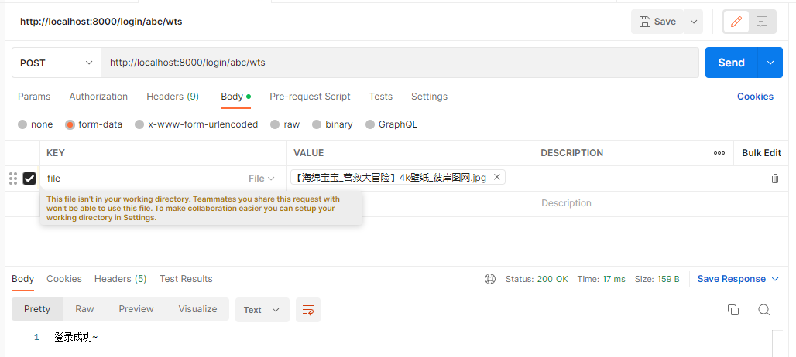

```js
const express = require('express');
const app = express();

app.post('/login/:id/:name', (req, res, next) => {
  console.log(req.params);  // { id: 'abc', name: 'wts' }
  res.end('登录成功~')
})

app.listen('8000', '127.0.0.1', () => {
  console.log('服务器启动成功');
})
```


### 获取query

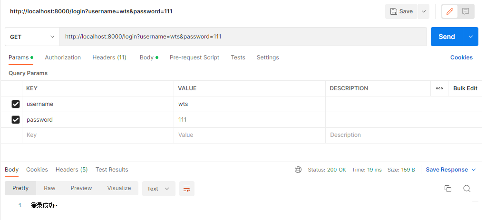

```js

const express = require('express');
const app = express();

app.get('/login', (req, res, next) => {
  console.log(req.query);  // { username: 'wts', password: '111' }
  res.end('登录成功~')
})

app.listen('8000', '127.0.0.1', () => {
  console.log('服务器启动成功');
})
```


## 响应数据

默认rens.end只能传字符串,buffer

### 响应JSON数据（一）

```js
const express = require('express');
const app = express();

app.get('/login', (req, res, next) => {
  // 告诉浏览器这是个json，浏览器才能自动解析为json
  res.type('application/json')；
  res.end(JSON.stringify({ name: 'wts', age: 18 }))；
})

app.listen('8000', '127.0.0.1', () => {
  console.log('服务器启动成功');
})
```

这样的话，我们响应给客户端的就是json数据了

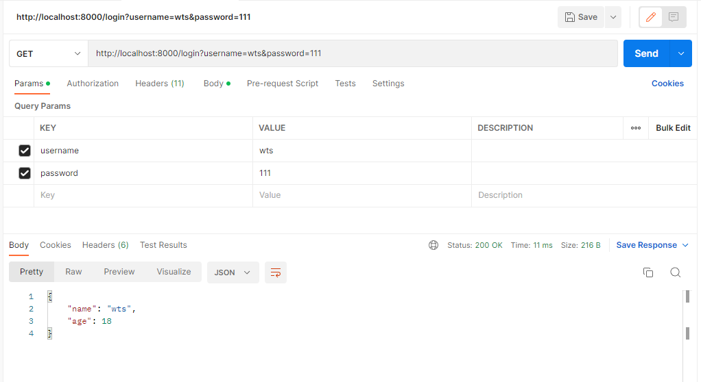


### 响应JSON数据（二）

```js

const express = require('express');
const app = express();

app.get('/login', (req, res, next) => {
  console.log(req.query);
  // 告诉浏览器，这个是json格式的数据
  res.json({ name: 'wts', age: 18 })
  // res.json(['abc', 'cba'])
})

app.listen('8000', '127.0.0.1', () => {
  console.log('服务器启动成功');
})
```

也可以这样做，响应的结果和上面是一样的


### 响应状态

```js

const express = require('express');
const app = express();

app.get('/login', (req, res, next) => {
  console.log(req.query);

  /**
   * 经过测试，这两个东西只能存在一个
   * 要么存在status，要么存在json
   * 前面的会生效，后面的不会生效
   */
  // 响应状态
  res.status(205);
  res.json({name: 'wts', age: 18})
})

app.listen('8000', '127.0.0.1', () => {
  console.log('服务器启动成功');
})
```

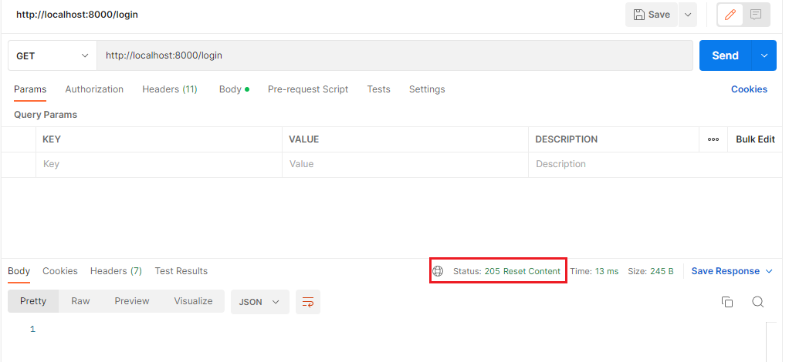

可以看到res.json并没有生效，205导致不生效的（http状态码 205 （**重置内容**） 服务器成功处理了请求，但没有返回任何内容。）

那么问题来了，如果既想状态码生效，又想转成json要怎么办呢？

```js
const express = require('express');
const app = express();

app.get('/login', (req, res, next) => {
  console.log(req.query);
  // 修改状态码，以及返回对应数据
  res.status(400).json({name: 'wts'})
})

app.listen('8000', '127.0.0.1', () => {
  console.log('服务器启动成功');
})
```

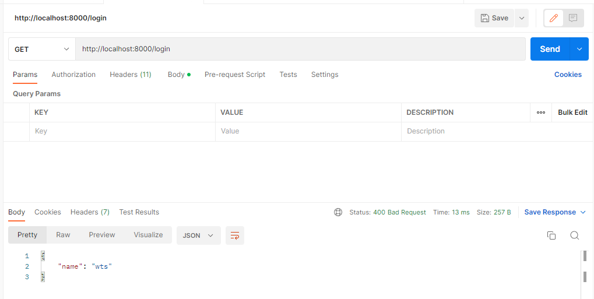


### end方法

- 类似于http中的response.end方法，用法是一致的

### json方法

- json方法中可以传入很多的类型：object、array、string、boolean、number、null等，它们会被转换成 json格式返回；

status方法

- 用于设置状态码：

更多响应的方式：https://www.expressjs.com.cn/4x/api.html#res


## Express的路由

如果我们将所有的代码逻辑都写在app中，那么app会变得越来越复杂：

- 一方面完整的Web服务器包含非常多的处理逻辑；
- 另一方面有些处理逻辑其实是一个整体，我们应该将它们放在一起：比如对users相关的处理
  - 获取用户列表； 
  - 获取某一个用户信息； 
  - 创建一个新的用户； 
  - 删除一个用户； 
  - 更新一个用户；

我们可以使用 express.Router来创建一个路由处理程序：

- 一个Router实例拥有完整的中间件和路由系统； 
- 因此，它也被称为 迷你应用程序（mini-app）；

router/products.js

```js
/**
 * 举个例子:
 *   请求所有的用户信息: get /users
 *   请求所有的某个用户信息: get /users/:id
 *   请求所有的某个用户信息: post /users body {username: passwod:}
 *   请求所有的某个用户信息: delete /users/:id 
 *   请求所有的某个用户信息: patch /users/:id {nickname: }
 */

const express = require('express');

const router = express.Router();

module.exports = router;

```


routers/users.js

```js
/**
 * 举个例子:
 *   请求所有的用户信息: get /users
 *   请求所有的某个用户信息: get /users/:id
 *   请求所有的某个用户信息: post /users body {username: passwod:}
 *   请求所有的某个用户信息: delete /users/:id 
 *   请求所有的某个用户信息: patch /users/:id {nickname: }
 */

const express = require('express');

const router = express.Router();

router.get('/', (req, res, next) => {
  res.json(["why", "kobe", "lilei"]);
});

router.get('/:id', (req, res, next) => {
  res.json(`${req.params.id}用户的信息`);
});

router.post('/', (req, res, next) => {
  res.json("create user success~");
});

module.exports = router;

```


index.js

```js
const express = require('express');
const userRouter = require('./routers/users');
const productRouter = require('./routers/products');

const app = express();

// 注意：这里加了/users，那么userRouter这个文件中就可以不带/users了
app.use("/users", userRouter);
app.use("/products", productRouter);

app.listen(8000, () => {
  console.log("路由服务器启动成功~");
});
```


## 静态资源服务器

部署静态资源我们可以选择很多方式：

- Node也可以作为静态资源服务器，并且express给我们提供了方便部署静态资源的方法；

将打包后的项目（build）部署在node静态服务器中

index.js

```js
const express = require('express');

const app = express();

// build是项目打包后的文件，解压后的
app.use(express.static('./build'))

app.listen('8000', () => {
  console.log('服务器启动成功');
})
```


## 服务端的错误处理

方案一：

```js
const express = require('express');

const app = express();

// 登录
app.post('/login', (req, res, next) => {
  const isLogin = true;
  if(isLogin) {
    res.json('user login success~')
  }else {
    res.type(400);
    res.json('username does node exists~');
  }
})

// 注册
app.post('/register', (req, res, next) => {
  const isExists = true;
  if(!isExists) {
    res.json('user register success~');
  } else {
    res.type(400);
    res.json('username already exists~');
  }
})

app.listen('8000', () => {
  console.log('服务器启动成功');
})
```


方案二：

```js
const express = require('express');

const app = express();
const USERNAME_DOES_NOT_EXISTS = 'USERNAME_DOES_NOT_EXISTS';
const USERNAME_ALREADY_EXISTS = 'USERNAME_ALREADY_EXISTS';

app.post('/login', (req, res, next) => {
  const isExists = false;
  if(isExists) {
    res.json('username login success~');
  } else {
    next(new Error(USERNAME_DOES_NOT_EXISTS))
  }
})

app.post('/register', (req, res, next) => {
  const isExists = true;
  if(!isExists) {
    res.json('username register success~');
  } else {
    next(new Error(USERNAME_ALREADY_EXISTS))
  }
})

// 处理错误的中间件
app.use((err, req, res, next) => {
  let status = 400;
  let message = '';
  switch (err.message) {
    case USERNAME_DOES_NOT_EXISTS:
      message = 'username login success~';
      status = 400;
      break;
    case USERNAME_ALREADY_EXISTS:
      message = 'username register success~'
      status = 401;
      break;
    default:
      message = 'not found!'
  }
  res.status = status;
  res.json({
    errCode: status,
    errMessage: message
  });
})

app.listen('8000', () => {
  console.log('服务器启动啦啦')
})
```

next不是不能带参数，而是如果带参数了，那么就不会走下一个中间件，而是直接走到了处理错误的中间件中，所以如果不是处理错误的时候，就不要带参数


## 创建app的过程

express函数的本质其实是createApplication：

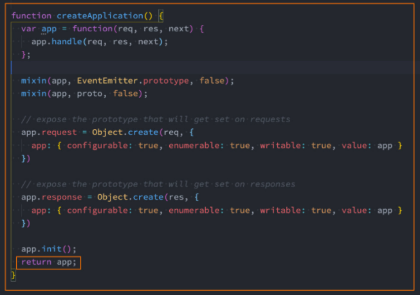

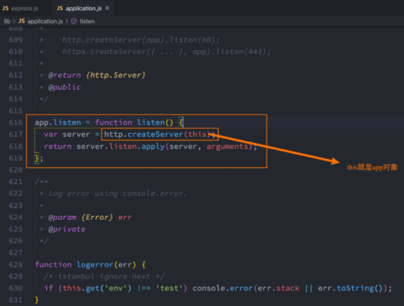


## 注册中间件

比如我们通过use来注册一个中间件，源码中发生了什么？ 

- 我们会发现无论是app.use还是app.methods都会注册一个主路由； 
- 我们会发现app本质上会将所有的函数，交给这个主路由去处理的；

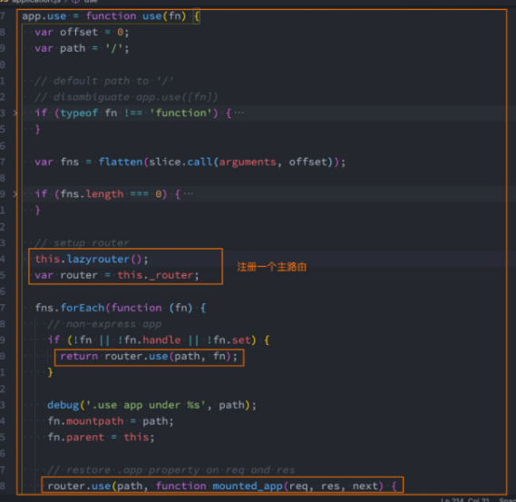

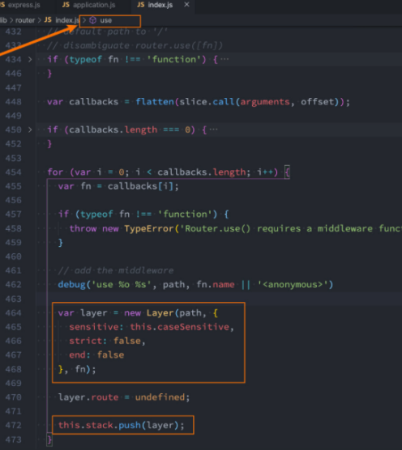


## 请求的处理过程

如果有一个请求过来，那么从哪里开始呢？

- app函数被调用开始的；

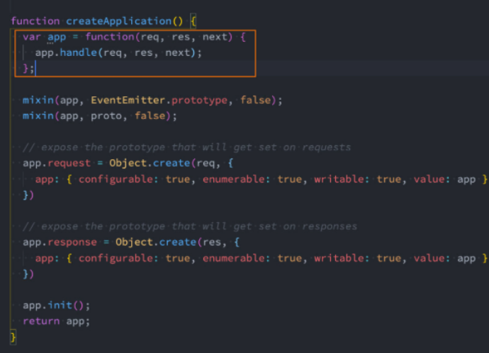

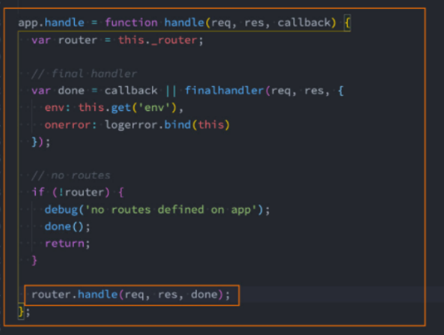


## router.handle中做的什么事情呢？

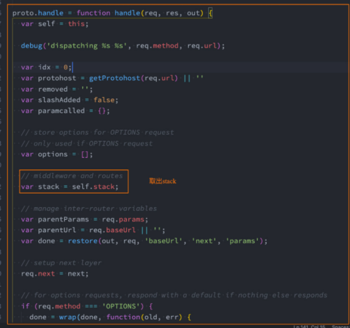

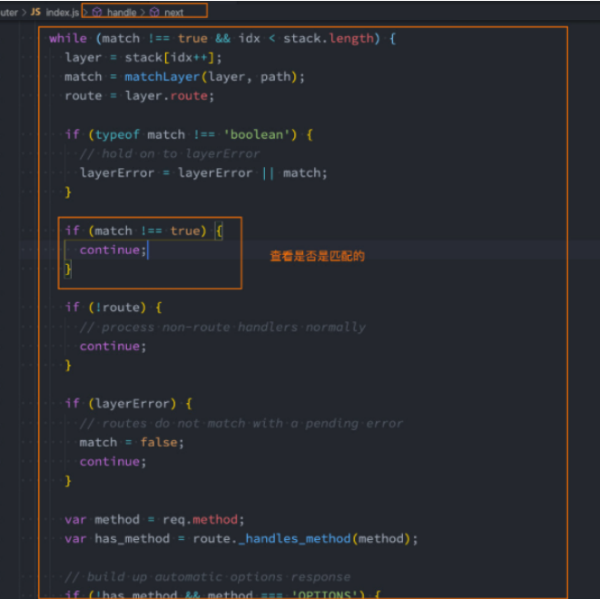