## coderhub功能接口说明

Coderhub旨在创建一个程序员分享生活动态的平台。

完整的项目接口包括：

- 面向用户的业务接口； 
- 面向企业或者内部的后台管理接口；

课堂上完成的功能如下：

- 1.用户管理系统 
- 2.内容管理系统 
- 3.内容评论管理 
- 4.内容标签管理 
- 5.文件管理系统 
- 其他功能其实都是非常相似的


## 项目的搭建

功能一：目录结构的划分：

-  按照功能模块划分； 
- 按照业务模块划分；

功能二：应用配置信息写到环境变量 

- 编写.env文件 
- 通过dotenv加载配置的变量 

功能三：创建和启动服务器 

- 基于koa创建app； 
- 启动服务器；


## 用户注册接口

用户注册接口编写流程： 

- 注册用户路由router编写； 
- 处理函数的控制器controller编写； 
- 操作数据库的service编写； 

数据库连接操作：mysql2 

- 创建数据库连接； 
- 测试数据库连接是否成功； 

注册用户校验 

- 用户名或密码不能为空 
- 用户名没有被注册过

密码加密存储


创建用户表sql

```sql

CREATE TABLE IF NOT EXISTS `users` (
	id INT PRIMARY KEY AUTO_INCREMENT,
    name VARCHAR(30) NOT NULL UNIQUE,
    password VARCHAR(50) NOT NULL,
    createdAt TIMESTAMP DEFAULT CURRENT_TIMESTAMP
    updatedAt TIMESTAMP DEFAULT CURRENT_TIMESTAMP ON UPDATE CURRENT_TIMESTAMP
);
```


## 错误统一处理

封装错误处理函数：

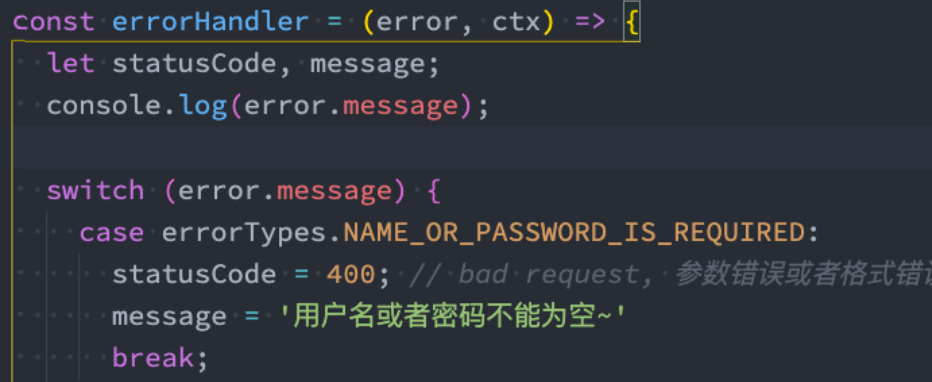

App监听错误事件：

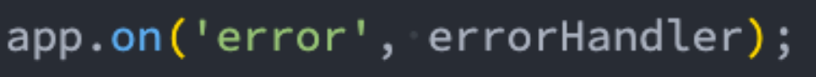


## 用户登录接口

用户登录接口编写流程： 

- 授权router的编写； 
- 处理函数的controller编写； 

验证的中间件： 

- 账号和密码是否为空； 
- 用户名是否存在； 
- 校验密码是否一致； 

登录成功返回凭证： 

- cookie+session； 
- Token令牌；


## 为什么需要登录凭证呢？

web开发中，我们使用最多的协议是http，但是http是一个无状态的协议。

- 无状态的协议？什么叫做无状态协议呢？

举个例子：

我们登录了一个网站 www.coderhub.com（当然这个网站不存在，是我要开发一个的）; 

登录的时候我们需要输入用户名和密码：比如用户名coderwhy，密码：Coderwhy666.; 

登录成功之后，我们要以coderwhy的身份去访问其他的数据和资源，还是通过http请求去访问。

- coderhub的服务器会问：你谁呀？ 
- coderwhy说：我是coderwhy呀，刚刚登录过呀； 
- coderhub：怎么证明你刚刚登录过呀？ 
- coderwhy说：这。。。，http没有告诉你吗？ 
- coderhub：http的每次请求对我来说都是一个单独的请求，和之前请求过什么没有关系。

看到了吧？这就是http的无状态，也就是服务器不知道你上一步做了什么，我们必须得有一个办法可以证明我们登录过。


## 认识cookie

Cookie（复数形态Cookies），又称为“小甜饼”。类型为“小型文本文件，某些网站为了辨别用户身份而存储 在用户本地终端（Client Side）上的数据。

- 浏览器会在特定的情况下携带上cookie来发送请求，我们可以通过cookie来获取一些信息；

Cookie总是保存在客户端中，按在客户端中的存储位置，Cookie可以分为内存Cookie和硬盘Cookie。

- 内存Cookie由浏览器维护，保存在内存中，浏览器关闭时Cookie就会消失，其存在时间是短暂的； 
- 硬盘Cookie保存在硬盘中，有一个过期时间，用户手动清理或者过期时间到时，才会被清理；

如果判断一个cookie是内存cookie还是硬盘cookie呢？

- 没有设置过期时间，默认情况下cookie是内存cookie，在关闭浏览器时会自动删除； 
- 有设置过期时间，并且过期时间不为0或者负数的cookie，是硬盘cookie，需要手动或者到期时，才会删除；


## cookie常见的属性

cookie的生命周期： 

- 默认情况下的cookie是内存cookie，也称之为会话cookie，也就是在浏览器关闭时会自动被删除； 

- 我们可以通过设置expires或者max-age来设置过期的时间；
  - expires：设置的是Date.toUTCString()，设置格式是;expires=date-in-GMTString-format； 
  - max-age：设置过期的秒钟，;max-age=max-age-in-seconds (例如一年为60*60*24*365)；

cookie的作用域：（允许cookie发送给哪些URL） 

- Domain：指定哪些主机可以接受cookie
  - 如果不指定，那么默认是 origin，不包括子域名。 
  - 如果指定Domain，则包含子域名。例如，如果设置 Domain=mozilla.org，则 Cookie 也包含在子域名中（如developer.mozilla.org）。
- Path：指定主机下哪些路径可以接受cookie
  - 例如，设置 Path=/docs，则以下地址都会匹配：
    - /docs 
    - /docs/Web/ 
    - /docs/Web/HTTP


## 客户端设置cookie

js直接设置和获取cookie：

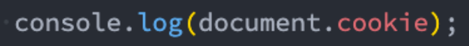

这个cookie会在会话关闭时被删除掉；

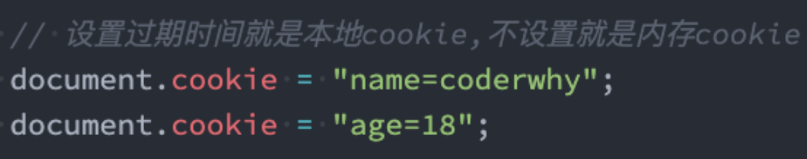

设置cookie，同时设置过期时间（默认单位是秒钟）

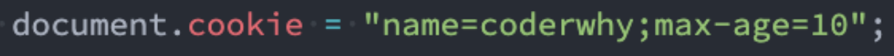


## 服务器设置cookie

Koa中默认支持直接操作cookie 

- /test请求中设置cookie 
- /demo请求中获取cookie

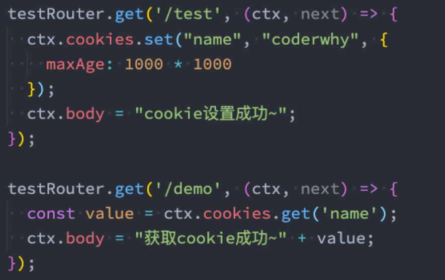


## Session是基于cookie实现机制

在koa中，我们可以借助于 koa-session 来实现session认证：

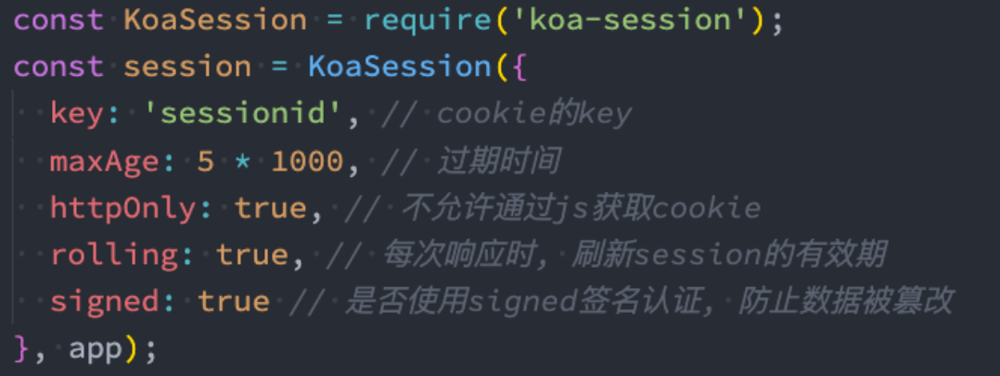

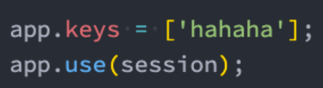

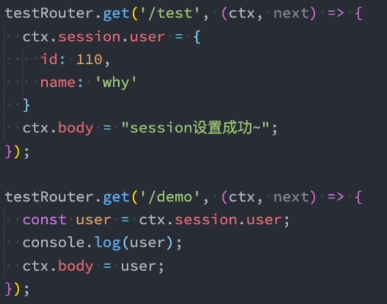


## 认识token

cookie和session的方式有很多的缺点：

- Cookie会被附加在每个HTTP请求中，所以无形中增加了流量（事实上某些请求是不需要的）； 
- Cookie是明文传递的，所以存在安全性的问题； 
- Cookie的大小限制是4KB，对于复杂的需求来说是不够的； 
- 对于浏览器外的其他客户端（比如iOS、Android），必须手动的设置cookie和session； 
- 对于分布式系统和服务器集群中如何可以保证其他系统也可以正确的解析session？

所以，在目前的前后端分离的开发过程中，使用token来进行身份验证的是最多的情况：

- token可以翻译为令牌； 
- 也就是在验证了用户账号和密码正确的情况，给用户颁发一个令牌； 
- 这个令牌作为后续用户访问一些接口或者资源的凭证； 
- 我们可以根据这个凭证来判断用户是否有权限来访问；

所以token的使用应该分成两个重要的步骤：

- 生成token：登录的时候，颁发token； 
- 验证token：访问某些资源或者接口时，验证token；


## JWT实现Token机制

JWT生成的Token由三部分组成：

header

- alg：采用的加密算法，默认是 HMAC SHA256（HS256），采用同一个密钥进行 加密和解密； 
- typ：JWT，固定值，通常都写成JWT即可； 
- 会通过base64Url算法进行编码；

payload

- 携带的数据，比如我们可以将用户的id和name放到payload中； 
- 默认也会携带iat（issued at），令牌的签发时间； 
- 我们也可以设置过期时间：exp（expiration time）； 
- 会通过base64Url算法进行编码

signature

- 设置一个secretKey，通过将前两个的结果合并后进行HMACSHA256的算法； 
- HMACSHA256(base64Url(header)+.+base64Url(payload), secretKey); 
- 但是如果secretKey暴露是一件非常危险的事情，因为之后就可以模拟颁发token， 也可以解密token；

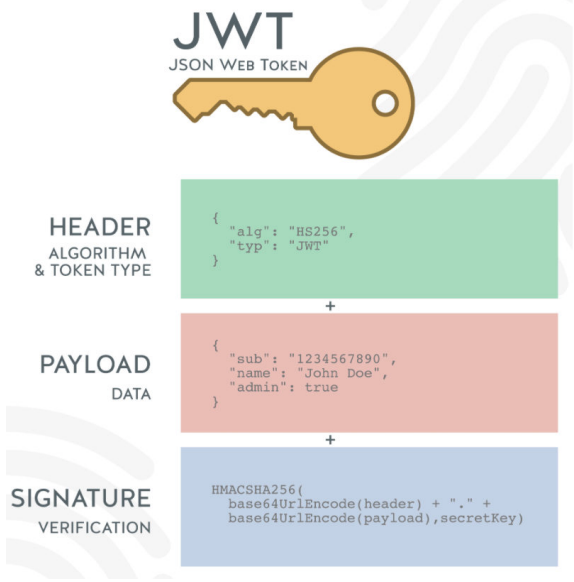


## Token的使用

当然，在真实开发中，我们可以直接使用一个库来完成： jsonwebtoken；

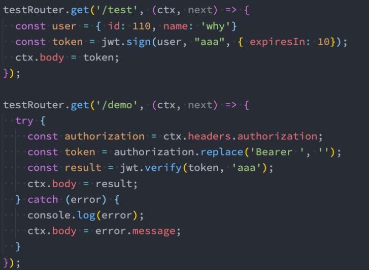


## 非对称加密

前面我们说过，HS256加密算法一单密钥暴露就是非常危险的事情： 

- 比如在分布式系统中，每一个子系统都需要获取到密钥； 
- 那么拿到这个密钥后这个子系统既可以发布另外，也可以验证令牌； 
- 但是对于一些资源服务器来说，它们只需要有验证令牌的能力就可以了； 

这个时候我们可以使用非对称加密，RS256： 

- 私钥（private key）：用于发布令牌； 
- 公钥（public key）：用于验证令牌；

我们可以使用openssl来生成一对私钥和公钥： 

- Mac直接使用terminal终端即可； 
- Windows默认的cmd终端是不能直接使用的，建议直接使用git bash终端；

```sql
openssl
> genrsa -out private.key 1024
> rsa -in private.key -pubout -out public.key
```


## 使用公钥和私钥签发和验证签名


## 派发令牌和验证令牌

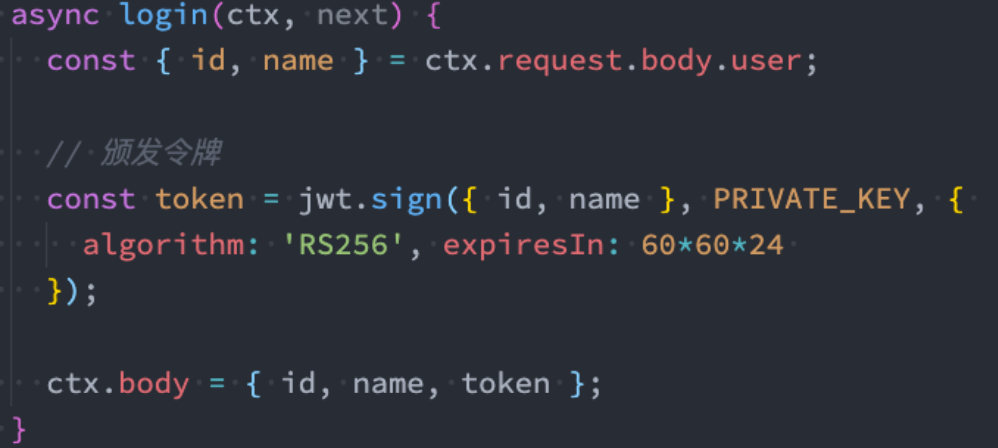

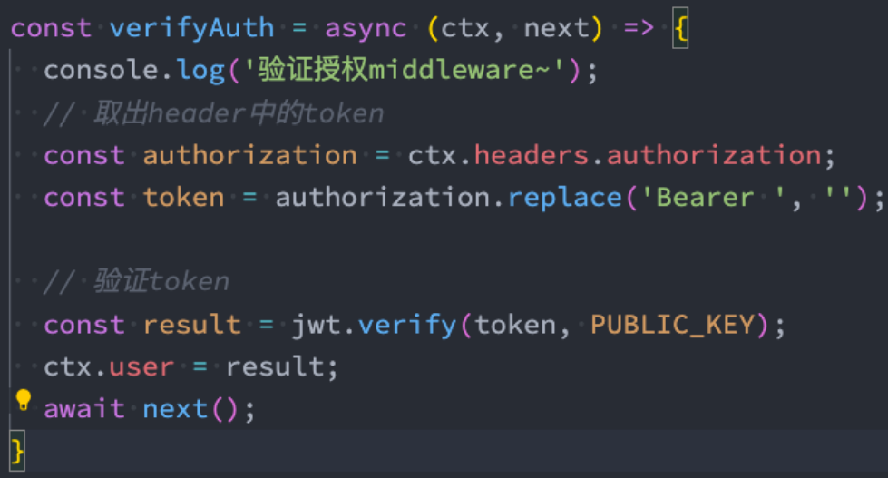


## 发布和修改动态内容

创建新的表 moment 

定义发布动态内容的接口 

- 定义路由接口 
- 验证用户登录 
- Controller和Service中处理内容 

定义修改动态内容的接口 

- 定义路由接口 
- 验证用户登录 
- 验证用户的权限 
- Controller和Service中的处理


## 删除和查询动态内容

定义删除内容的接口

- 定义路由接口 
- 验证用户登录 
- 验证用户权限 
- Controller和Service的处理 

定义查询单个内容的接口

- 根据momentId查询接口内容； 

定义查询多条内容的接口

- 查询所有moment接口内容（根据offset和limit决定查询数量）


## 发表和修改评论内容

创建新的表 comment 

定义发布评论内容的接口 

- 定义路由接口
- 验证用户登录
- Controller和Service中处理内容

定义修改评论内容的接口

- 定义路由接口
- 验证用户登录
- 验证用户的权限
- Controller和Service中的处理


## 删除和查询评论内容

定义删除评论内容的接口 

- 定义路由接口
- 验证用户登录
- 验证用户权限
- Controller和Service的处理

查询动态的时候，同时显示评论信息

- 查询多个动态时，显示评论的个数
- 查询单个动态时，显示评论的列表


## 标签接口开发

创建标签的表

定义创建标签接口

- 路由配置Router
- 验证用户登录
- 创建标签

创建标签和动态关系表

定义给动态添加标签的接口

- 给动态添加新的接口

查询标签接口

- 查询动态列表，展示标签数量
- 查询动态详情，展示标签列表


## 上传头像图片

上传头像逻辑

- 定义上传图像的接口
- 定义获取图像的接口
- 请求用户信息时，获取头像

上课分析实现思路：

- 1.图片（文件）上传 /upload/avatar 
  - *目的：服务器端可以保存一张图片 
- 2.提供一个接口，可以让用户获取图片 
  - */1/avatar -> 找到图片\读取图片\content-type: image/jpeg\返回图像的信息 
- 3.将URL存储到用户信息中
  - *avatarURL: 头像的地址
- 4.获取信息时，获取用户的头像


## 上传动态的配图

上传动态配图 

- 定义上传动态配图的接口
- 定义获取动态配图的接口
- 获取动态时，获取配图信息


