## 什么是Node.js呢

 我们先看一下官方对Node.js的定义：

-  Node.js是一个基于V8 JavaScript引擎的JavaScript运行时环境。


但是这句话对于很多同学来说，非常笼统：

- 什么是JavaScript运行环境？
- 为什么JavaScript需要特别的运行环境呢？
- 什么又是JavaScript引擎？
- 什么是V8？

8？擎？呢？twood 在2007年提出了著名的 Atwood定律：


## JavaScript无处不在

Stack Overflow的创立者之一的 Jeff Atwood 在2007年提出了著名的 Atwood定律：

- Any application that can be written in JavaScript, will eventually be written in JavaScript.
- 任何可以使用**JavaScript来实现的应用**都最终都会**使用JavaScript实现**。

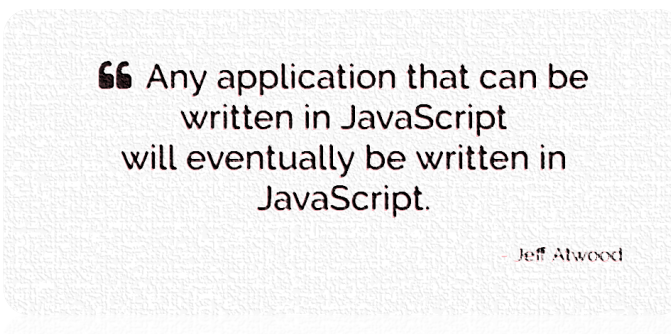

- 但是在发明之初，JavaScript的目的是应用于在浏览器执行简单的脚本任务，对浏览器以及其中的 DOM进行各种操作，所以JavaScript的应用场景非常受限。
- Atwood定律更像是一种美好的远景，在当时看来还没有实现的可能性。
- 但是随着Node的出现，Atwood定律已经越来越多的被证实是正确的。
- 但是为了可以理解Node.js到底是如何帮助我们做到这一点的，我们必须了解JavaScript是如何被运行的。

javascript最早是应用在浏览器的，那么先了解一下浏览器


## 浏览器内核是什么？

大家有没有深入思考过：JavaScript代码，在浏览器中是如何被执行的？

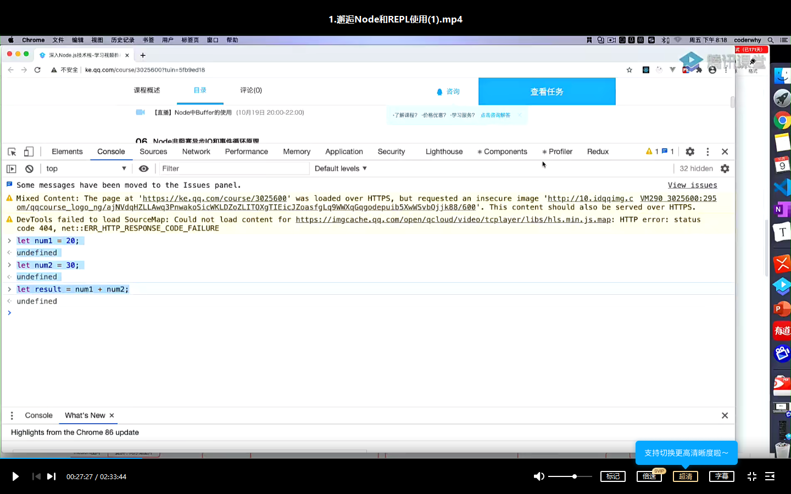

这里写了这么多东西，浏览器为什么会帮我们运行呢？内部是一个什么样的机制呢？

浏览器有非常多的组成部分，其中最重要的叫浏览器内核，浏览器内核是什么样的东西呢？

最主要的是帮助我们把页面渲染出来，如果有一些js代码，他可以帮助我们运行

浏览器内核就是负责帮助我们做这个事情的

另外不同的浏览器有不同的内核

那么有哪些内核呢？

我们经常会说：不同的浏览器有不同的内核组成

- Gecko：早期被Netscape（网景）和Mozilla Firefox（火狐）浏览器使用；
- Trident：微软开发，被IE4~IE11浏览器使用，但是Edge浏览器已经转向Blink；
- Webkit：苹果基于KHTML开发、开源的，用于Safari，Google Chrome之前也在使用；
- Blink：是Webkit的一个分支，Google开发，目前应用于Google Chrome、Edge、Opera等；
- 等等...

那么浏览器内核到底是个什么东西呢？

事实上，我们经常说的浏览器内核指的是浏览器的**排版引擎**：

- **排版引擎**（layout engine），也称为**浏览器引擎**（browser engine）、**页面渲染引擎**（rendering engine） 或**样版引擎**。


## 渲染引擎工作的过程

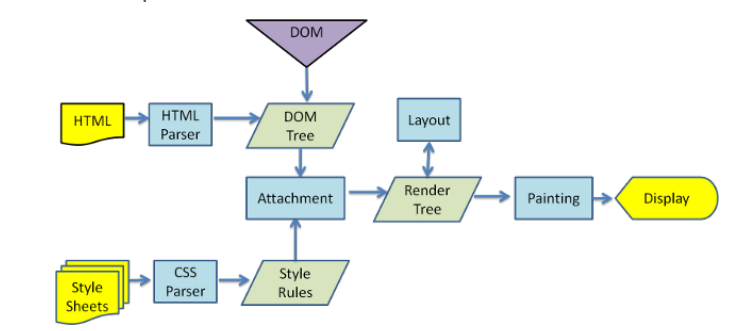

会通过html的解析

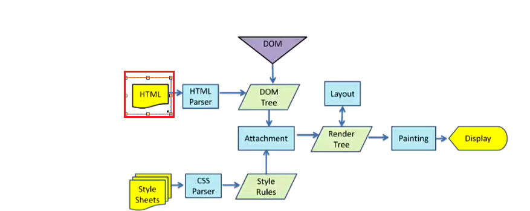

对html的解析，因为我们知道当前的页面它里面所展示的这些内容，其实都是html的代码

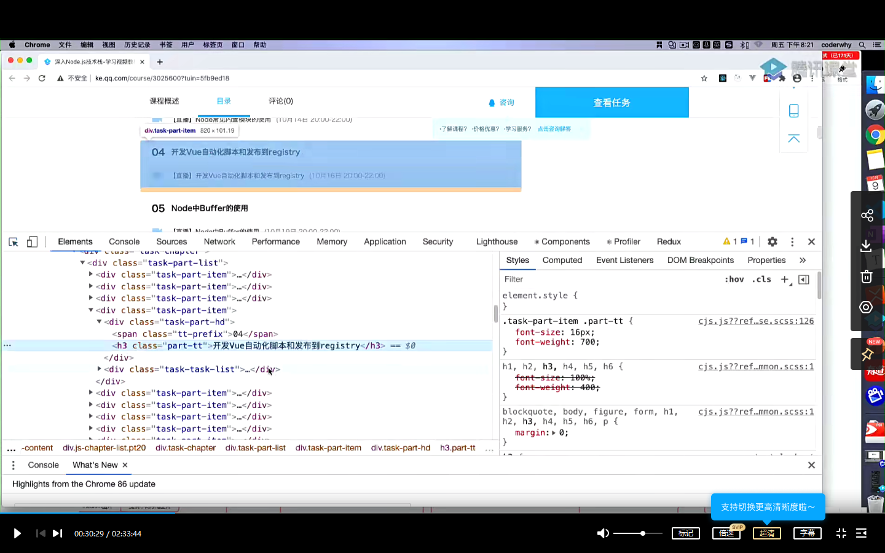

那这些html的代码都是需要通过html的解析，它使用的是 **HTML Parser** 来进行解析的

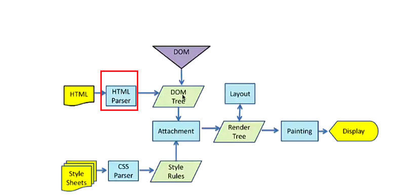

解析之后，会生成一棵dom树

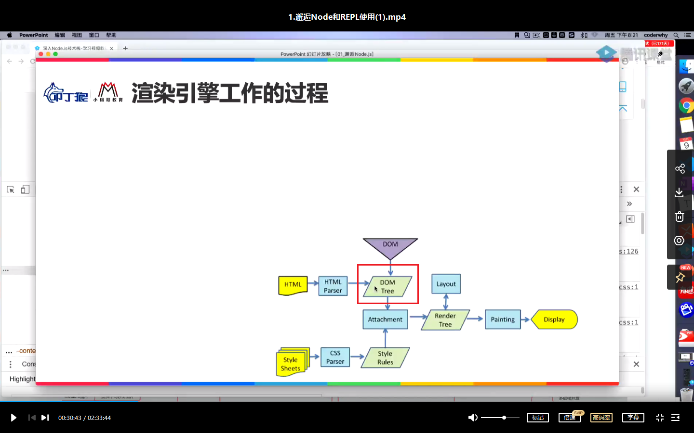

里面也会有css代码，解析到css代码的时候也会进行解析，解析完了以后会在attachment进行附加，附加之后的话会生成一个render Tree，还会生成一个layout树，生成这两个之后的话就会进行绘制了，页面就能看到了

当然我们这里还会有很多的css样式

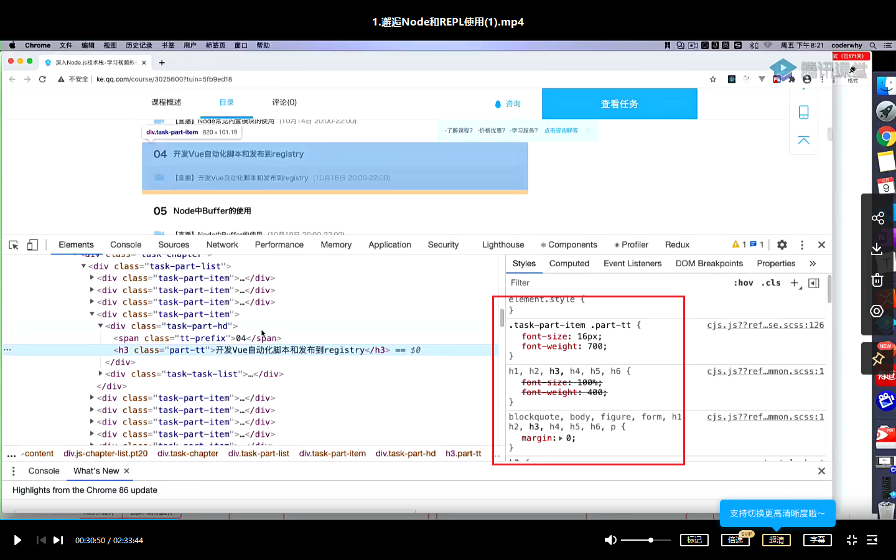

这些css样式的话，也会进行解析

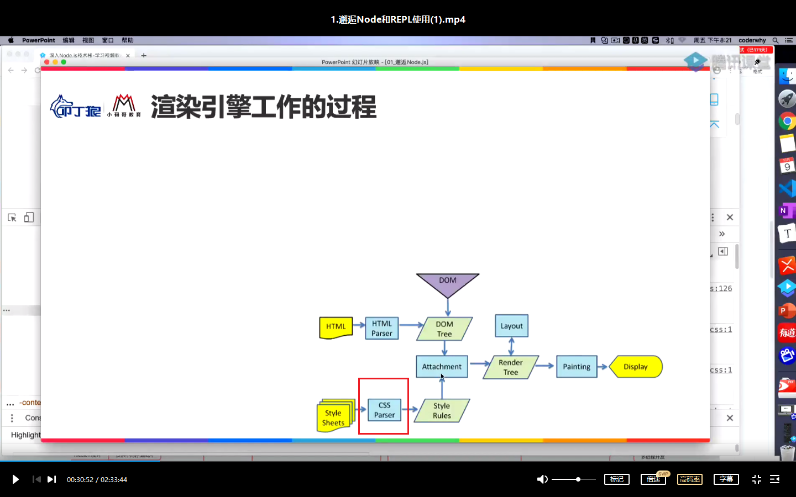

解析之后的话，会进行attachement，会进行附加，附加之后会生成一个renderTree，渲染树，


而渲染树有了之后的话，还需要生成另外一个东西，叫layout Tree ,layoutTree叫做布局树

把这两个东西给它结合起来，结合起来之后，就可以进行绘制了，然后一旦进行绘制，在浏览器上就会产生展示的页面了

但是这里要注意另外一个东西

在浏览器内核对页面进行解析的时候，他其实有另外一个东西，我们在编写html代码的时候，我们其实可以通过script标签在我们的html代码里面嵌入script

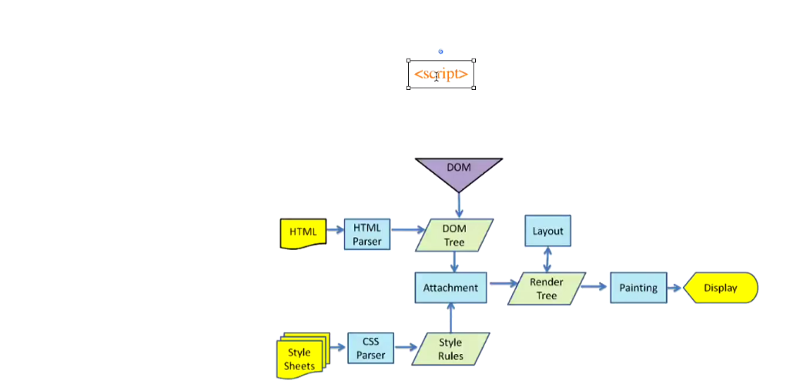

script里面放的其实是js代码

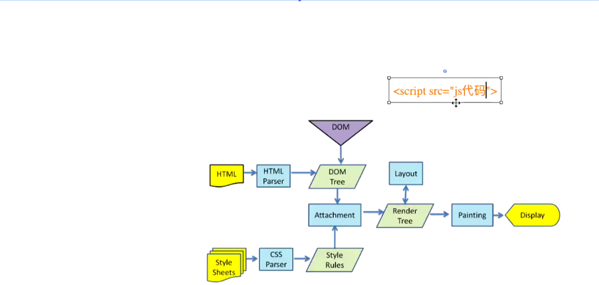


但是在这个执行过程中，HTML解析的时候遇到了JavaScript标签，应该怎么办呢？

- 会停止解析HTML，而去加载和执行JavaScript代码；
- 那既然要执行javascript代码就必须有一个东西叫javascript引擎

当然，为什么不直接异步去加载执行JavaScript代码，而要在这里停止掉呢？

- 这是因为JavaScript代码可以操作我们的DOM；
- 所以浏览器希望将HTML解析的DOM和JavaScript操作之后的DOM放到一起来生成最终的DOM树，而不是频繁的去生成新的DOM树；

也就是说我们的html代码是包含js代码的，这个js代码可能会做一些事情，比如说操作dom，或者其他事情

总之html里面可能会有js代码，他可能会做一些事情的

那么，JavaScript代码由谁来执行呢？

- JavaScript引擎

那么既然有js代码，你就需要有一个东西来执行javascript代码，那要想执行我们的javascript代码的话，就必然有某一个东西，这个东西叫什么呢？

这个东西叫做**javascript引擎**

必须有javascript引擎，才能执行我们javascript代码

为什么不能直接执行呢？

因为javascript属于一门高级语言

高级语言要想执行，必须将高级语言转化成汇编语言，再把它转成机器语言

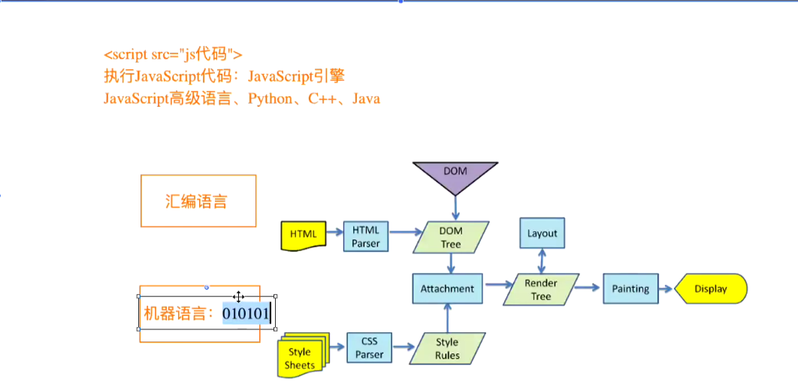

转成机器语言才能真正的被机器执行

之后的话cpu就可以执行这段代码

所以我们这里的javascript代码要想真正的运行，必须有一个东西，帮助他来完成这些操作

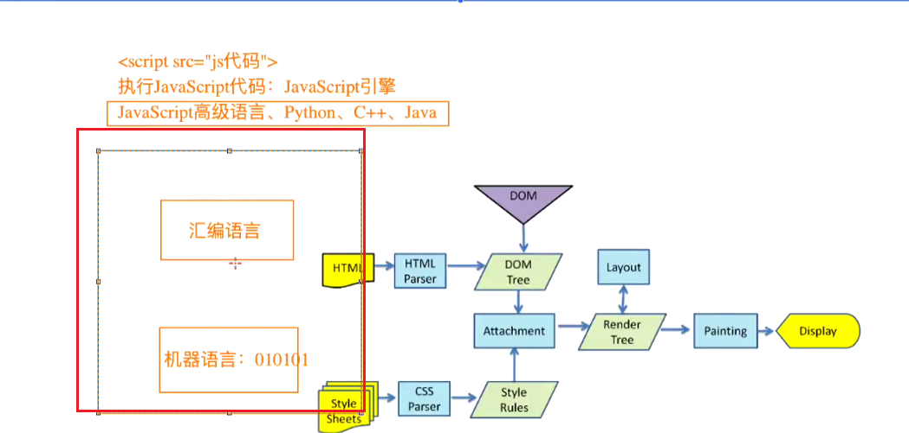

而这部分东西就被称为javascript引擎

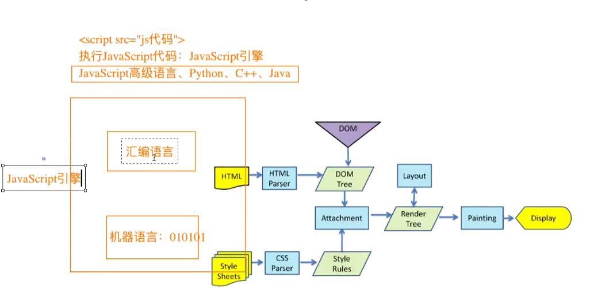

这些操作就是javascript引擎完成的

所以呢，浏览器里面应该也是包含javascript引擎的，因为包含javascript引擎，我们在编写的javascript代码，才能被它执行

所以我们任何一个浏览器，它们里面都有一个javascript引擎的


## JavaScript引擎

为什么需要JavaScript引擎呢？

- 事实上我们编写的JavaScript无论你交给浏览器或者Node执行，最后都是需要被CPU执行的；
- 但是CPU只认识自己的指令集，实际上是机器语言，才能被CPU所执行；
- 所以我们需要JavaScript引擎帮助我们将JavaScript代码翻译成CPU指令来执行；

比较常见的JavaScript引擎有哪些呢？

- **SpiderMonkey**：第一款JavaScript引擎，由Brendan Eich开发（也就是JavaScript作者）；
- **Chakra**：微软开发，用于IE浏览器；
- **JavaScriptCore：WebKit**中内置的JavaScript引擎，Apple公司开发；
- **V8**：Google开发的强大JavaScript引擎，也帮助Chrome从众多浏览器中脱颖而出，因为V8引擎执行javascript代码性能比较高；


javascript引擎和浏览器内核之间有什么关系呢？


## WebKit内核

这里我们先以WebKit内核为例，WebKit事实上由两部分组成的：

- WebCore：负责HTML解析、布局、渲染等等相关的工作；
  - 如果在这期间遇到了javascript代码他会交给javascriptCore来执行
- JavaScriptCore：解析、执行JavaScript代码； 

所以，一个javascript引擎是由两部分组成的，一部分是负责解析布局方面的工作，另一部分是负责解析执行javascript代码的

这就是内核和js引擎之间的关系

看到这里，学过小程序的同学有没有感觉非常的熟悉呢？

- 在小程序中编写的JavaScript代码就是被JSCore执行的；

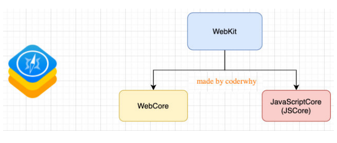

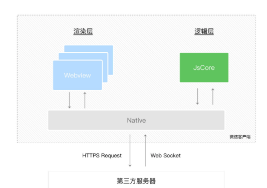

webview实际上就是webCore, jsCore实际上就是javascriptCore

另外一个强大的JavaScript引擎就是V8引擎。


## V8引擎

我们来看一下官方对V8引擎的定义：

- V8是用C++编写的Google开源高性能JavaScript和WebAssembly（一门语言，未来可能替换javascript，但是现在不行， 它的性能可能更高一点，可以将一些代码直接转成汇编代码，之后再来执行的话，效率可能更高一点，但是现在没有广泛的使用）引擎，它用于Chrome和Node.js等。
- 它实现ECMAScript和WebAssembly，并在Windows 7或更高版本，macOS 10.12+和使用x64，IA-32， ARM或MIPS处理器的Linux系统上运行（这些是一些cpu架构），所以v8是跨平台的。
- V8可以独立运行，也可以嵌入到任何C++应用程序中。
  - 如果有一个C++程序，把V8嵌入进去也是可以的
    - chrom浏览器或者nodeJs这些应用程序都是把V8嵌入进去的（chrom和nodejs是c++写的）

那v8到底是怎么对我们代码进行解析的呢？chorm

```javascript
console.log("Hello World");
function sum(num1, num2) {
    return num1 + num2;
}
```

这里写了一堆代码，他到底是如何对这些代码运行起来的的呢？

因为javascript语言属于高级语言，高级语言你要想真正的给cpu来运行

也就是说你不管的编写的所有的代码，比如java，python，还是其他代码，你需要知道，最终他都是交给cpu来执行的，那你要想交给cpu来执行，你必须有一个转化的过程， 这一步步的转化过程就是你现在必须最终把javascript代码把他转化成，机器代码，然后最终才会被运行

那这个v8如何做到这点呢？


## V8引擎的原理

V8引擎本身的源码非常复杂，大概有超过100w行C++代码，但是我们可以简单了解一下它执行JavaScript代码的原理：

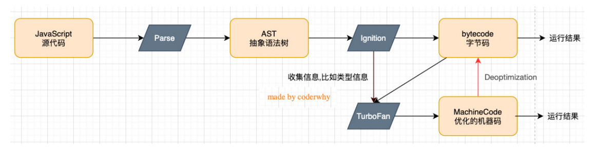

Parse模块会将JavaScript代码转换成AST（抽象语法树），这是因为解释器并不直接认识JavaScript代码；

- 如果函数没有被调用，那么是不会被转换成AST的；
- Parse的V8官方文档：https://v8.dev/blog/scanner

Ignition是一个解释器，会将AST转换成ByteCode（字节码）

- 同时会收集TurboFan优化所需要的信息（比如函数参数的类型信息，有了类型才能进行真实的运算）；
- 如果函数只调用一次，Ignition会执行解释执行ByteCode；
- Ignition的V8官方文档：https://v8.dev/blog/ignition-interpreter

TurboFan是一个编译器，可以将字节码编译为CPU可以直接执行的机器码；

- 如果一个函数被多次调用，那么就会被标记为热点函数，那么就会经过TurboFan转换成优化的机器码，提高代码的执行性能；
- 但是，机器码实际上也会被还原为ByteCode，这是因为如果后续执行函数的过程中，类型发生了变化（比如sum函数原来执行的是number类型，后 来执行变成了string类型），之前优化的机器码并不能正确的处理运算，就会逆向的转换成字节码；
- TurboFan的V8官方文档：https://v8.dev/blog/turbofan-jit

上面是JavaScript代码的执行过程，事实上V8的内存回收也是其强大的另外一个原因，不过这里暂时先不展开讨论：

- Orinoco模块，负责垃圾回收，将程序中不需要的内存回收；
- Orinoco的V8官方文档：https://v8.dev/blog/trash-talk

他这里其实有一个复杂的过程的

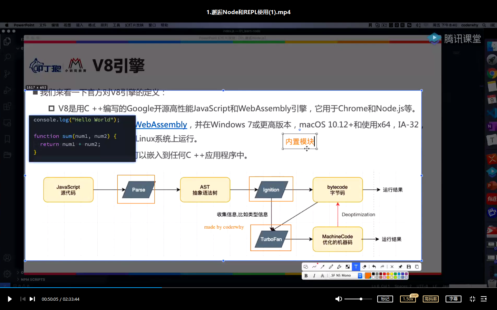

这里面几个灰色的东西，是V8里面内置的模块

当然我们不会去操作这个模块，但是我们可以去了解这些模块有什么作用， 知道它内部是怎么操作的

parse、ignition、TurboFan它们都是V8引擎里面的内置模块

每一个模块都有自己的作用

parse: 将源代码给我们转成AST树，AST叫做抽象语法树，基本上所有的语言都会将语言转成抽象语法树，抽象语法树叫做abstract syntax tree ， 为什么转成抽象语法树呢？因为我们的解释器**ignition**，是不能直接认识javascript代码的，所以需要把javascript代码经过语法分析，词法分析，先转成抽象语法树

有了这个抽象语法树之后的话，ignition将可以根据这个抽象语法树的结构，把他转成另外的东西，叫做bytecode（字节码），字节码类似汇编代码的一种代码，但是他并不是真正的汇编的代码，因为这个东西还需要进一步的转化，再给他转成汇编代码，再给他转成真正的机器码，才能被机器所执行

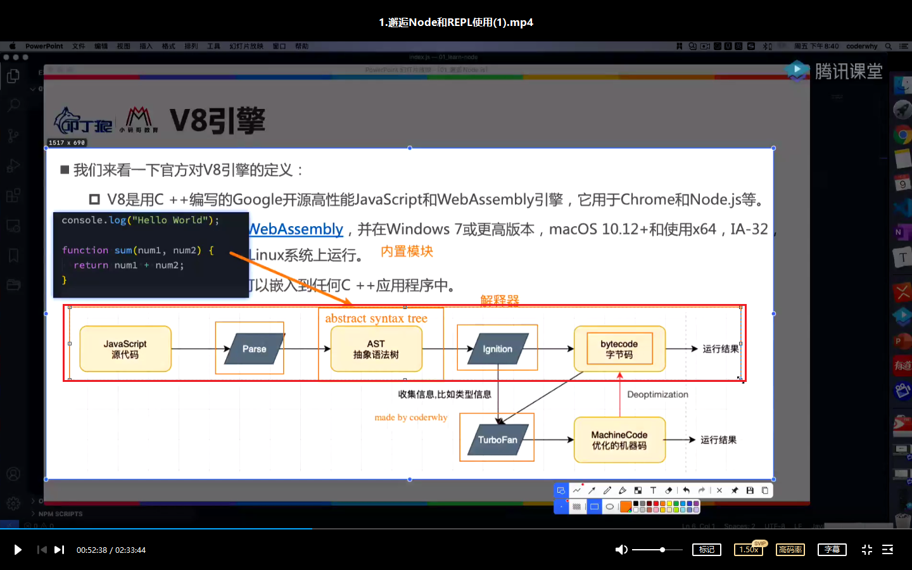

有一段javascript代码的话就是经过这样一个流程，然后给他执行的

在这个流程里面这个解释器ignition的话既可以把抽象语法树转成字节码，并且，我们的字节码怎么执行的呢？字节码的执行其实也是交给解释器ignition的，ignition它可以进一步把字节码转成汇编代码，然后汇编代码再转成机器码交给cpu来执行

编程语言可以分成：解释性语言，和编译型语言

这个解释型语言的运行效率相对较低，编译型语言运行效率相对较高，为什么，因为编译型语言是直接将源代码编译成机器代码，编译成机器代码，在运行它的时候，可以直接加载到内存里面运行，它的效率比较高

解释型语言的话，它需要执行上面那么多步骤，它的效率相对来说是比较低的，因为这个就是解释型语言的一个运行过程

那么V8引擎为了提高，我们javascript的一个运行效率的话，它对我们的整个的步骤做了一个优化，什么优化呢？

就是在将我们的AST在转成字节码的过程中，他会收集一些信息，比如某一个函数的时候，函数中参数的类型信息，它在收集完这些东西之后，他会通过TurboFan这个模块，直接将我们的字节码转成优化好的机器码，那下一次再来执行某一个函数的时候我就可以直接运行这个机器码，直接运行机器码就意味着我不用转成字节码，汇编代码，我直接就可以执行机器码就可以了

所以接下来继续走这一部分流程的话，它的运行效率会变得更好，这也就是为什么V8引擎执行效率更好的原因

但是也有可能会出现问题，比如，我在调用一个sum函数的时候，第一次传的是数字sum(10, 30),传的是数字的话，它在转成机器码的话，就会认为我这个函数传的都是数字就会给我缓存下来，等下一次的时候就会直接使用我优化的机器码直接执行，而不需要转成字节码了，但是我如果下一次调用的是后传的是sum('aaa', 10),这个时候它检测到我的是一个字符串，他就不知道怎么来执行了，他就会做一个操作

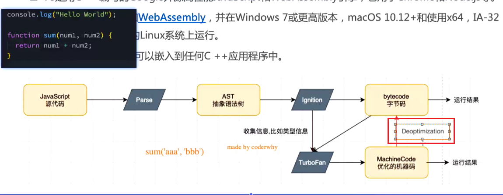

这个单词是优化的意思，就是将我们之间转的机器码，在某些特殊的情况，会再反向转换成字节码，转成字节码之后，再重新转成机器码来运行，所以在开发中尽可能的不要在函数中，不要随随便便，突然在传递参数的时候改变参数的类型，这样做的话，js引擎做的操作是非常多的，会影响性能的

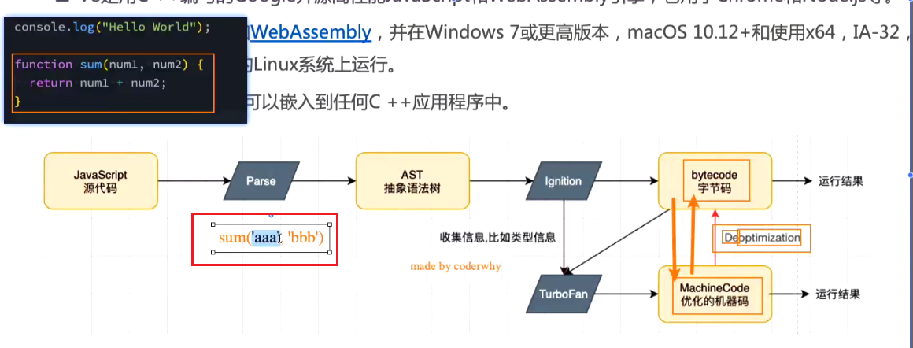

多写这种代码的话，在一定程度上是可以提高性能的

typescript代码是可以提高性能的

这个是v8引擎在执行代码的一个流程


## 回顾：Node.js是什么

- 什么是JavaScript运行环境？
  - js是一门高级语言，而高级语言是需要被解析成机器码的跑在cpu上的，而运行环境帮助我们做的就是这样一件事
- 为什么JavaScript需要特别的运行环境呢？
- 什么又是JavaScript引擎？
- 什么是V8？

 回顾：官方对Node.js的定义：

- Node.js是一个基于V8 JavaScript引擎的JavaScript运行时环境。

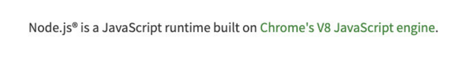

也就是说Node.js**基于**V8引擎来执行JavaScript的代码，但是不仅仅只有V8引擎：

- 前面我们知道V8可以嵌入到任何C ++应用程序中，无论是Chrome还是Node.js，事实上都是嵌入了V8引擎 来执行JavaScript代码；
- 但是在Chrome浏览器中，还需要解析、渲染HTML、CSS等相关渲染引擎，另外还需要提供支持浏览器操作 的API、浏览器自己的事件循环等；
- 另外，在Node.js中我们也需要进行一些额外的操作，比如文件系统读/写、网络IO、加密、压缩解压文件等 操作；


## 浏览器和Node.js架构区别

我们可以简单理解规划出Node.js和浏览器的差异：

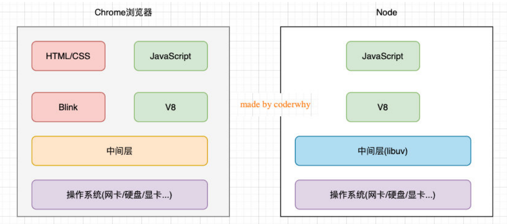

### 浏览器

浏览器除了有javascript还有v8，还有渲染内核，还需要有一些中间层，中间层最主要是对操作系统进行一些操作， 比如说，如果发生了网络请求，那么就需要调用操作系统里面的网卡来发送网络请求，来链接网络，如果你操作本地的一些东西，可能还需要链接一些硬盘

那如果你需要渲染一些东西的时候，可能还需要调用显卡，把有些东西给渲染出来，所以浏览器里面可能还包含很多东西的，而V8仅仅是作为它的一部分而已（嵌入其中）

### node

node的架构和浏览器实际上是差不多的，只不过在node当中的话，我们一般编写的都是javascript代码，因为我们之后基于node开发的不管是web服务器，还是脚本工具等等，我们编写的都是javascript代码，而我们编写的javascript代码都是交给V8引擎来执行的，而V8引擎解析执行中的话，它实际上会调用我们的中间层， 他这个中间层的话叫libuv,libuv包含一个非常重要的东西，叫做事件循环，而这个libuv的话，他可以再去调用操作系统里面的一些其他东西，所以是这样一个架构

下面是node的一个架构图

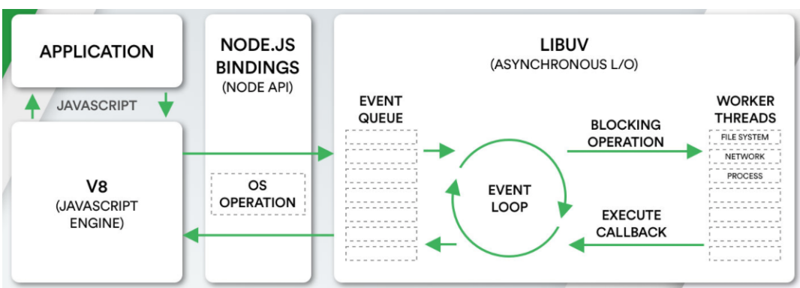


## Node.js架构

我们来看一个单独的Node.js的架构图：

- 我们编写的JavaScript代码会经过V8引擎，再通过Node.js的Bindings，将任务放到Libuv的事件循环中；
- libuv（Unicorn Velociraptor—独角伶盗龙）是使用C语言编写的库；
  - 在node架构里面，有些东西，我们自己写的东西，或者node给我们提供的API一些东西，这些东西是js来写的
  - 而V8引擎的话，它大部分的代码都是使用C++来编写的，而libuv是使用c语言来编写的
  - 所以不要单纯的来说node单纯是用什么来编写的，它里面比较多的是用javascript来编写的，但是它不是只有javascript
- libuv提供了事件循环、文件系统读写、网络IO、线程池等等内容；
- 具体内部代码的执行流程，我会在后续专门讲解事件和异步IO的原理中详细讲解；


解释上面的一些东西：

我们编写的代码其实都是一些application

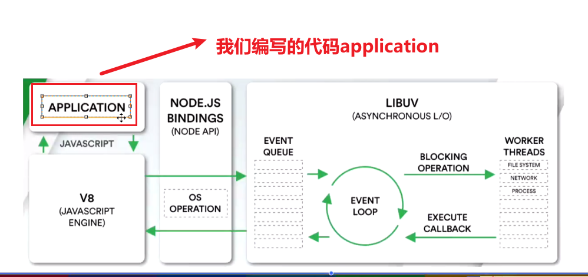

我们的应用程序是通过javascript来编写的

然后javascript交给V8来执行

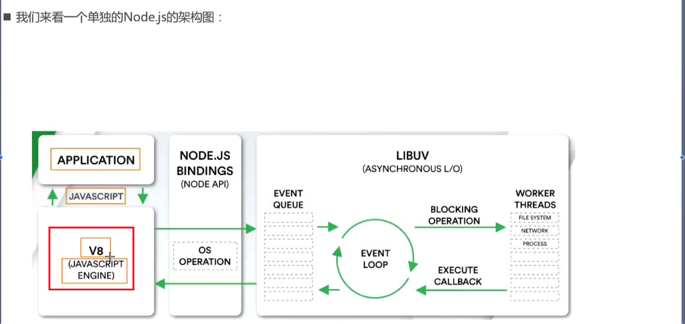

然后V8就需要调用另外一个东西叫NODE.JSBINDINGS,这个东西其实最主要是node中的一些API，链接我们的libuv的一个东西， 如果js有一些 事件需要处理，那么就会派发到libuv的事件循环队列中，让libuv来处理

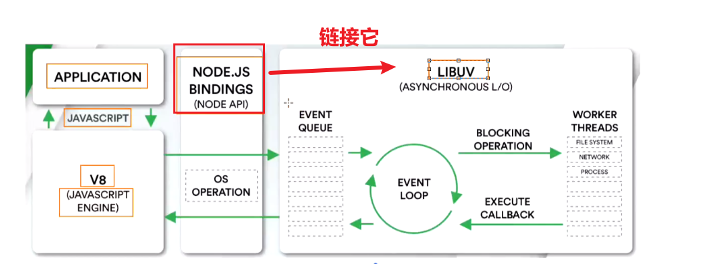

LIBUV有一个东西叫做事件循环

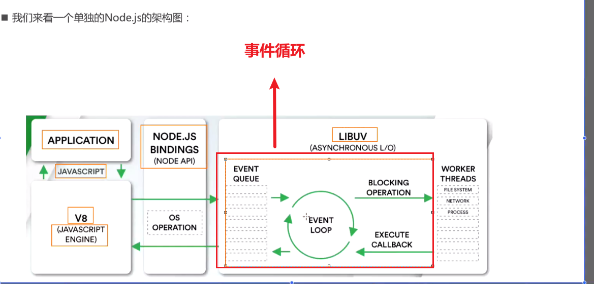

事件循环就是EVENT LOOP

里面还有个EVENTQUEUE

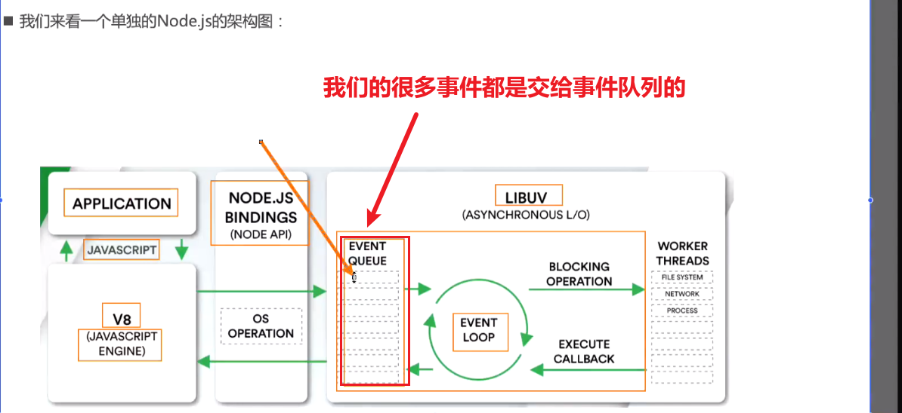

事件循环会做很多操作

 libuv他会去调用我们操作系统里面的


工作线程可以调用操作系统里面的，file system(文件系统）等

会帮助我们再去做其他的一些操作，这个是node单独的架构图


## Node.js的应用场景

Node.js的快速发展也让企业对Node.js技术越来越重视，在前端招聘中通常会对Node.js有一定的要求，特别对于高级前端开发工程师，Node.js更是必不可少的技能：

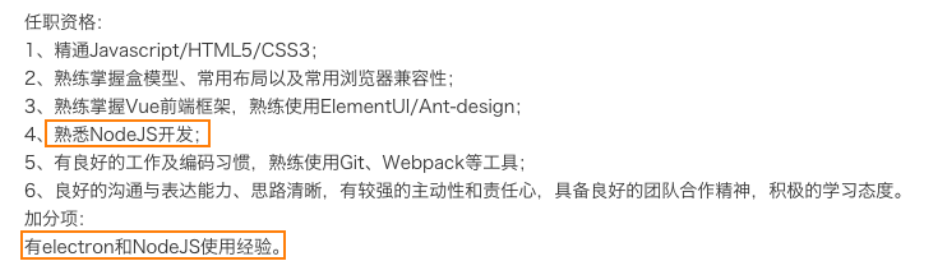


- 目前前端开发的库都是以node包的形式进行管理；

- npm、yarn工具成为前端开发使用最多的工具；

- 越来越多的公司使用Node.js作为web服务器开发；

- 大量项目需要借助Node.js完成前后端渲染的同构应用；

- 资深前端工程师需要为项目编写脚本工具（前端工程师编写脚本通常会使用JavaScript，而不是Python或者shell）；

- 很多企业在使用Electron来开发桌面应用程序（vscode)；


## Node的安装

Node.js是在2009年诞生的，目前最新的版本是分别是LTS 12.19.0以及Current 14.13.1：

- LTS版本：相对稳定一些，推荐线上环境使用该版本；
- Current版本：最新的Node版本，包含很多新特性；

这些我们选择什么版本呢？

- 如果你是学习使用，可以选择current版本；
- 如果你是公司开发，建议选择LTS版本；

Node的安装方式有很多：

- 可以借助于一些操作系统上的软件管理工具，比如Mac上的homebrew，Linux上的yum、dnf等；
- 也可以直接下载对应的安装包下载安装；

我们选择下载安装，下载自己操作系统的安装包直接安装就可以了：

- window选择.msi安装包，Mac选择.pkg安装包，Linux会在后续部署中讲解；
- 安装过程中会配置环境变量（让我们可以在命令行使用）；并且会安装npm（Node Package Manager）工具；


## Node的版本工具

在实际开发学习中，我们只需要使用一个Node版本来开发或者学习即可。

但是，如果你希望通过可以快速更新或切换多个版本时，可以借助于一些工具：

- nvm：Node Version Manager；
- n：Interactively Manage Your Node.js Versions（交互式管理你的Node.js版本）

问题：这两个工具都不支持window

- n：n is not supported natively on Windows.
- nvm：nvm does not support Windows

Window的同学怎么办？

- 1.并不是每个人都需要安装多个版本，在课堂上我会以最新的Current版本讲解几乎所有内容；
- 2.接下来我会在Mac上面演练n工具的使用，后面我会录制一个在window上使用nvm的视频；


## 版本管理工具：n

安装n：直接使用npm安装即可

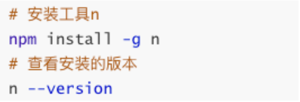

安装最新的lts版本：

- 前面添加的sudo是权限问题；
- 可以两个版本都安装，之后我们可以通过n快速在两个版本间切换；

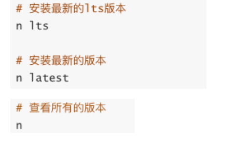


## 管理工具：window电脑

不重要......


## JavaScript代码执行

如果我们编写一个js文件，里面存放JavaScript代码，如何来执行它呢？

index.js

```javascript
console.log("Hello World");

function sum(num1, num2) {
    return num1 + num2;
}

console.log(sum(20, 30));
console.log(sum(20, 30));
console.log(sum(20, 30));
console.log(sum("aaa", "bbb"));

setTimeout(() => {
    console.log('定时器被执行了');
}, 1000);
```


index.html

```html
<!DOCTYPE html>
<html lang="en">
    <head>
        <meta charset="utf-8">
        <meta name="viewport" content="width=device-width, initial-scale=1.0">
        <title>Document</title>
    </head>
    <body>
        <script src="./index.js"></script>
    </body>
</html>
```


目前我们知道有两种方式可以执行：

如果我们希望把代码交给浏览器执行：

- 需要通过让浏览器加载、解析html代码，所以我们需要创建一个html文件；
- 在html中通过script标签，引入js文件；
- 当浏览器遇到script标签时，就会根据src加载、执行JavaScript代码；

- 当这段代码在浏览器解析的时候，遇到了script代码，他就会加载js文件，并且执行js文件

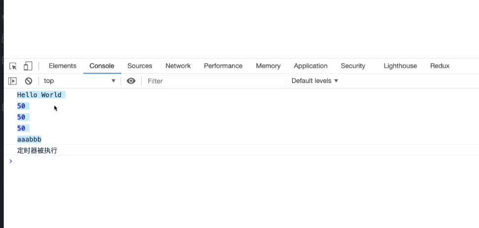

能够看到上面那段代码被执行，就是因为浏览器中通过V8引擎执行的

但是不想让浏览器执行，我要让node来执行

如果我们希望把js文件交给node执行：

- 首先电脑上需要安装Node.js环境，安装过程中会自动配置环境变量；

- 可以通过终端命令node js文件的方式来载入和执行对应的js文件；

- 将代码载入到node环境中执行；

  

  index.js

  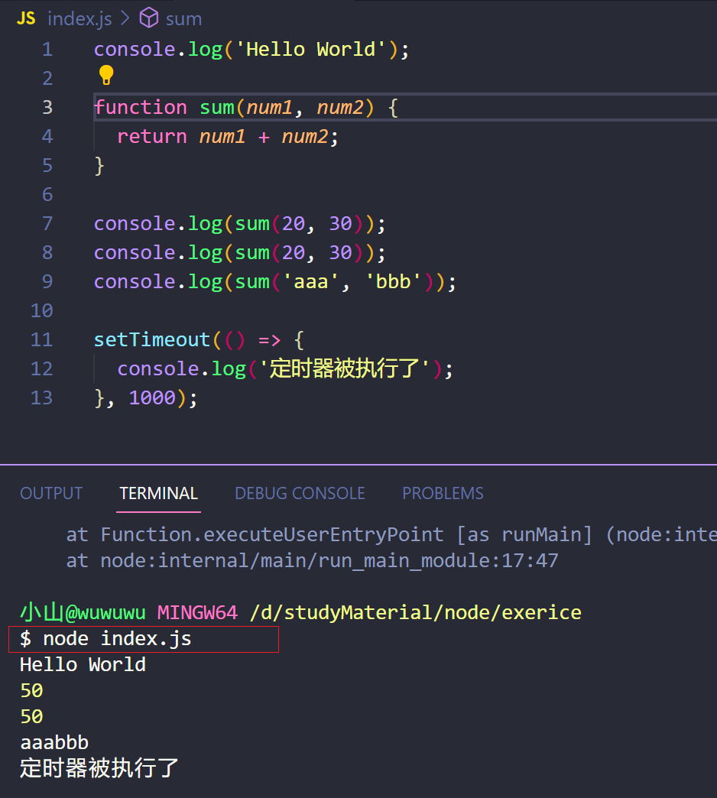
  
  这样写的话，这段js代码就会被加载到node当中， node当中就会有V8引擎，V8引擎就会帮助我们执行这一段js代码，所以就可以这样写
  
  注意在执行的时候路径一定要正确

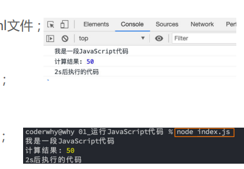


## Node的REPL

什么是REPL呢？感觉挺高大上

- REPL是Read-Eval-Print-Loop的简称，翻译为 读取-求值-输出-循环；
- REPL是一个简单的、交互式的编程环境；
  - 其实在很多的编程语言里面的话，都会有类似的交互环境，比如python，其实python在安装完了之后也会有一个交互环境的，这个交互环境的话对于我们来说应该是非常的熟悉，为什么呢，因为浏览器里面就有交互环境，比如下面的F12开发者调试工具

事实上，我们浏览器的console就可以看成一个REPL。

Node也给我们提供了一个REPL环境，我们可以在其中演练简单的代码。

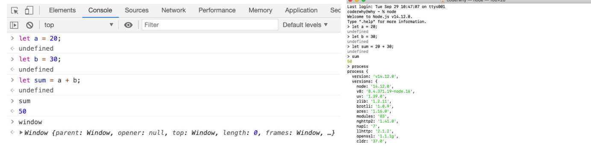

这个东西就是浏览器帮助我们实现的一个交互环境

而node当中，因为在node中，我们是不会使用浏览器的，在没有浏览器的情况下，node本身也给我们提供了REPL，这个REPL在哪里呢？

 可以来到命令行工具里面，可以在vscode，也可以在终端

比如在终端里面

我敲一个node

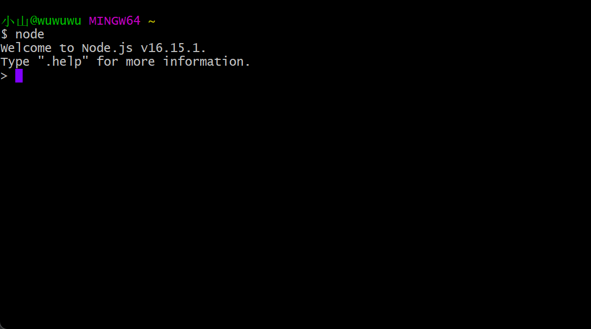

这个时候我就可以敲一些代码，比如说

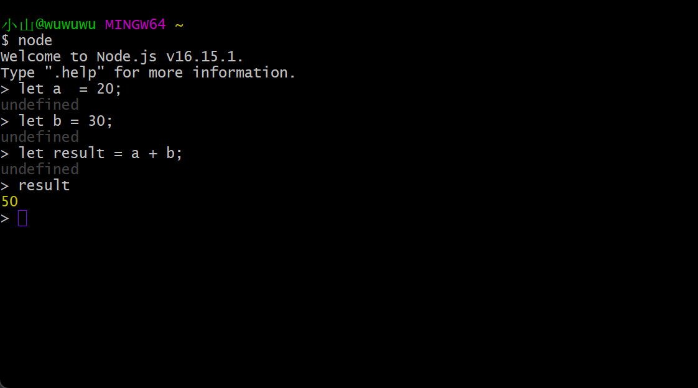

可以看到和浏览器非常相似

因为浏览器中的F12开发者调试工具就是浏览器给我们提供的一个REPL

那看看node中的window呢

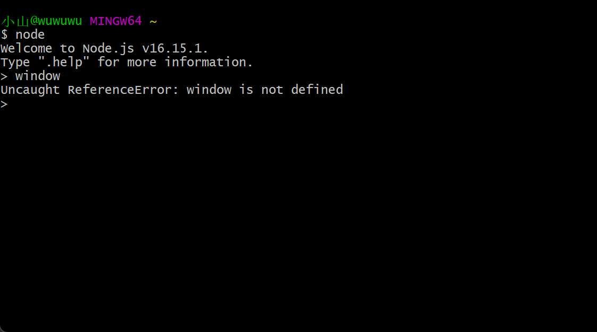

会发现node中的window是没有定义的

浏览器中是有window对象，但是node是没有window对象的

document也是没有的

但是node当中也有属于自己的全局对象，比如process


有很多东西

process翻译过来叫进程，进程包含很多进程的信息，比如当前使用的node版本，还包括V8引擎版本，还有uv版本，就是libuv的版本

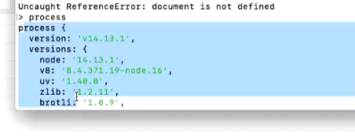

后面会讲到

总之这个交互环境就叫做REPL，但是一般只会在这里演示一般简单的代码，就像在浏览器演练一些简单的代码也是一样的，当然也可以写一些其他的代码

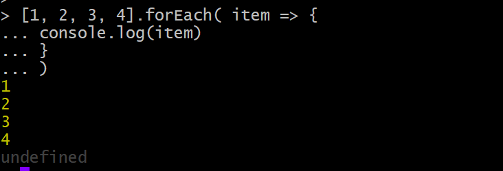

注意，他会自动识别你有括号，所以，如果我们写了一个大括号，想换行，直接敲回车，当我们把大括号，小括号都写完整了（有开头有结尾）之后，这个时候继续敲回车，他会自动知道你这个代码是写完了的，就会帮我们执行

多行代码可以这样写，注意，箭头写完以后不要写小括号，直接敲回车就可以换行了


## Node程序传递参数

 

正常情况下执行一个node程序，直接跟上我们对应的文件即可：

node运行js，我们要先进入到这个目录当中，之后敲上

```js
node index.js
```

node + 文件名，这样写了之后，这个文件就会被载入到node里面，而node里面是包含V8引擎的，V8引擎就会执行这个文件的JS代码了

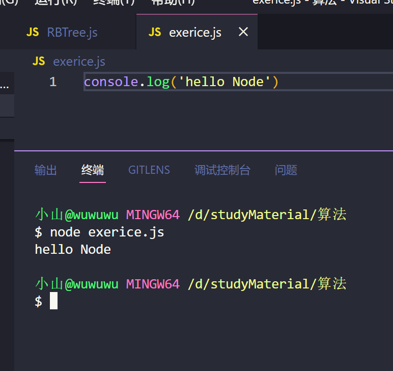


但是我想给node传递一个参数， 比如我在执行某个文件的时候，我想额外的给node传递一些东西

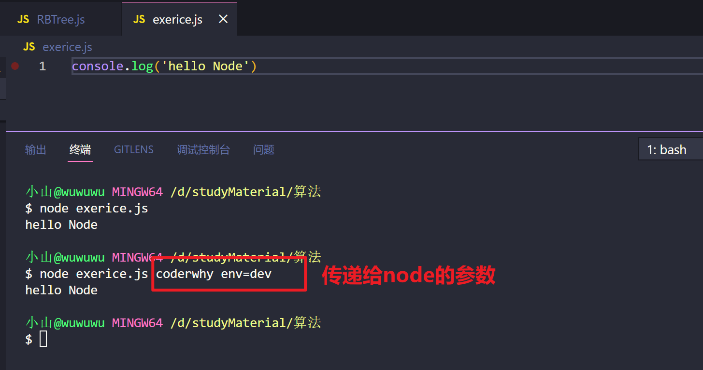

那怎么怎么获取到这个东西呢？

此时我们打印process,process包含很多东西，比如node版本，libuv版本，V8版本， 比如cpu架构，等

process有一个东西叫做argv，里面会存储这运行node的东西

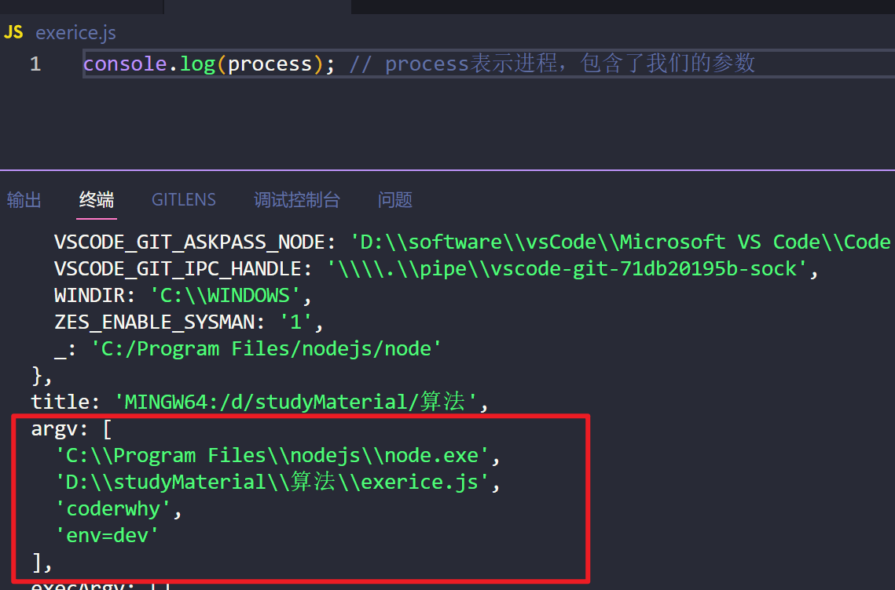

当前这两个路径，第一个路径表示，当前使用node，他所在的一个路径

第二个路径表示，当前使用node执行的文件，他所在的路径

第三个和第四个表示传递过来的参数

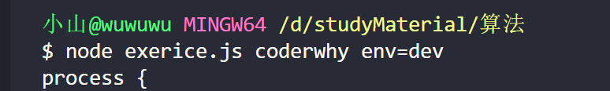

所以这个就是我们传递参数给node了

那我想拿到我传递的参数

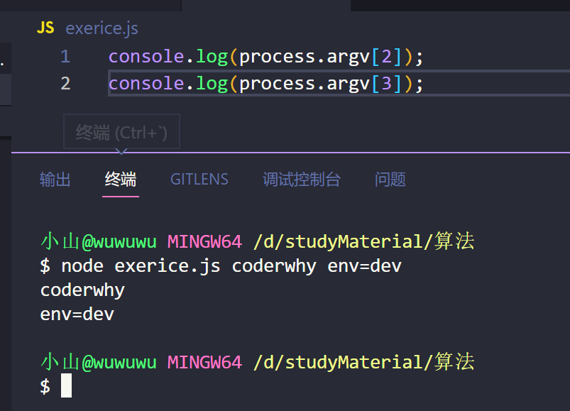

这样就拿到传递的参数了

如果想拿到所有的参数

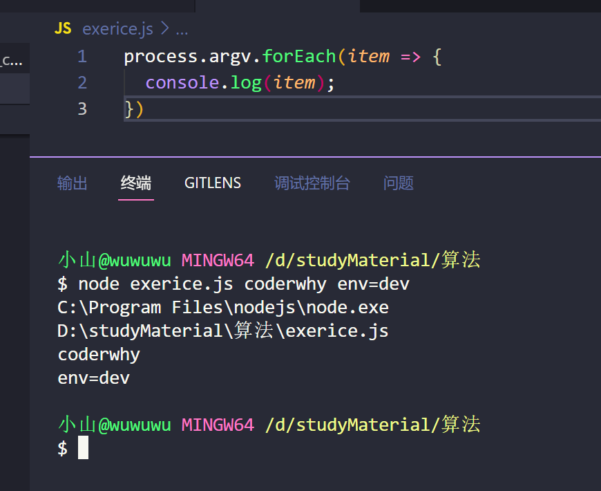


但是，在某些情况下执行node程序的过程中，我们可能希望给node传递一些参数：

```js
node index.js env=development coderwhy
```

如果我们这样来使用程序，就意味着我们需要在程序中获取到传递的参数：

- 获取参数其实是在process的内置对象中的；
- 如果我们直接打印这个内置对象，它里面包含特别的信息：
- 其他的一些信息，比如版本、操作系统等大家可以自行查看，后面用到一些其他的我们还会提到；

现在，我们先找到其中的argv属性：

- 我们发现它是一个数组，里面包含了我们需要的参数；

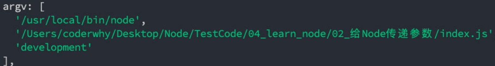


## 为什么叫argv呢？

你可能有个疑问，为什么叫argv呢？

在C/C++程序中的main函数中，实际上可以获取到两个参数：

- argc：argument counter的缩写，传递参数的个数；
- argv：argument vector的缩写，传入的具体参数。
  - vector翻译过来是矢量的意思，在程序中表示的是一种数据结构。
  - 在C++、Java中都有这种数据结构，是一种数组结构；
  - 在JavaScript中也是一个数组，里面存储一些参数信息；
- 我们可以在代码中，将这些参数信息遍历出来，使用：

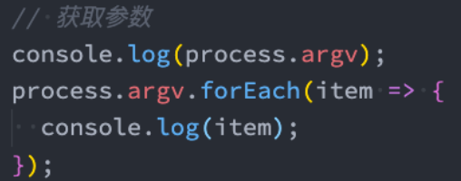

这个可以归类为，node的输入

那node也是可以输出的


## Node的输出

这些就是node的输出

console.log

- 最常用的输入内容的方式：console.log

console.clear

- 清空控制台：console.clear

- 这个不需要跟参数

  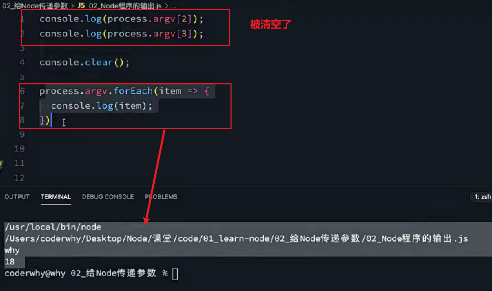

  

console.trace

- trace是跟踪的意思

- 打印函数的调用栈：console.trace

  

  调用栈，现在bar函数调用，然后是foo函数调用，然后是全局调用，所以我们如果想知道某一个函数在哪个地方一步一步调用的话，可以用console.trace()来看
  
  下面没有用红色标记出来的是，它如何查找路径, 找他的扩展名，如何编译，如何解析...

上面就是一些输出

**console是一个全局对象**，还有一些其他的方法，其他的一些console方法，可以自己在下面学习研究一下。

- https://nodejs.org/dist/latest-v14.x/docs/api/console.html


## 常见的全局对象

什么是全局对象，全局对象意味着，我可以在程序的任何位置都是可以访问到的，就跟浏览器中的window对象和document对象是一样的，当然和他们也是有一些区别的

Node中给我们提供了一些全局对象，方便我们进行一些操作：

- 这些全局对象，我们并不需要从一开始全部一个个学习；
- 某些全局对象并不常用，某些全局对象我们会在后续学习中讲到；
- 比如module、exports、require()会在模块化中讲到；
- 比如Buffer后续会专门讲到；

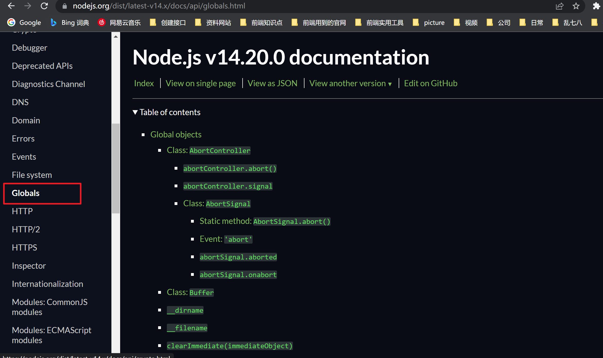

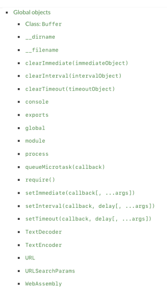


## 特殊的全局对象

为什么我称之为特殊的全局对象呢？

- 这些全局对象可以在模块中任意使用，但是在**命令行交互**中是不可以使用的；

- 虽然官方文档里面定义为全局的，但是里面有些东西并不是全局的，属于每个模块私有的，只不过每个模块都有，但是并不是全局的，但是每个模块中的值是不一样的

- 包括：

  ```js
  __dirname、 __filename、 exports、 module、 require()
  ```

  

__dirname：获取当前文件所在的路径：

- 注意：不包括后面的文件名

  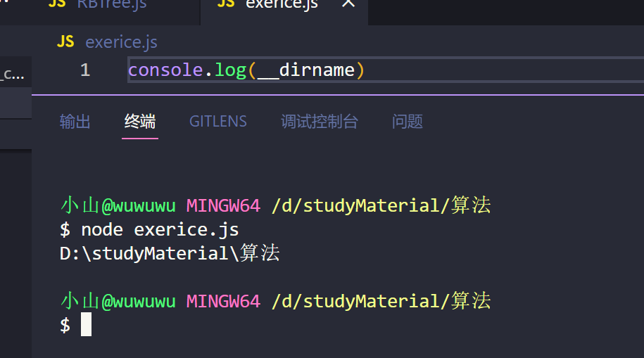

  打印所在文件的绝对路径

__filename：获取当前文件所在的路径和文件名称：

- 注意：包括后面的文件名称

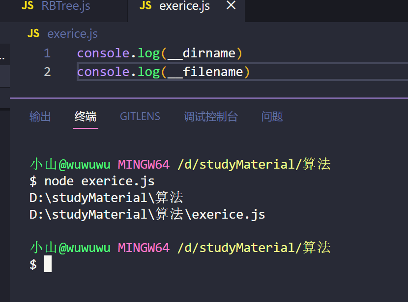

这两个就是比较特殊的全局变量，为什么是比较特殊的全局变量呢，前面说过，它们是每个模块都有的，但是实际上它们并不是全局变量，它们不能在命令行交互中使用

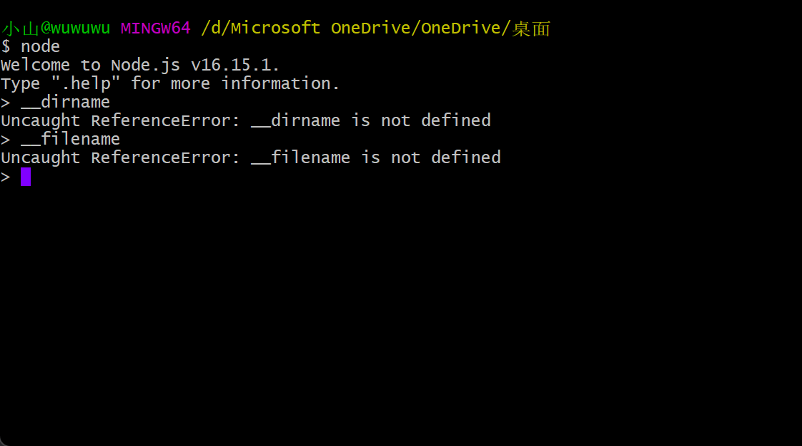

这两个是获取某一个文件的路径或者某一个文件的名字，在命令行中根本就没有创建某一个文件，或者某一个文件名字，肯定就没有任何打印的，在命令行中是没办法使用的

它们只能在模块中使用，所以说它们不算是全局对象


## 常见的全局对象

process对象：process提供了Node进程相关的信息：

- 为什么是node进程中的信息呢，因为我们通过node去运行一个程序的时候，不管是任何一个程序，他实际上会在我们的操作系统上面开启一个进程的，而process包含的就是进程的一些信息，包括运行环境啊，包括参数，包括跑在的cpu架构上等等等 ，包括讲项目的时候，还可以给里面写入一些环境变量等
- 目前知道他是一个进程信息，并且可以获得一些参数信息就可以了

- 比如Node的运行环境、参数信息等；
- 后面在项目中，我也会讲解，如何将一些环境变量读取到 process 的 env 中；

console对象：提供了简单的调试控制台，在前面讲解输入内容时已经学习过了。

- 更加详细的查看官网文档：https://nodejs.org/api/console.html

定时器函数：在Node中使用定时器有好几种方式：

可以使用定时器是因为node给我们提供了定时器函数

- setTimeout(callback, delay[, ...args])：callback在delay毫秒后执行一次；
- setInterval(callback, delay[, ...args])：callback每delay毫秒重复执行一次；
- setImmediate(callback[, ...args])：callbackI / O事件后的回调的“立即”执行；
  - 这里先不展开讨论它和setTimeout(callback, 0)之间的区别；
  - 因为它涉及到事件循环的阶段问题，我会在后续详细讲解事件循环相关的知识；
  - 后面不需要放任何一个delay的时间的
- process.nextTick(callback[, ...args])：添加到下一次tick队列中；
  - 具体的讲解，也放到事件循环中说明；
  - nextTick是下一帧，下一秒的意思

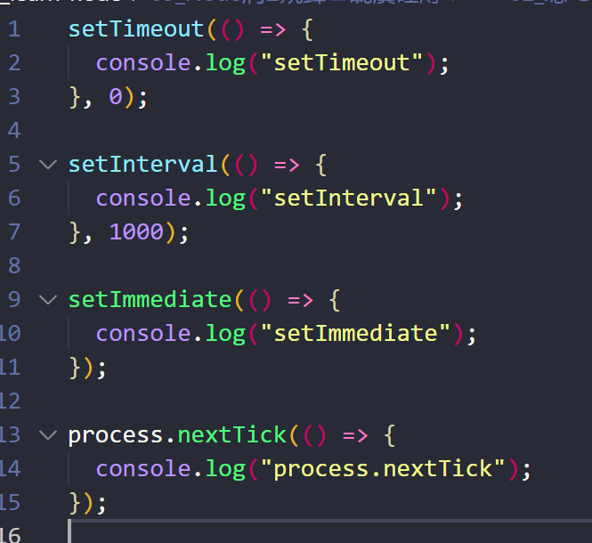

如果setTimeout写的是0秒钟和setImmediate有什么区别呢？

它们是有区别的，它们具体的区别暂时不讲，因为它涉及到事件循环的流程，甚至nextTick什么时候回调也放到后面讲

这几个就是计时器相关的全局对象

当然还有取消计时器相关的全局对象

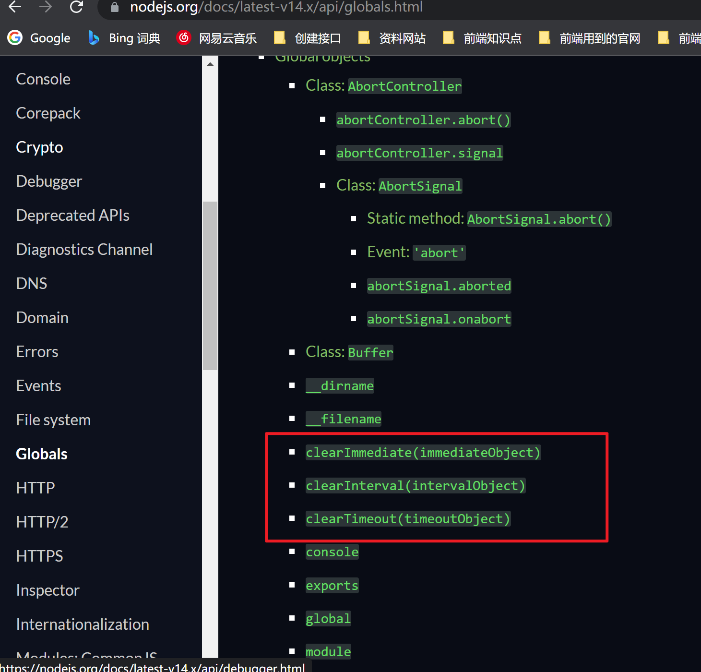

注意取消setInterval略有不同

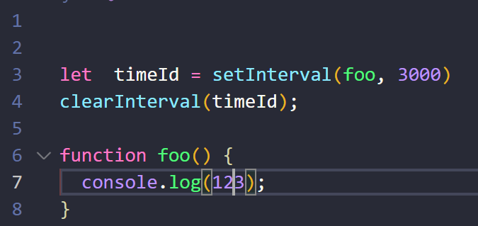


## global对象

global是node提供的一个全局对象，事实上前端我们提到的process、console、setTimeout等都有被放到global中：

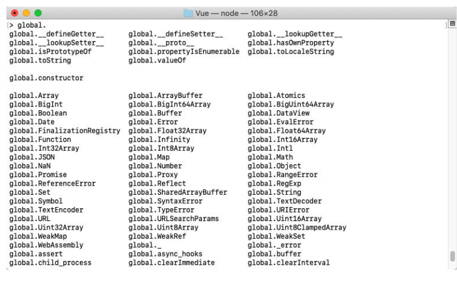

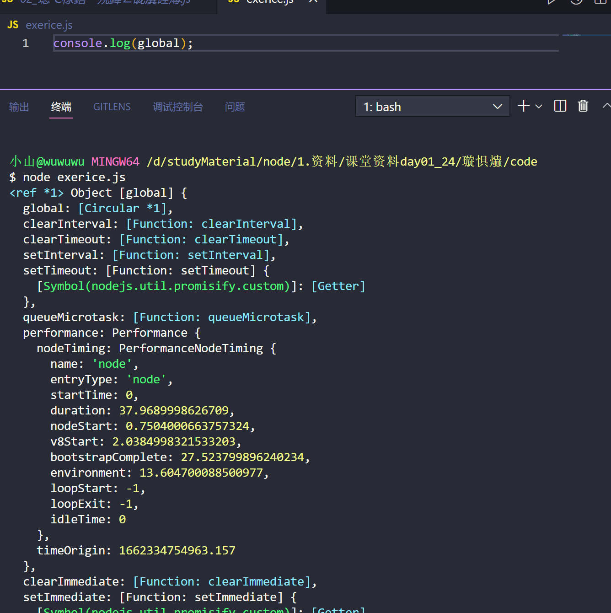

global里面包含很多东西，而且这些还不是global的全局内容

怎么看到全部内容呢

1、输入node，进入REPL

2、输入global.     然后按table，按两次

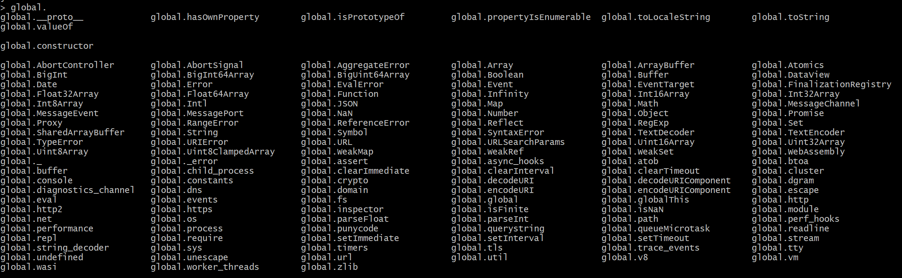

就有一大堆内容，这些都是table的内容了

这些都是global上面的东西，比如类型，Array，Date，Set，Object，URL等等，console,module都放到了global里面去了，包括process都放到了global里面去了

如果想使用一个对象，可以直接拿，也可以通过global来拿这个对象

为什么把很多对象放到global上面呢？

因为有时候想要用一个对象，但是不方便拿，这个时候可以直接通过global直接拿某一个东西，和浏览器很像，浏览器很多东西放到window上的，比如document对象

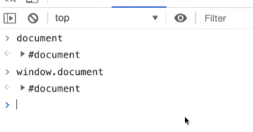

在node上就是放到global上面的

这里通过process和global拿到的process是一样的

global拿到的信息和window拿到的是差不多的，但是还有有一些区别的

## global和window的区别

在浏览器中，全局变量都是在window上的，比如有document、setInterval、setTimeout、alert、console等等

在Node中，我们也有一个global属性，并且看起来它里面有很多其他对象。

但是在浏览器中执行的JavaScript代码，如果我们在顶级范围内通过var定义的一个属性，默认会被添加到window 对象上：

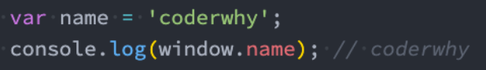

但是在node中，我们通过var定义一个变量，它只是在当前模块中有一个变量，不会放到全局中：

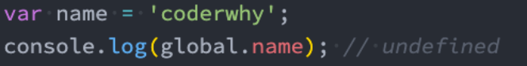

为什么没有放到上面呢？

因为在window写的东西，它实际上没有放到模块上面，他实际上就是最顶层的东西

所以他会随随便便把我们这个变量放到window上

但是在node当中，每一个文件都是一个模块，那么当我定义一个name的时候，他会在这个模块当中定义的name，它是不会随随便便放到global上的

因为如果随随便便放到global上的话，在后面再给name赋值的话，他会给他覆盖掉的，所以这里的name只属于模块，不属于全局，这里没有这样来做

那process怎么就放到global上面呢？

process在源码里面是有手动的放上去

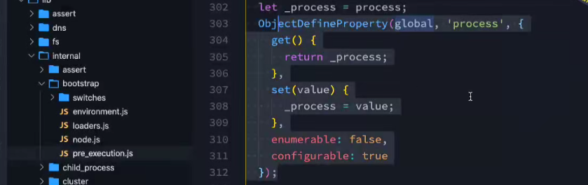

这就是为什么可以通过global.process来使用的process的，就是因为他给他加到了process中去

