# JavaScript模块化

## 什么是模块化呢？

那么，到底什么是模块化开发呢？

- 事实上，模块化开发最终的目的是将程序划分成一个个小的结构
- 这个结构中编写属于自己的逻辑代码，有自己的作用域，不会影响到其他的结构
- 这个结构可以将自己希望暴露的变量、函数、对象等导出给其结构使用
- 也可以通过某种方式，导入另外结构中的变量、函数、对象等

上面说提到的结构，就是模块； 按照这种结构划分开发程序的过程，就是模块化开发的过程

javascript是被称之为披着c语言外衣的Lisp(非常古老的语言，用在人工智能领域，天才程序员使用的语言)

无论你多么喜欢JavaScript, 以及他现在发展的有多好，我们都需要承认在Brendan Eich用了10天写出JavaScript的时候，他都有很多的缺陷

- 比如var定义的变量作用域问题
- 比如JavaScript的面向对象并不能像常规面向对象语言一样使用class
- 比如JavaScript没有模块化的问题

Brendan Eich本人也多次承认过JavaScript设计之初的缺陷，但是随着JavaScript的发展以及标准化，存在的缺陷问题基本都得到了完善。无论是web、移动端、小程序端、服务端、桌面应用都被广泛的使用；


## 早期的JavaScript

在网页开发的早期，Brendan Eich开发JavaScript仅仅作为一种脚本语言，做一些简单的表单验证或动画实现等，那个时候代码还是很少的

- 这个时候我们只需要将JavaScript代码写到`<script>`标签中即可
- 并没有必要放到多个文件中来编写；甚至流行：通常来说JavaScript程序的长度只有一行

但是随着前端和JavaScript的快速发展，JavaScript代码变得越来越复杂了：

- ajax的出现，前后端开发分离，意味着后端返回数据后，我们需要通过JavaScript进行前端页面的渲染；
- SPA的出现，前端页面变得更加复杂：包括前端路由、状态管理等等一系列复杂的需求需要通过JavaScript来实现
- 包括Node的实现，JavaScript编写复杂的后端程序，没有模块化是致命的硬伤；

所以，模块化已经是JavaScript一个非常迫切的需求

- 但是JavaScript本身，直到ES6(2015)才推出了自己的模块化方案；
- 在此之前，为了让JavaScript支持模块化，涌现出了很多不同的模块化规范：AMD、CMD、CommonJS等


## 没有模块化带来很多的问题

早期没有模块化带来了很多的问题： 比如命名冲突的问题

bar.js

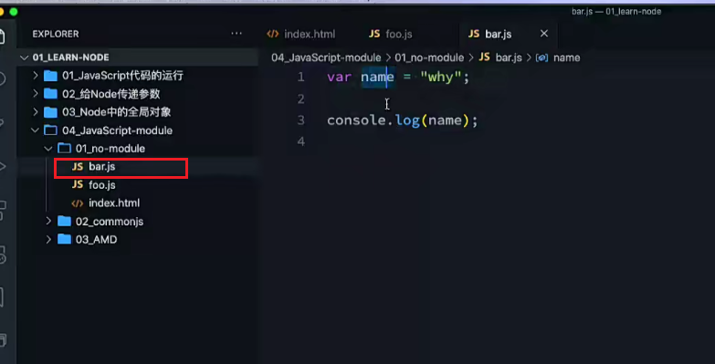

foo.js

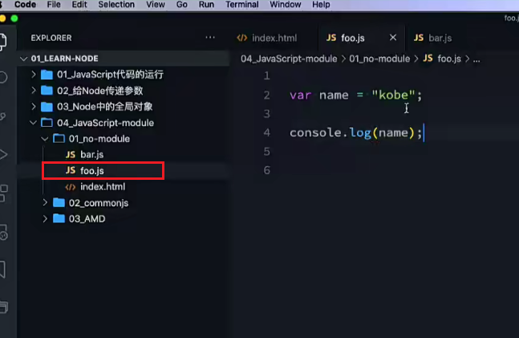

引入两个文件

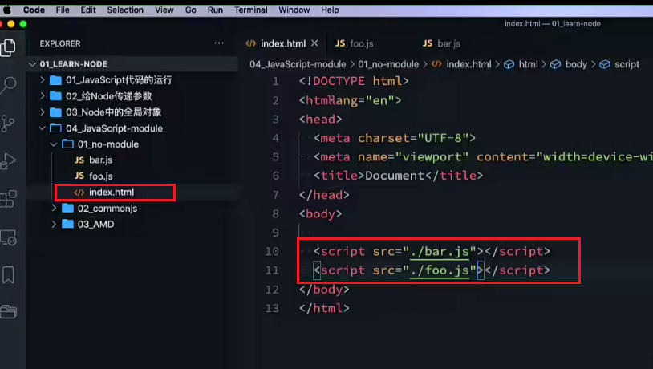

小明在开发完bar文件之后，又开发了baz这个文件，它没有定义name，就想直接使用，能不能使用呢？可以的

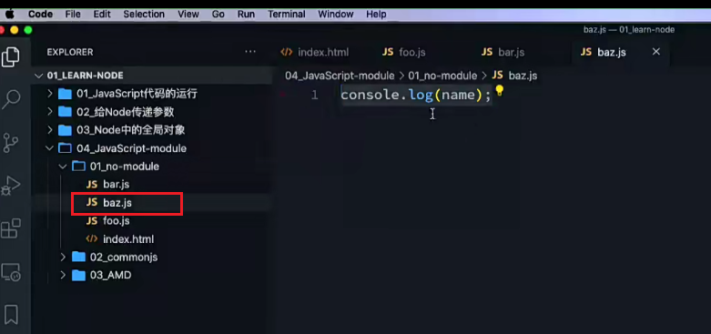

baz也在html引入后，这个时候打印的时候，会发现这个name不是bar这个文件的名字，而是foo里面的名字

因为JavaScript没有单独的作用域，所以，你定义的文件在html引入后，都是会被共享的，而且可能会被修改，并且获得的值可能不是自己想要的 

能不能解决呢？

当然，我们有办法可以解决上面的问题：立即函数调用表达式(IIFE)

- IIFE(Immediately Invoked Function Expression)

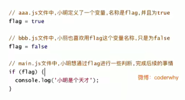

在以前的话是用自执行函数来解决的

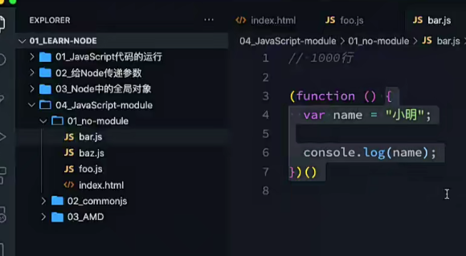

这样虽然不会将bar里面的name被其他文件修改，但是也有一个问题，就是其他文件，压根也访问不到这个bar里面的内容了

会告诉name未定义，或者其他变量也是一样的，未定义

那怎么办呢？

把要共享的东西返回出去

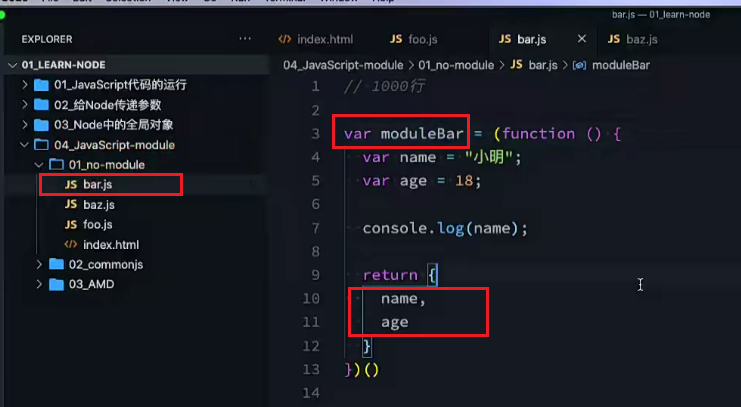

意味着moduleBar这个变量是接收这个自执行函数的返回值的，也就意味着他只想这个retruen，而且moduleBar是在顶层的，如果在其他文件想用name或者age的话可以这样

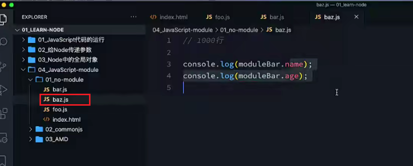

而且，对这里的顺序没有任何要求

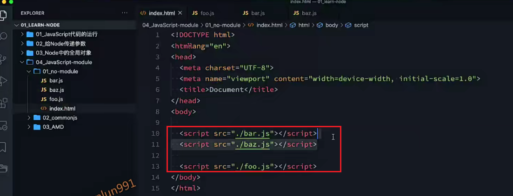


但是，我们其实带来了新的问题：

- 第一，我必须记得每一个模块中返回对象的命名，才能在其他模块使用过程中正确的使用
- 第二，代码写起来混乱不堪，每个文件中的代码都需要包裹在一个匿名函数中来编写
- 第三，在没有合适的规范情况下，每个人、每个公司都可能会任意命名、甚至出现模块名称相同的情况

所以，我们会发现，虽然实现了模块化，但是我们的实现过于简单，并且是没有规范的

- 我们需要指定一定的规范来约束每个人都按照这个规范去编写模块化的代码；
- 这个规范中应该包括核心功能：模块本身可以导出暴露的属性，模块又可以导入自己需要的属性；
- JavaScript社区为了解决上面的问题，涌现出一些列好用的规范。
- 要知道AMD、CMD、commonjs，都是一些规范，并不是库


## CommonJS和Node

我们需要知道CommonJS是一个规范，最初提出来是在浏览器以外的地方使用，并且当时被命名为ServerJS, 后来为了体现它的广泛性，修改为CommonJS，平时我们也会简称为CJS

- Node是CommonJS在服务器端一个具有代表性的实现；
- Browserify是CommonJS在浏览器中的一种实现；
- webpack打包工具具备对CommonJS的支持和转换；

所以，Node中对CommonJS进行了支持和实现，让我们在开发node的过程中可以方便的进行模块开发：

- 在Node中每一个js文件都是一个单独的模块；
- 在这个模块中包括CommonJS规范的核心变量：exports、module.exports、require;
- 我们可以使用这些变量来方便的进行模块化开发

前面我们提到过模块化的核心是导出和导入，Node中对其进行了实现：

- exports和module.exports可以负责对模块中的内容进行导出
- require函数可以帮助我们导入其他模块（自定义模块、系统模块、第三方模块）中的内容


## 案例

有一个main文件，是主入口

bar.js文件

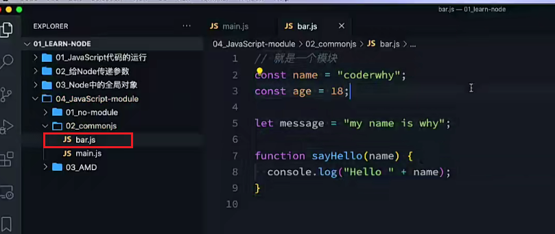

在main.js能不能引用呢？

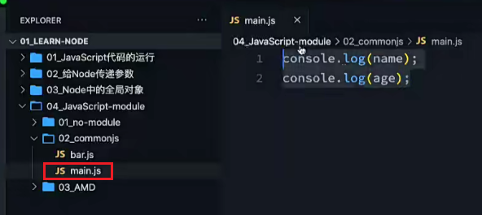

显然是不能引用的

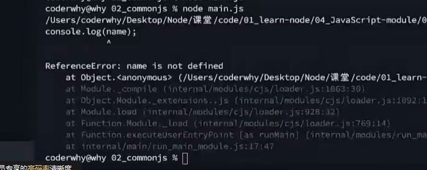

那就验证在node每一个文件就是一个模块，不同的模块是不能相互引用的，那如果我想去访问你这个模块的东西怎么办呢？

你必须把你这个模块的东西导出出去，在别的模块中进行导入，那导入以后，我就可以进行使用了

bar.js进行导出

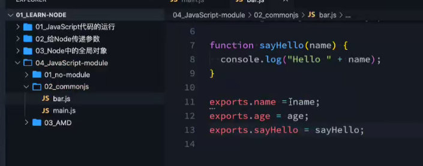

这三个属性已经被导出了

那main.js导入就行了

用require是一个函数（不是一个关键字），全局的函数，它返回一个对象，它返回的就是exports这个对象

所以可以这样写


bar这个变量指向的就是exports这个对象，也可以说，这个bar就是bar.js中的exports这个对象了

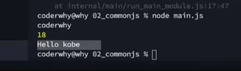

既然这个东西就是这个对象了，我们也可以换一个写法， 对象的解构


运行起来也是一样的


## 理解对象的引用赋值

对象会在堆内存里面开辟一块空间的，而这块空间有自己的内存地址，那么当把一个对象赋值给另外一个变量的时候，这个变量保存的实际上是一个内存地址

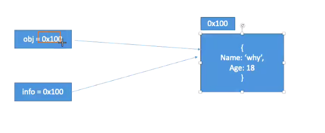

都是同一个地址之后，假如在obj中把name修改成kobe呢？

 通过obj找到内存空间，把他修改成kobe

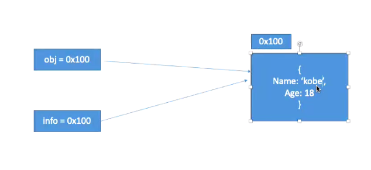

改成kobe之后我通过info来访问name之后，也是通过内存空间找到name，他就是kobe


这里做了一些导出

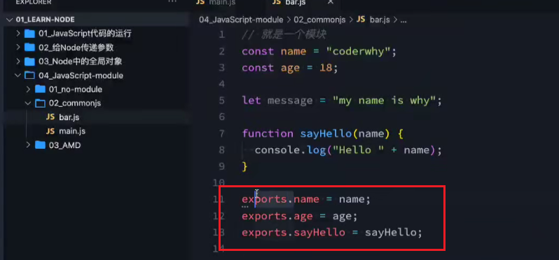

导出之后，require为什么可以拿到呢？

首先要知道每一个模块中都有一个**exports对象**，它默认指向的是一个**空对象**

只要是一个对象，就意味着它在内存中会开辟一块空间

开辟一块空间什么都没有

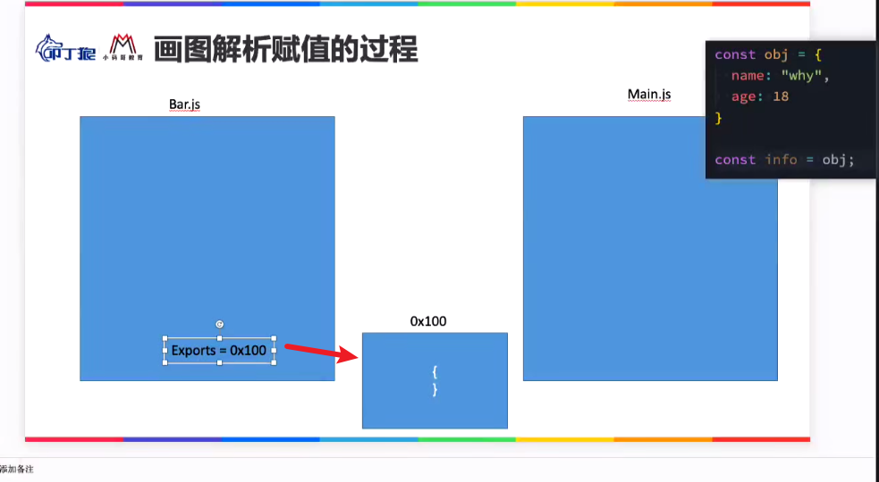

main.js想用bar.js里面的东西

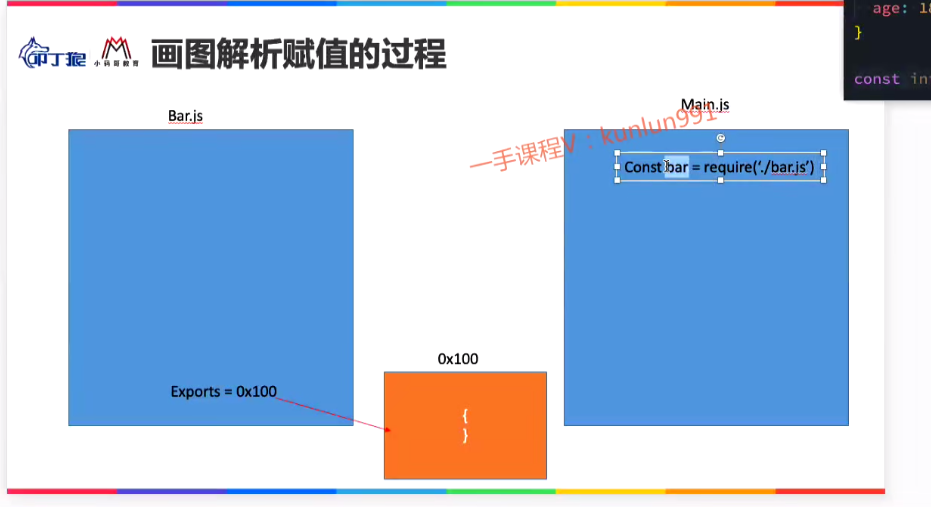

main里面通过require来获取bar.js里面的东西，也就是想获取exports这个对象，也就是想获取0x100这个内存空间，也就是require执行完了以后返回一个对象，这个对象指向0x100

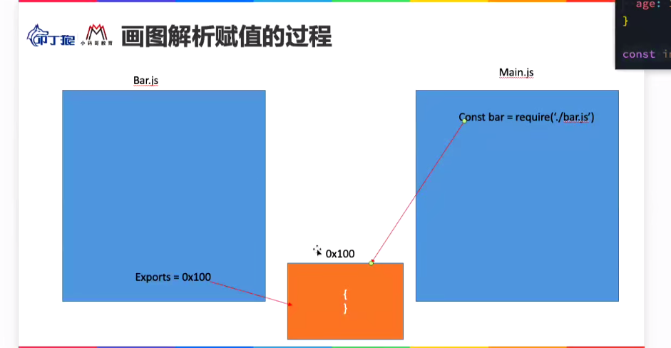

一旦require执行以后返回0x100那么bar这个变量指向的就是0x100

exports.name = 'wts'

bar.js中在写这行代码的时候会怎么样呢？

会在内存空间中找到0x100，然后添加一个属性name = 'wts'

又给export添加属性，依然先找到内存空间，然后添加属性

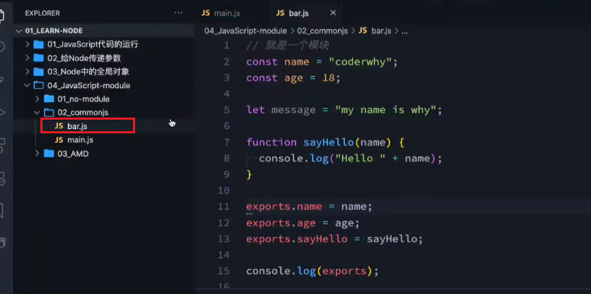

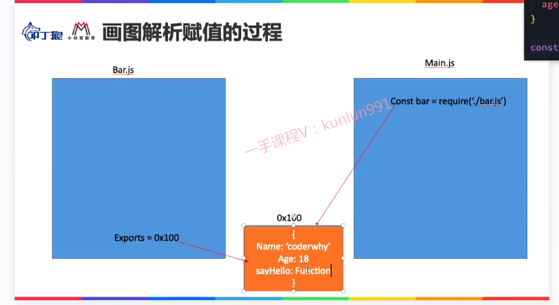

函数比较特殊，它传递过去的是函数的地址，任何地方都可以执行这个函数

这里是前面exports一直再往export添加东西

那么require执行的函数的返回值也是可以拿到0x100地址，并且拿到里面的东西


它们确实是指向同一个地址吗？可以做一个这样的实验

在bar.js中这样写

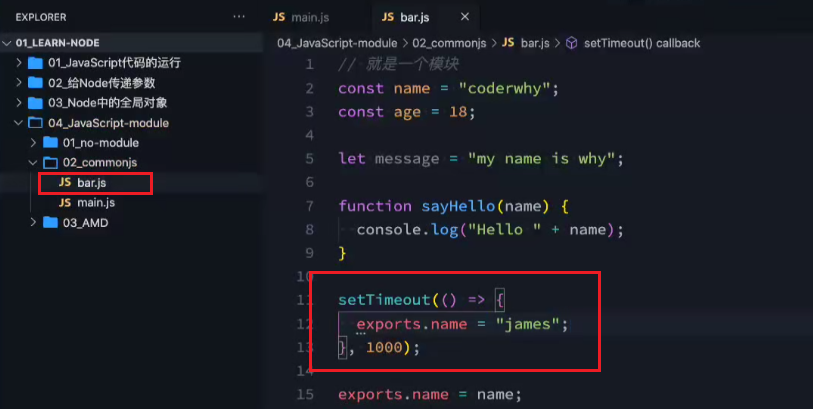

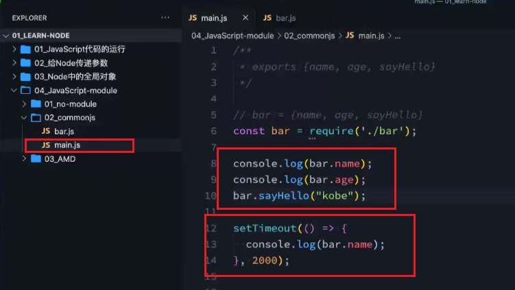

一秒钟之后进行修改，两秒钟之后重新读取，如果他们指向的是同一个内存空间的话，那么是可以读到新的name的

这里刚开始会打印coderwhy，过了两秒钟打印jams，为什么呢？因为定时器一秒钟之后会改成0x100这个内存地址中保存的name，给他改成了jams，所以你在两秒钟之后通过0x100这个地址再来访问name的之后，exports在你之前（1秒钟）的时候通过0x100这个地址改成了jams

所以Node中实现CommonJs的本质就是对象的引用赋值

这个就是commonjs的本质

甚至可以这样

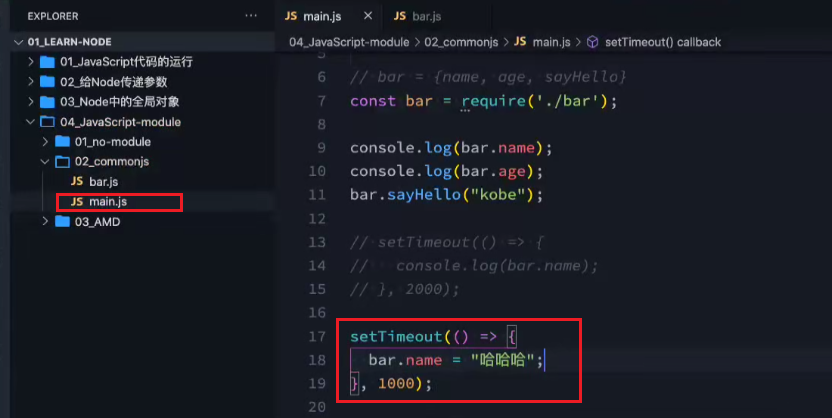

在main.js中1秒钟之后把导入的bar中的name修改成哈哈哈

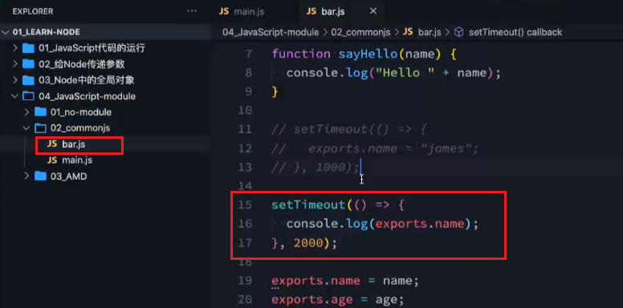

在两秒钟之后让bar.js来打印exports中的name

这个后bar.js中的打印的exports.name获取的也是哈哈哈

这个道理和上面也是一样的


## 它们实际上是一个浅层拷贝

所以，有一种说法就是说，上面的export和require()就是一种浅层拷贝，但是实际上浅层拷贝就是引用赋值


## module.exports又是什么？

但是Node中我们经常导出东西的时候，又是通过module.exports导出的：

- module.exports和exports有什么关系或者区别呢？

我们追根溯源，通过维基百科中对CommonJS规范的解析：

- CommonJS规范中是没有module.exports的概念的；
- 但是为了实现模块的导出，Node中使用的是Module的类，每一个模块都是module的一个实例，也就是module
  - 一个js文件就是一个实例
- **所以在Node中真正用于导出的其实根本不是exports, 而是module.exports**
- 因为module才是导出的真正实现者

在所有的文件中都有一个对象（类），叫module

当我们console.log(module) 的时候


他就是一个module类

每一个js文件都会new 一个module的对象（类），那么得到的实际上就是module的实例，那new这个对象有什么用呢？

真正导出的东西的看起来是export，真正导出的是module.exports

那为什么是往export上加东西呢？

```js
export.name = name; 

export.age = age;
```

为什么这样也能导出呢？

因为它源码里面做了这样一件事情

module.exports = exports

源码里面做了这样一个赋值

就意味着内存地址给他了

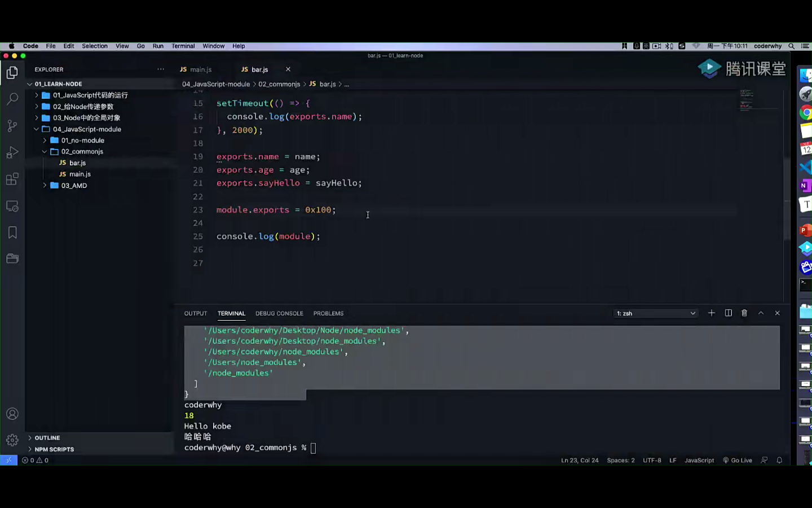

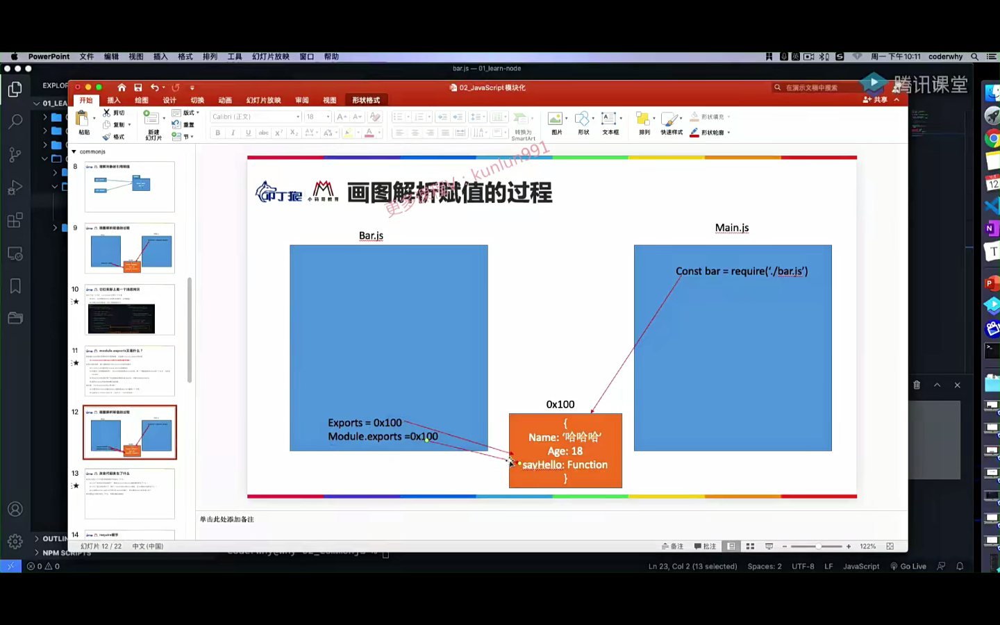

三个都指向同一个内存空间的，也就是同一个对象

可以验证一下

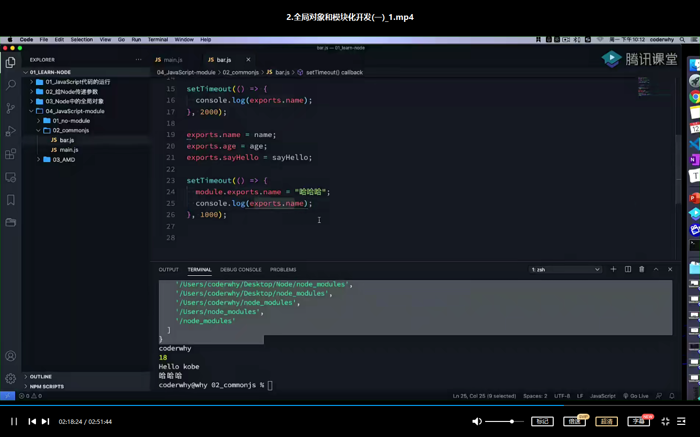

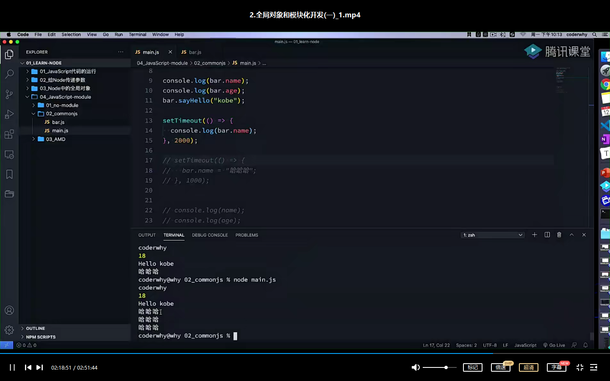

它们打印的都是 哈哈哈

所以最终导出的时候实际上是module.export才是本质上，它在导出的

如果这样做了呢

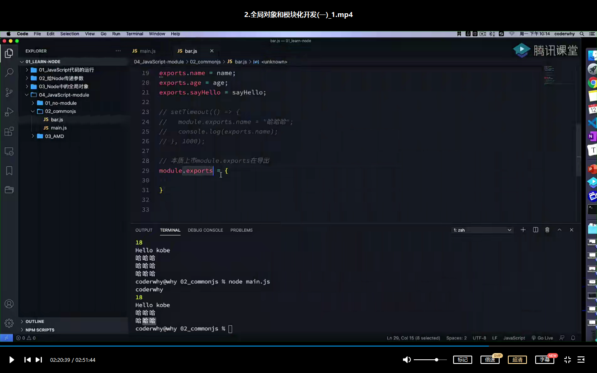

这里 module.export赋值了一个新对象

那么内存里面赋值了一个新对象

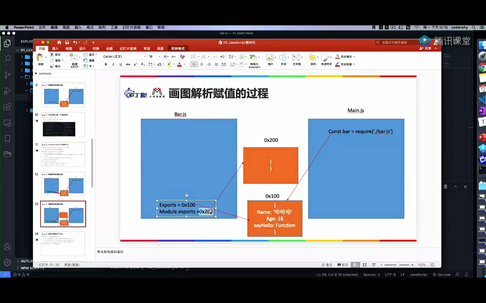

所以导入的地方就执行它了

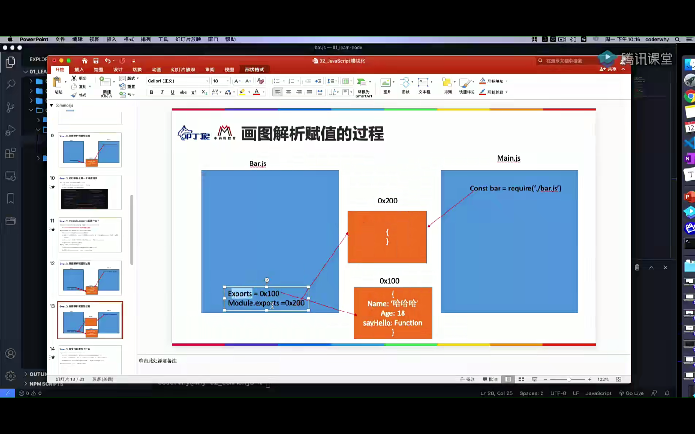

不管上面exports怎么赋值，但是因为最后我给module.export赋值了一个空对象，所以导入的地方也只会导入一个空对象

就算我们在导出的时候再怎么修改exports，但是因为module.export最后不指向exports了，所以导入的地方也不会随着exports来修改了

赋值操作的位置

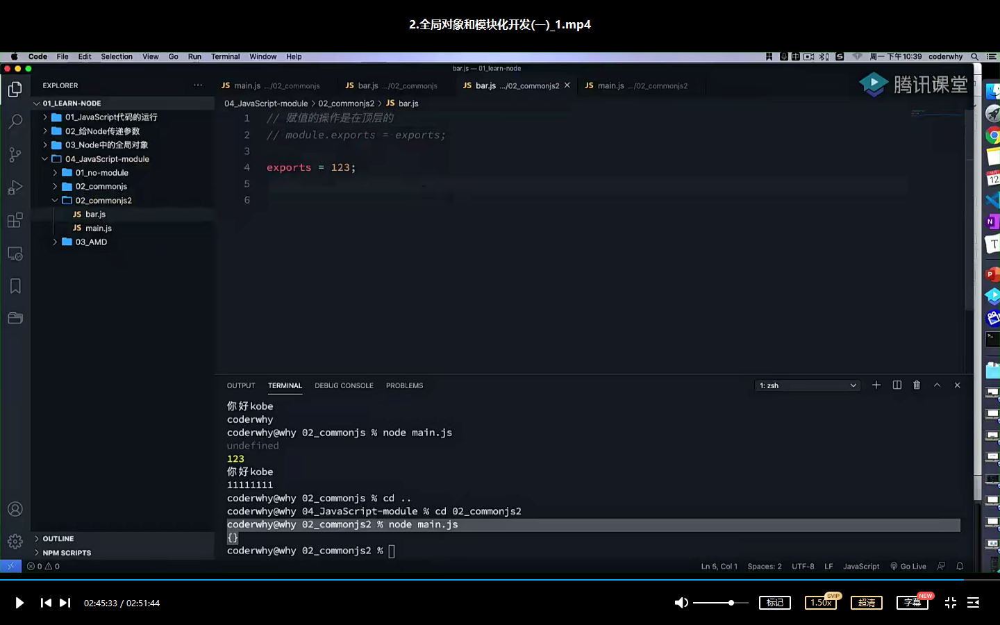

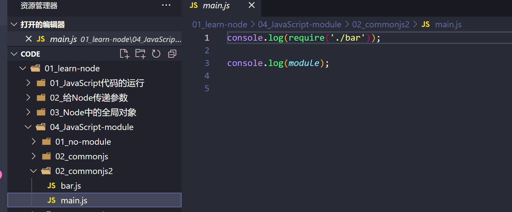

赋值的操作是在顶层的，在顶层module.exports会先被赋值为一个空对象，然后将module.exports赋值给exports，然后exports修改了内存地址，所以export修改后的值无法影响到module.exports了，通过打印可以说明这个问题，打印的是空对象，说明，在顶层的时候赋值给了module.exports这个对象一个空对象，然后exports重新对自己赋值了，但是没有影响到module.exports


## 改变代码发生了什么

我们这里从几个方面来研究修改代码发生了什么？

- 1.在三者项目引用的情况下，修改exports中的name属性到底发生了什么？
- 2.在三者引用的情况下，修改了main中的bar的name属性，在bar模块中会发生什么？
- 3.如果module.exports不再引用exports对象了，那么修改export还有意义吗？

先画出在内存中发生了什么，再得出最后的结论。

理解上面的内存图之后，这些问题就可以得出结论了


那么exports存在的意义是什么呢？

- 因为CommonJS规范要求，有一个exports作为导出
- CommonJS只是一个规范，node实现了这个规范,exports就是这个规范中要求导出的一个关键字


## require细节

我们现在已经知道，**require是一个函数**，可以帮助我们引入一个文件（模块）中导入的对象。他跟ES6中的import和export不一样，它是一个函数

- 他跟ES6中的import是不一样的，因为它是一个函数，就意味着函数内可以加一个小括号，小括号里面引入一个文件，这个文件就是一个模块，在node中一个js文件就是一 个模块

- https://nodejs.org/dist/latest-v14.x/docs/api/modules.html

这里我总结比较常见的查找规则：导入格式如下：require(X)


情况一：X是一个核心模块，比如path、http

- 直接返回核心模块，并且停止查找

情况二：X是以 ./ 或 ../ 或 /（根目录）开头的

- 说明你查找的是一个本地文件

- 第一步：将X当做一个文件在对应的目录下查找；
  - 1.如果有后缀名，按照后缀名的格式查找对应的文件
  - 2.如果没有后缀名，会按照如下顺序：
    - 1> 直接查找文件X
    - 2> 查找X.js文件
    - 3> 查找X.json文件
    - 4> 查找X.node文件
  - 2是node帮我们做的，如果导入一个文件没有后缀名，那么node会帮我查找到这个文件，然后给这个文件加上后缀名的，例如webpack也是这样的，导入一个vue文件，可以不加后缀名，但是webpack会帮我们加上后缀名，webpack有一个属性叫extensions，它是一个数组，表示能帮我们加的后缀名
- 第二步：没有找到对应的文件，将X作为一个目录
  - 查找目录下面的index文件
    - 1> 查找X/index.js文件
    - 2> 查找X/index.json文件
    - 3> 查找X/index.node文件
- 如果没有找到，那么报错：not found


情况三：直接是一个X（没有路径），并且X不是一个核心模块

- /Users/coderwhy/Desktop/Node/TestCode/04_learn_node/0 5_javascript-module/02_commonjs/main.js中编写 require('why’)
- 当我写这个东西的时候require('why');
- 当我查找why不是一个node的核心模块的时候，就会去node_module中去找，如果当前02_commonjs找不到的话，就会去上一层的文件夹node_module找，会一层一层的去找，这就是为什么会安装到node_module中，因为他会一直往上找node_module中去查找

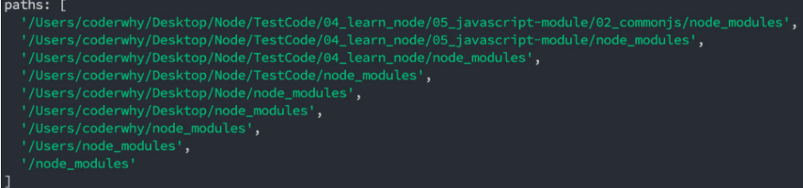


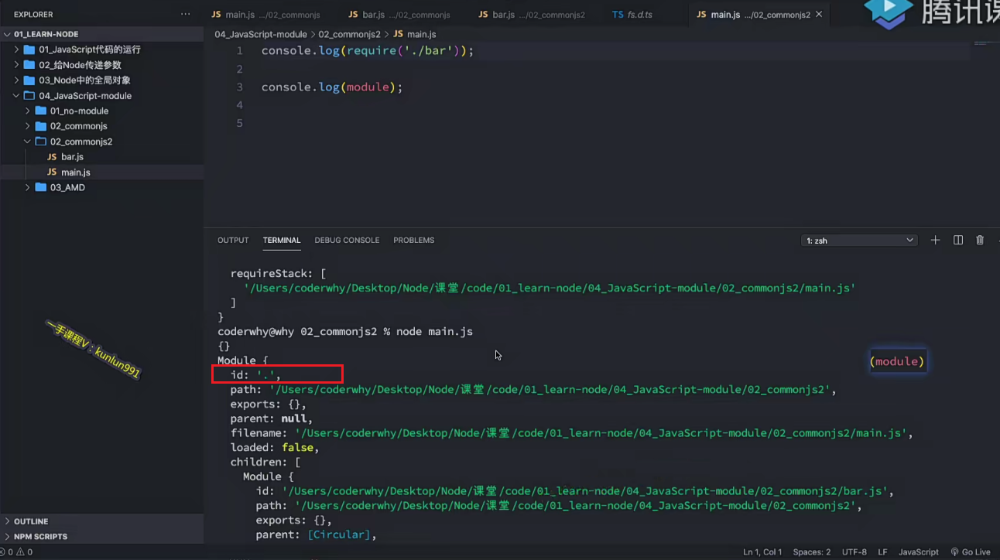

这里打印了module对象

每一个模块（js文件）都是一个module对象，而在这个module对象中有特别多的东西

id: 这个id，因为我执行的就是当前这个模块，所以它是一个.  ，如果我执行的是其他模块，这里就不是一个.了，而是一个路径了

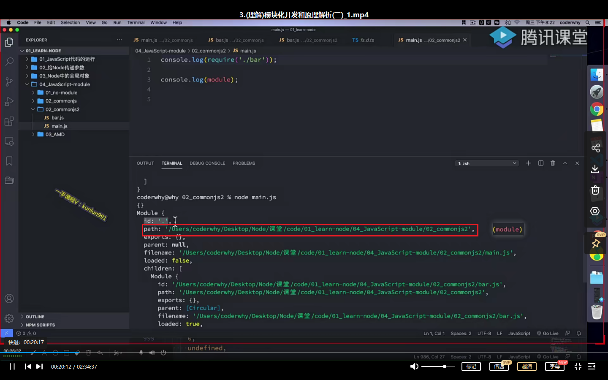

exports: 当前文件所在的路径，也包括exports属性，默认情况下，exports就是一个空的对象，可以往这个对象里面添加其他的属性，然后把这个属性导出出去了

parent: 是个null，因为你就是根路径，为什么是根路径，因为我在运行你，那么你就是根路径

还有个loaded，后面会说到

还有children，表示还有哪些子模块

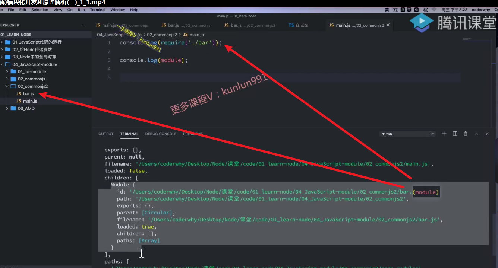

还有个paths，这个paths就是上面的path，如果我找why，找不到的话，他就会开始遍历paths这个数组，然后一个一个的沿着这个数组去找

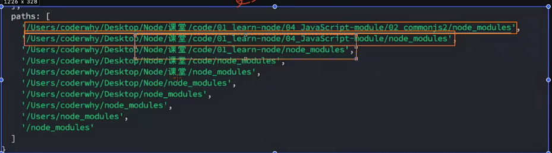

一直找到最后，如果还没有找到的话就会报错，这个就是它的查找顺序


## 模块的加载过程

 结论一：模块在被第一次引入时，模块中的js代码会被运行一次


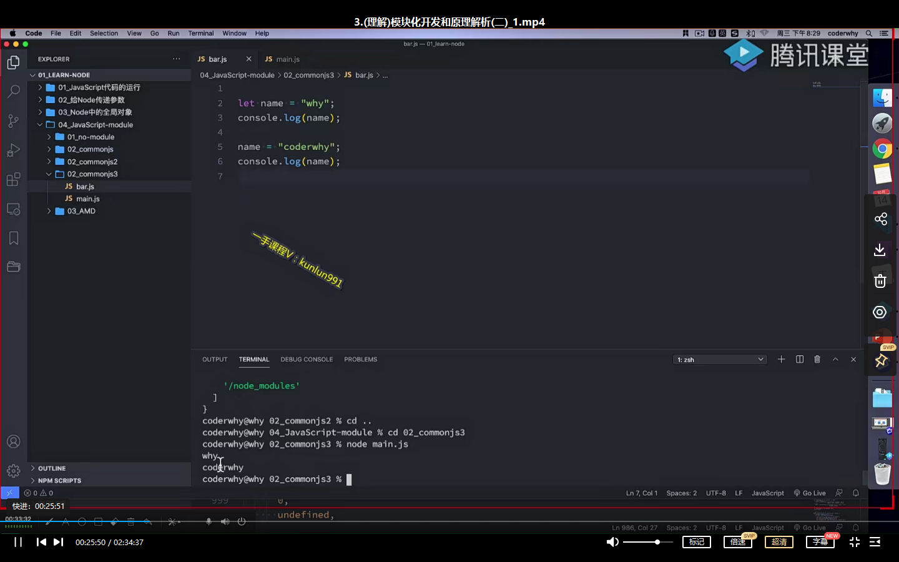

发现都有被打印

所以，相当于在main.js中做了两件事情，第一件事，引入了这个文件，第二件事我自己做了一个打印，就是main.js里面自己也做了一个打印，

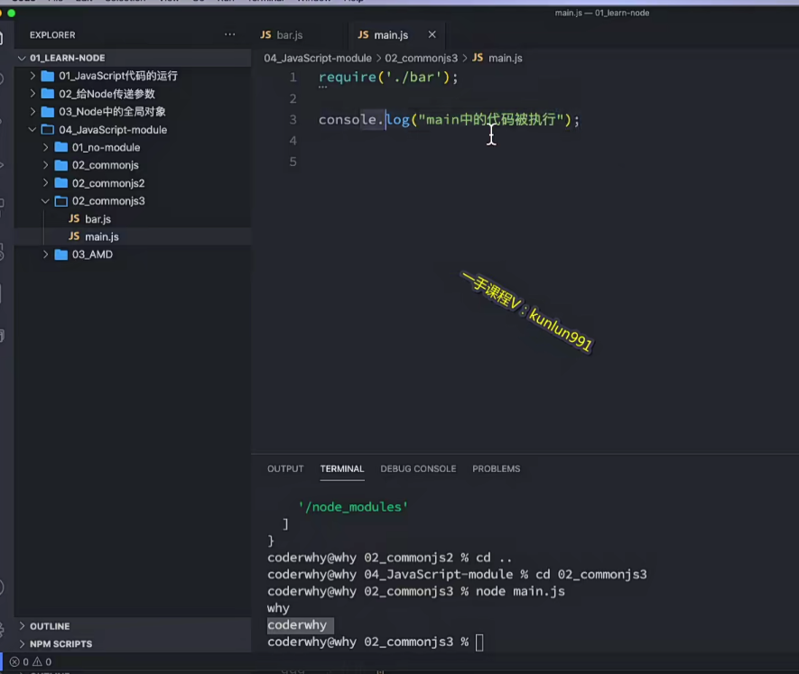

那么why和codewhy，在main.js代码执行的时候，main中的打印，是在bar.js的打印之前，还是之后呢？

也就是先打印谁，后打印谁呢？

也就是说，是先执行引入的模块中的代码，还是这个模块中的代码是异步的，先执行本文件的代码呢？

先打印bar.js中的代码，在打印main.js中的代码

为什么会这样呢？

因为node在实现的时候，它的这个加载过程是同步的

同步就意味着，必须等里面的东西加载完了以后，才会继续去执行下一行代码，也就是你引入的js文件必须全部执行完了之后，才能执行本文件的代码，因为它的加载过程是同步的，相当于阻塞了，那么阻塞了会不会浪费性能呢？不会的，因为我们这个node最主要是用来开发服务器的，在开发服务器的情况下，所有的文件都是部署在同一个服务器的，不会说这个文件在服务器A，另一个在服务器B，我要先下载A文件，再加载，不会这样的，他都是在同一个服务器，所以它的加载效率很高的，但是因为你是同步的，如果你把这个东西应用在浏览器里面，就会有很大的问题了，什么问题呢？我如果执行了一个文件，你这个文件引入了其他的文件，那么我就需要等你其他的文件执行完了以后，在执行我的文件的代码，那么如果我引入的文件需要再从服务器下载下来，在执行，执行完了以后再执行我本来要执行的文件，效率是非常低的，用户也能明显的感觉到卡顿和白屏，所以在这里不会有这样的问题，但是在浏览器会有问题

如果，模块被多次加载，它是有缓存的，也就是模块只会加载一次，那么只加载一次，也就说明代码只会运行一次，也就是说多个模块引用，被引用的代码也只会运行一次、


 结论二：模块被多次引入时，会缓存，最终只加载（运行）一次

-  为什么只会加载运行一次呢？
-  这是因为每个模块对象module都有一个属性：loaded。
-  为false表示还没有加载，为true表示已经加载；


foo引入了一次bar.js

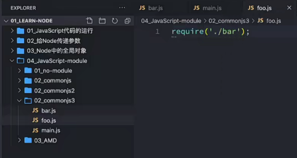

main.js也会引入一次bar.js

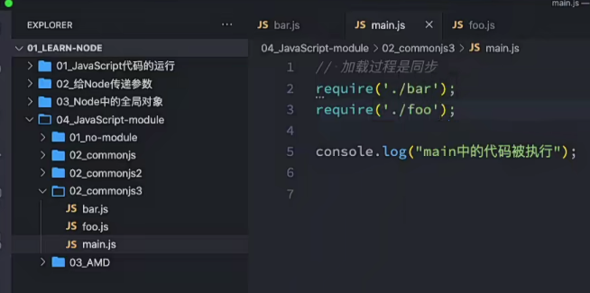

也就是说bar.js在foo.js加载一次，在main.js也会加载一次

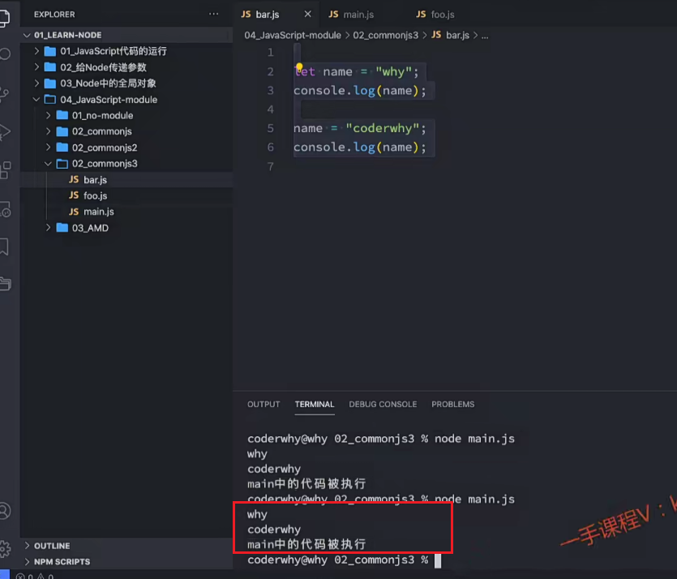

可以看出来只加载了一次，只加载了一次就说明，它是有一个缓存的，加载完一次之后，下一次就不会再加载了，下一次使用的话，就直接取就行了


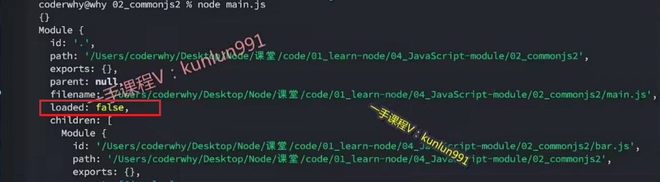

module里面有一个属性就是loaded，这个属性就是用来记录这个模块有没有被加载过，一旦这个模块被加载过之后，这个属性就会变成true

因为子模块也使用了这个东西，所以子模块的loaded会设置为true

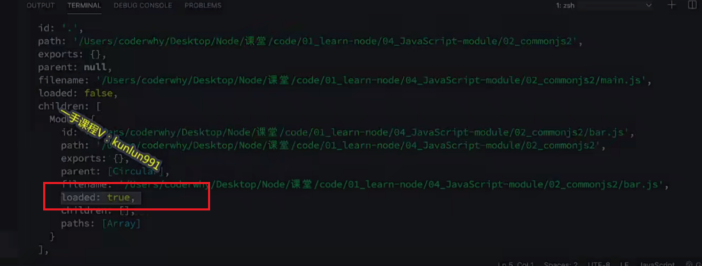

但是我自己的loaded为什么是false呢？因为在打印的这个时候我自己的模块还没有加载完，所以它是一个false，等我自己加载完了之后我的loaded也会变成true的


结论三：如果有循环引入，那么加载顺序是什么？

如果出现右图模块的引用关系，那么加载顺序是什么呢？

- 这个其实是一种数据结构：图结构
-  图结构在遍历的过程中，有深度优先搜索（DFS, depth first search）和广度优先搜索（BFS, breadth first  search）；
- Node采用的是深度优先算法：main -> aaa -> ccc -> ddd -> eee ->bbb

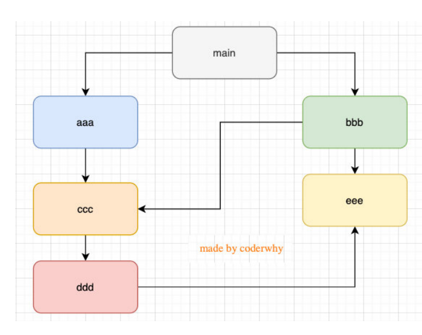

在主入口如果加载了aaa，aaa又加载了ccc，ccc又加载了ddd，ddd又加载了eee，右边的bbb加载了ccc，可以发现，这里形成了一个闭环

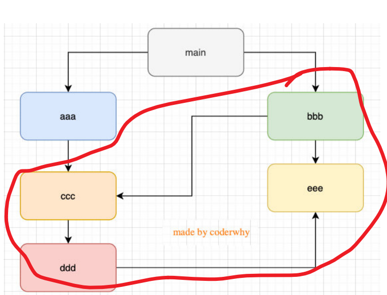

形成了闭环会不会无限加载呢？ 

其实是不会的，它是有自己的一个加载顺序的，当然这个加载顺序可以验证一下

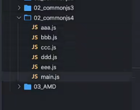

按照上面的图创建文件

注意，打印要放在最上面，因为先打印就意味着，我这个文件加载了，并且我先加载，之后我在require其他的文件，表示要加载其他文件了

main.js


aaa.js


ccc.js


eee.js


bbb.js


ddd.js


按照上面的组织之后，我们执行main.js这个文件


你会发现，他会先加载main.js

之后是aaa,  ccc, ddd, eee, bbb

他会先走aaa，然后顺着aaa走到最根上，当发现最根上没有指向了之后，他会再回来，在ddd看有没有其他指向，没有再走到ccc看有没有其他指向，再往上走到aaa，再往上走到main，发现main还引入了bbb，就走bbb了


bbb执行完了以后发现bbb还引用了ccc，所以该去执行ccc了，但是发现ccc的loaded被设置为true了，所以他就不会执行ccc了，就过掉了，那bbb如果还引入了其他的，依然按照这个规则，当然在加载eee的时候发现eee的loaded已经被加载过了，所以就不会再去加载它了

所以所有的模块就加载完了，所以就是这样一个顺序

其实这种就是一种数据结构，这是一种图结构，node在遍历的过程采用的是深度优先


## Node源码解析

这里讲的是，到底是exports 给 module.exports赋值，还是module.exports给exports赋值呢？


module._load这个方法返回这个模块的exports这个对象，所以其他地方通过require拿到的就是这个返回的对象，所以他们其实是同一个对象

 加载每一个node中的js文件，实际上把文件里面所有的代码都是放到一个沙盒里面来执行的，这个沙盒本质上就是一个函数，把js文件里面的代码放到函数里面来运行的，跟匿名函数自执行比较相似，为什么放到自执行函数里面来执行呢？ 因为函数里面是有作用域的，这样的话，函数里面的代码是不会影响到其他地方的


这个this.exports就是module.exports，是先给module.exports赋值为{}，然后module.exports给exports赋值的


## CommonJS规范缺点

CommonJS加载模块是同步的：

- 同步的意味着只有等到对应的模块加载完毕，当前模块中的内容才能被运行；
- 这个在服务器不会有什么问题，因为服务器加载的js文件都是本地文件，加载速度非常快；

如果将它应用于浏览器呢？

- 浏览器加载js文件需要先从服务器将文件下载下来，之后在加载运行；
- 那么采用同步的就意味着后续的js代码都无法正常运行，即使是一些简单的DOM操作；

所以在浏览器中，我们通常不使用CommonJS规范：

- 当然在webpack中使用CommonJS是另外一回事；
- 因为它会将我们的代码转成浏览器可以直接执行的代码；

在早期为了可以在浏览器中使用模块化，通常会采用AMD或CMD：

- 但是目前一方面现代的浏览器已经支持ES Modules，另一方面借助于webpack等工具可以实现对CommonJS或者 ES Module代码的转换；

其实在javascript原生的esmodules出来之前的话，有很多社区的规范，包括commonjs，AMD, CMD

commonjs是最重要的

但是commonjs存在一些缺点，就是上面的缺点，这个时候就可以采用AMD或者CMD

vite为什么那么快呢？因为vite压根就不编译，他直接把esmodule这些新特性放到浏览器上，那如果有些浏览器不支持这些规范怎么办呢？它在打包的时候同时他又会对我们的esmodules进行转化，所以你在开发过程中，进行相关的开发测试的时候，速度非常快，它比webpack快很多，但是你在打包的时候，又会对你的代码再做一层转化，对你的代码转成低版本浏览器支持的代码


## AMD规范

AMD主要是应用于浏览器的一种模块化规范：

- AMD是Asynchronous Module Definition（异步模块定义）的缩写；
- 它采用的是异步加载模块；
- 事实上AMD的规范还要早于CommonJS，但是CommonJS目前依然在被使用，而AMD使用的较少了；

我们提到过，规范只是定义代码的应该如何去编写，只有有了具体的实现才能被应用：

- AMD实现的比较常用的库是require.js和curl.js；


## require.js的使用

第一步：下载require.js

- 下载地址：https://github.com/requirejs/requirejs
- 找到其中的require.js文件；

第二步：定义HTML的script标签引入require.js和定义入口文件：

- data-main属性的作用是在加载完src的文件后会加载执行该文件


不能直接上面这样引用，要在下面这样引用

```js
<script src="./lib/require.js" data-main="./index.js"></script>
// 这里的意思是当加载（下载）了require.js文件之后，再加载index.js
```

index.js


这个require是哪来的呢？它是lib/require.js给我们提供的

我们引入了两个模块，一个是bar，另一个是foo

那么我们需要在bar这个模块里面去编写代码

bar.js


我希望，我这里定义的name，age，sayHello这些东西可以在foo使用，那么怎么办呢？我需要导出

bar.js


现在我要在foo.js使用bar.js这个模块了


但是现在的代码在浏览器中是不会显示任何东西的，因为我们当前只是加载了main.js，main.js当前是没有加载其他任何的代码的，所以它是不会进行加载的，注意：上面只是配置，所以如果想真正看到效果的话，需要这样


一旦引入了foo.js， 就会执行foo.js里面的代码，foo.js里面会引入bar.js的代码，并且进行一些打印


这样在浏览器中进行了打印

总结一下，第一步


导入require库，然后引入我们的js代码

第二步


我们在我们引入的js代码中配置了两个模块，然后我们导入了其中一个模块，foo模块

第三步


我们在foo模块导入了bar模块，并且我们打印了bar模块的一些东西

第四步


我们定义了bar模块中的一些变量，并且导出了

我们可以发现，require也可以导入，define的第一个参数也可以导入，那么他们有什么区别呢？

下面就有说明


我们在文件中需要在define中写了


注意这里不需要src

上面的案例说明了一个问题，在foo中导出了东西，在main.js导入了东西，所以，这个就实现了模块化了


如果给baseUrl为空

那么就需要给foo加src


然后我们在bar模块中引入foo


## CMD规范

CMD规范也是应用于浏览器的一种模块化规范：

- CMD 是Common Module Definition（通用模块定义）的缩写；
- 它也采用了异步加载模块，但是它将CommonJS的优点吸收了过来；
- 但是目前CMD使用也非常少了；

CMD也有自己比较优秀的实现方案：

- SeaJS

它们都是用在浏览器上的，所以要有html文件


## SeaJS的使用

第一步：下载SeaJS

- 下载地址：https://github.com/seajs/seajs
- 找到dist文件夹下的sea.js

第二步：引入sea.js和使用主入口文件

- seajs是指定主入口文件的

foo.js导出


index.js进行导入


运行，就可以看到


但是我们要这样写才能运行成功


## 认识 ES Module

JavaScript没有模块化一直是**它的痛点**，所以才会产生我们前面学习的**社区规范**：CommonJS、AMD、CMD等， 所以在ES推出自己的模块化系统时，大家也是兴奋异常。

ES Module和CommonJS的模块化有一些不同之处：

- 一方面它使用了import和export**关键字**；
  - 它不是像CommonJS、AMD、CMD那样的**对象**，而是**关键字**
- 另一方面它采用编译期的静态分析，并且也加入了动态引用的方式；

ES Module模块采用export和import关键字来实现模块化：

- export负责将模块内的内容导出；
- import负责从其他模块导入内容；
- 它们是关键字，**不是对象**，**也不是函数**，意味着它们会被引擎解析
  - 说明，export、import这两个关键字需要交给JS引擎来解析，解析完了之后才能知道是什么意思
- 采用ESModule会自动的采用严格模式
- ESModule是ES6出现的，也就是ES2015才出现的

了解：采用ES Module将自动采用严格模式：use strict

- 如果你不熟悉严格模式可以简单看一下MDN上的解析；
- https://developer.mozilla.org/zh-CN/docs/Web/JavaScript/Reference/Strict_mode


### 演示ESModule

#### 浏览器演示ESModule

index.html


index.js

暂时没有代码...


这个时候我们运行index.html文件，它有运用模块化吗？

是没有的，他就把他当成一个普通的JS文件一样，不会把他当成模块的

那么想把它当成一个模块要怎么样呢？

index.html


需要把这个script标签加上type属性

一旦这样写的话，加载这个文件，就变成模块了

修改index.js


当把index.html执行起来之后


会遇到这个错误，这个错误就是跨域的错误

所以我们需要用VScode的一个插件来避免跨域


‘

并没有给他当成模块化

所以必须要这样


这样就可以了


live-server


如果通过本地打开也会报错


是因为当前，如果要把一个文件当成一个模块


你不能用file这个url-scheme前缀，你可以用http、或者https


file不能正常的去加载一个模块


这样才能正确解析

这就是模块化的基本使用

模块化是异步的


## 案例代码结构组件

这里我在浏览器中演示ES6的模块化开发：

```js
<script src="./modules/foo.js" type="module"></script>
<script src="main.js" type="module"></script>

```


如果直接在浏览器中运行代码，会报如下错误：


这个在MDN上面有给出解释：

- https://developer.mozilla.org/zh-CN/docs/Web/JavaScript/Guide/Modules
- 你需要注意本地测试 — 如果你通过本地加载Html 文件 (比如一个 file:// 路径的文件), 你将会遇到 CORS 错误，因为 Javascript 模块安全性需要。
- 你需要通过一个服务器来测试。

我这里使用的VSCode，VSCode中有一个插件：Live Server


## exports关键字（导出）

export关键字将一个模块中的变量、函数、类等导出；

我们希望将其他中内容全部导出，它可以有如下的方式：

方式一：在语句声明的前面直接加上export关键字

方式二：将所有需要导出的标识符，放到export后面的 {}中

- 注意：这里的 {}里面不是ES6的对象字面量的增强写法，{}也不是表示一个对象的；
- 所以： export {name: name}，是错误的写法；

方式三：导出时给标识符起一个别名

```javascript
// 第一种方式： export 声明语句，注意，这里不是exports
export const name = 'why';
export function foo() {
	console.log('foo function')
}
export class Person{

}

// 第二种方式：export 导出和声明分开
const name = 'why';
const age = 19;
function foo() {
    console.log('foo function')
}

export {
	name,
    age,
    foo
}
// 这是一个固定语法，它不是一个对象,他就是一个大括号把要导出的东西挨个写在里面
// 千万不能这样写
export {
	name: name
}

// 第三种方式： 第二种的变种，第三种导出时起别名
export {
	name as fName,
    age as fAge,
    foo as fFoo
}
// 导入的时候就要用新的名字了
import {fName, fAge, fFoo} from './foo.js'
// 一般不在导出的时候起别名
// 习惯用哪种导出就用哪种
```


## import关键字（导入）

import关键字负责从另外一个模块中导入内容

导入内容的方式也有多种：

方式一：import {标识符列表} from '模块'；

- 注意：这里的{}也不是一个对象，里面只是存放导入的标识符列表内容；

方式二：导入时给标识符起别名

方式三：通过 * 将模块功能放到一个模块功能对象（a module object）上


```js
// 导入方式一：普通的导入
// 这个大括号不是一个对象
import {name, age, foo} from './foo.js'	// 这个js不在webpack的情况下，是不会帮我们加js，所以我们必须加js
// 导入方式二：起别名
import {name as fName, age as fAge, foo as fFoo} from './foo.js';
// 导入方式三： 将导出的所有内容放到一个标识符中
import * as foo from './foo.js'	// 说明将所有的东西都放到foo中
foo.name;
foo.age;
// 这样也可以避免命名冲突
```


## export和import结合使用

补充：export和import可以结合使用


为什么要这样做呢？

- 在开发和封装一个功能库时，通常我们希望将暴露的所有接口放到一个文件中；
- 这样方便指定统一的接口规范，也方便阅读；
- 这个时候，我们就可以使用export和import结合使用；


使用的时候这样就可以了


上面的导出有些繁琐，还有简单的办法


还有第三种方法


依然可以正常使用，导入的时候也是用上面的导入就行


## default用法

前面我们学习的导出功能都是有名字的导出（named exports）：

- 在导出export时指定了名字；
- 在导入import时需要知道具体的名字；

还有一种导出叫做默认导出（default export）

- 默认导出export时可以不需要指定名字；
- 在导入时不需要使用 {}，并且可以自己来指定名字；
- 它也方便我们和现有的CommonJS等规范相互操作；


注意：在一个模块中，只能有一个默认导出（default export）；


但是下面的用法用的多一点

注意： 默认导出只能有一个


## import函数

通过import加载一个模块，是不可以在其放到逻辑代码中的，比如：

为什么会出现这个情况呢？

- 这是因为ES Module在被JS引擎解析时，就必须知道它的依赖关系；
- 由于这个时候js代码没有任何的运行，所以无法在进行类似于if判断中根据代码的执行情况；
- 甚至下面的这种写法也是错误的：因为我们必须到运行时能确定path的值；

但是某些情况下，我们确确实实希望动态的来加载某一个模块：

- 如果根据不懂的条件，动态来选择加载模块的路径；
- 这个时候我们需要使用 import() 函数来动态加载；


这种情况下会报错的，因为代码在放到浏览器执行的时候，会先进行编译，在编译阶段的时候发现你的if中有import关键字，就会抛出错误，因为你不能确定你导出的是什么，他需要在编译的时候就需要确定一个依赖关系


首先要知道这些所有的代码都是交给JS引擎来执行和解析的

它是有一个parsing的过程，也就是解析的过程，解析我们语法的过程，但是解析的话，是不会执行我们代码的，解析仅仅是对我们的代码进行词法分析，语法分析，解析会生成我们的AST树，然后会生成字节码，转成二进制，然后再CPU运行的，在解析的过程中已经确定了依赖关系，所以没有等到转成AST...

然后看这个 if（flag) 这个代码要等到运行的时候才能知道这个flag是true还是false，那么里面的代码也只有等到运行阶段才能得到执行，所以把import写到if语句里面，他只是在解析阶段，还没有到运行阶段，他没办法确定要不要导入，所以上面会报了一个语法错误

因为，它当前在解析阶段，还不是运行阶段，所以他不知道flag是什么值，也就是要不要导入你

当然require是可以的，为什么呢？因为require是一个函数，是一个函数就说明，它是在运行阶段才会执行这个函数，但是它不是在parsing过程中的编译，它不是关键字，所以他不需要编译，他只需要在运行时解析就行，所以require导入是可以在if语句中使用的

但是require（）可以，因为require是一个函数，它是在执行的时候才会解析里面的内容，所以它不是在编译的时候确定引入的模块

那么如果我就想在条件判断里面导入一些东西呢？

- 如果是在webpack的环境下，模块化打包工具：es CommonJs 等，都是可以通过require来导入，require不存在上面的问题
- 如果是纯ES Module环境下面： import()
  - import除了是一个关键字的话，他还可以当成一个函数来调用
  - import这个函数是一个异步加载
    - 异步加载就意味着，即使这个东西还没有加载，也没有关系，我会让浏览器去下载这个JS文件（aaa.js)，下载完这个文件，再让JS引擎对它做一个解析就可以了
    - 也就是说，我编译到你的时候，发现你调用了import这个函数，那么我会先将你这个函数中的路径下载下来，先不解析，等到运行时，我就能知道flag是true还是false，那么我就可以知道我是否要解析你这个下载下来的文件了，如果需要解析，那么我就解析它，然后解析完了之后通过promise的方式给你解析的结果
  - 它返回的是一个promise
  - 脚手架中也可以使用import函数，这个import函数是什么呢？
    - 大部分的脚手架都是基于webpack环境的，所以这里写的import函数都是被webpack解析的，webpack解析import的时候，一旦发现了你这个文件，他就会单独对你这个文件进行打包，单独打包到一个js文件里面，这样的话，就能避免首屏渲染的时候加载过多的代码导致白屏等问题，等到用到哪个JS文件，再下载哪个JS文件就行了，这样效率会高很多


但是require（）可以，因为require是一个函数，它是在执行的时候才会解析里面的内容，所以它不是在编译的时候确定引入的模块


必须要前面的代码解析完之后，才执行后面的代码

因为后面的代码如果用到前面的命名，前面的解析完才能变量才能使用

那我不想等你解析完，在执行后面的代码怎么办呢


那怎么拿到结果呢


可以发现没有影响后面的代码运行

下载和解析不是由js线程来执行的，执行才是js线程做的

import 可以直接当成一个函数来执行

就是上面那样


import 也可以当成一个对象来使用


就是一个下载的url


下载的路径保存在meta属性中


## import meta

import.meta是一个给JavaScript模块暴露特定上下文的元数据属性的对象。

- 它包含了这个模块的信息，比如说这个模块的URL；
- 在ES11（ES2020）中新增的特性；


## CommonJS的加载过程

CommonJS模块加载js文件的过程是运行时加载的，并且是同步的：

- 运行时加载意味着是js引擎在执行js代码的过程中加载 模块；
- 同步的就意味着一个文件没有加载结束之前，后面的代码都不会执行；


CommonJS通过module.exports导出的是一个对象：

- 导出的是一个对象意味着可以将这个对象的引用在其他模块中赋值给其他变量；
- 但是最终他们指向的都是同一个对象，那么一个变量修改了对象的属性，所有的地方都会被修改；


## ES Module的解析流程

ES Module加载JS文件的过程是编译（解析）时加载的，并且是异步的；

- 编译时（解析）加载，意味着import不能和运行时相关的内容放在一起使用；
- 比如from后面的路径需要动态获取
- 比如不能将import放到if等语句的代码中
- 所以我们有时候也成ES Module是静态解析的，而不是动态或者运行时解析的；

如何体现它是异步的呢？

index.html


normal.js

  

index.js


index.js引用了foo.js

foo.js


在html中，命名index.js是放在上面的，但是我们可以看到打印中，它跑到了下面

因为他这个东西是异步的，他不会阻塞其他的代码的执行

我们给他加了一个 type = 'module' 相当于给他加了一个属性 async属性


那么我们可以验证一件事情

foo.js(导出)


index.js(导入)


上面的意思是，在导出的时候，1秒钟后将导出的name做一个修改，在导入的文件中2秒钟后打印修改后的name，它的值是什么呢？

打印结果


为什么是一个aaa呢？明明导出了一个对象，里面的name又不是引用赋值，怎么会跟着改呢？

要知道，我们导出的

```js
export {
	name
}
```

这个东西可不是一个对象，它是一种语法，他实际上导出的是引用，那么导出的引用有什么关系吗？


ES Module是如何被浏览器解析并且让模块之间可以相互引用的呢？

- https://hacks.mozilla.org/2018/03/es-modules-a-cartoon-deep-dive/

ES Module的解析过程可以划分为三个阶段：

- 阶段一：构建（Construction），根据地址查找js文件，并且下载，将其解析成模块记录（Module Record）；
- 阶段二：实例化（Instantiation），对模块记录进行实例化，并且分配内存空间，解析模块的导入和导出语句，把模块指向 对应的内存地址。
- 阶段三：运行（Evaluation），运行代码，计算值，并且将值填充到内存地址中；


esmodule原理

浏览器如何对esmodule进行解析呢？


加载和解析我们的JS文件都是JS引擎帮我们做的，那么JS引擎到底是什么样的原理呢？


## 阶段一：构建阶段


静态分析，不是运行代码


这些js文件应该是在服务器中，应该先找到js文件，然后给他下载下来

下载下来之后，esmodule才能对它进行解析

在main的js中还会引用其他的js文件


那么这些js文件应该会继续被下载，如果foo.js文件又有引用其他的文件，那么应该会继续被下载

应该是这样一个过程


因为file是本地的，但是esmodule是需要下载的，必须要通过http/https进行下载的，必须有这样一个过程


那么下载下来之后会怎么做呢？


这个就是构建


## 阶段二和三：实例化阶段 – 求值阶段


第二个过程被称为实例化

根据module Record这个数据结构来创建一个对象，并且专门分配一块内存空间，那么导入或者导出，会查找到的

那么创建对象的过程，被称为实例化的过程


第三个过程是求值的过程

假设有一个模块，这个模块最后有一个export，在上面这个阶段将这个export导出，并且分配一块内存，这块内存其实就保存着name的值，保存着age的值，但是在第二个阶段实际保存的是空值


为什么是未定义呢？因为在实例化的时候，内部代码没有运行


js引擎针对模块化文件，它是分开执行的，先执行import语句和export语句

当上面import和export都执行完了之后，才会运行中间的语句，才能确定name和age的值

也就是，我知道你导出了age，导出了name，但是我不知道它的值的

之后才会执行name赋值，age赋值

之后才能知道导出的name是什么，age是什么


这块内存就会保存具体值

所以有三个阶段


## 具体原理解析


就会找到里面的count，并且可以看到count是undefined

到第三个阶段运行阶段的时候，就会求值，给count赋值，给render赋值


求值完之后就可以用了


但是不允许导入的变量去修改变量


这个文件的类型是module

会把这个文件解析成Module Record这个数据结构

Module Record里面有一个东西叫做 RequestedModule

这个东西会记录着刚才解析的，main.js是依赖foo的js的

foo也是一个模块，它也会解析自己的Module Record

另外的Module Record没有其他的依赖，所以不会下载其他的模块


会把Module Record转成Module enveriment

会告诉Module enveriment导出的是什么东西


初始的时候，导出的实际上都是undefined

然后会运行代码，给这些导出赋值（阶段三）


然后给这些值取出来，但是要知道第五行的代码是不能赋值的，因为不允许在导入位置给导出的变量赋值

然后再导出的时候，一秒钟修改成另外一个值，导入也能识别到


## Node对ES Module的支持

在最新的Current版本（v14.13.1）中，支持es module我们需要进行如下操作：

- 方式一：在package.json中配置 type: module（后续学习，我们现在还没有讲到package.json文件的作用）
- 方式二：文件以 .mjs 结尾，表示使用的是ES Module；
- 这里我们暂时选择以 .mjs 结尾的方式来演练：

在最新的LST版本（v12.19.0）中，我们也是可以正常运行的，但是会报一个警告：


bair.js


main.js进行导入


这里没有加.js，之前讲过如果require没有加后缀的话，这里会自动加的，那import导出会不会加呢？

报错说的是不能使用import在一个module中

在node中一个文件不就是一个模块吗，确实是，但是有一个前提，默认一个模块是CommonJS中的模块，并不是ESModule中的模块，所以当前如果像上面那么写，并不能把main.js中当成一个模块

那么怎么解决呢？

在package中配置


ES Module这个东西，你需要设置一个type为module,在packge.json中

为了加载

这个没讲过，不使用这种方式

或者采用.mjs来作为扩展名使用这种方式


还是不行，为什么呢？没有写后缀名，所以要写bar.js


还是报错，因为bar.js也是当成了一个模块来使用的，所以我们也需要给他变成mjs


把他们都改成mjs，也就意味着这两个文件都是模块化文件，所以是成功的，如果你在执行代码的时候用到了import或者export，那么导出和引入都需要把文件改成.mjs

在node的早期是不支持的，

所以解决有两种方案

1、node的版本不能太落后

2、加一些参数


## commonjs和esmodule相互调用


能不能再commonjs中导出，在esmodule中导入呢？

或者在esmodule中导出，在commonjs中导入呢？

能或者不能，需要有一个前提，就是处于什么环境

在浏览器中：

​	不能，因为浏览器中默认不支持commonjs的

在node环境中：

​	区分不同的node版本，因为有些node版本不支持esmodule

平时开发（webpack环境)：

​	它支持两个（commonjs、esmodule), 它们支不支持相互引用呢？ 在webpack中，它们是支持相互引用的，所以在vue项目中或者react项目中，相互引用是没有问题

怎么证明呢？

下载webpack

```js
npm install webpack webpack-cli
```


然后写三个文件

​	分别用commonjs导出，esmodule导入

​	esmodule导出，commonjs导入

然后打包 npm webpack

可以发现，它们都是支持的


结论一：通常情况下，CommonJS不能加载ES Module

- 因为CommonJS是同步加载的，但是ES Module必须经过静态分析等，无法在这个时候执行JavaScript代码；
- 但是这个并非绝对的，某些平台在实现的时候可以对代码进行针对性的解析，也可能会支持
- Node当中是不支持的；

结论二：多数情况下，ES Module可以加载CommonJS

- ES Module在加载CommonJS时，会将其module.exports导出的内容作为default导出方式来使用；
- 这个依然需要看具体的实现，比如webpack中是支持的、Node最新的Current版本也是支持的；
- 比较老的node版本是不支持的


这里通过module.exports导出，通过import导入，是可以的，注意，这个main.js依然是mjs的后缀

