## 内置模块path

path模块用于对路径和文件进行处理，提供了很多好用的方法。

我们如果想对basePath和fileName这两个路径做一个拼接 

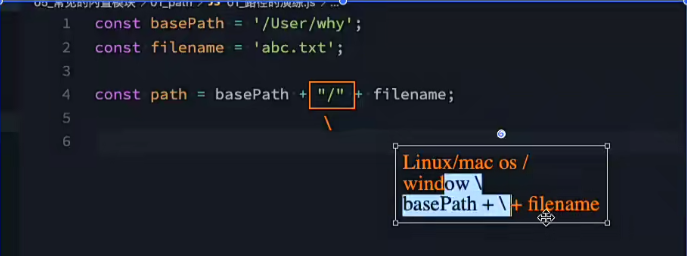

如果我们就随随便便的拼接有可能会出现\的问题，因为不同的操作系统下的斜杠可能不一样

并且我们知道在Mac OS、Linux和window上的路径时不一样的

- window上会使用 \或者 \\ 来作为文件路径的分隔符，当然目前也支持 /；
- 在Mac OS、Linux的Unix操作系统上使用 / 来作为文件路径的分隔符；

那么如果我们在window上使用 \ 来作为分隔符开发了一个应用程序，要部署到Linux上面应该怎么办呢？

- 显示路径会出现一些问题；
- 因为你的字符串 \ , 是写死的，所以别人是不会给你转化的，也就是说拼接的就是这个样子了
- 如果路径分隔符不同，可能会报错
- 所以为了屏蔽他们之间的差异，在开发中对于路径的操作我们可以使用 path 模块；

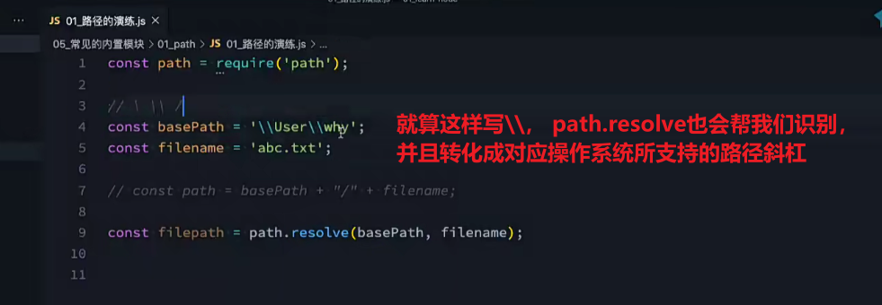

path.resolve将，两个路径进行合并在一起，这里主要强调，因为路径的分隔符在不同操作系统或者设备下可能会不同，所以我们不能写死，可以通过path.resolve方法将他们拼接，这样path.resolve给我们拼接在一起的路径是符合当前设备支持的路径分隔符的

这里就做了修改

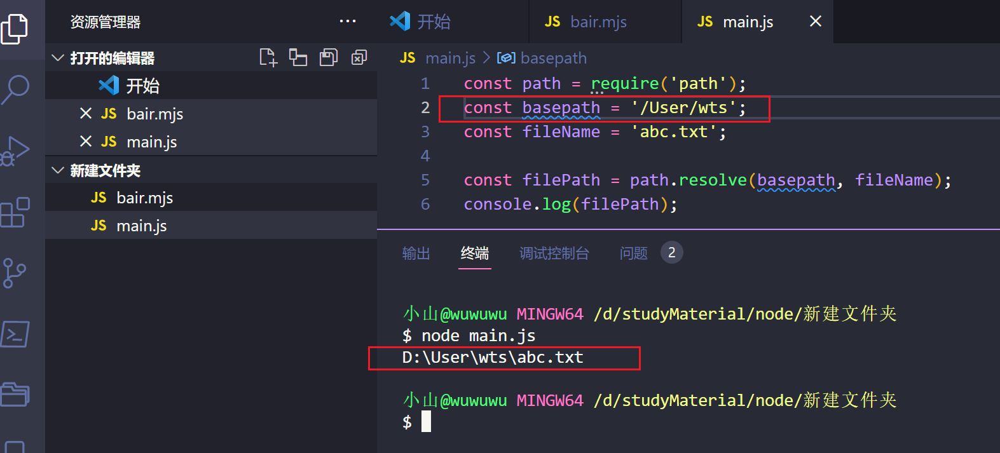


为什么会出现这样一个差异呢？ 

IEEE是一个协会，制定了一个标准叫可移植操作系统接口（英语：Portable Operating System Interface，缩写为POSIX）

- 其中一个标准就是路径分隔符的规定

- Linux和Mac OS都实现了POSIX接口；
- Window部分电脑实现了POSIX接口；
- 所以Linux和mac os以及部分window电脑是\, 但是window也有不同的斜杠

这就是我们使用path模块的原因，如果我们不使用path模块我们也可以做字符串的拼接，但是不能做到跨平台适配

注意：

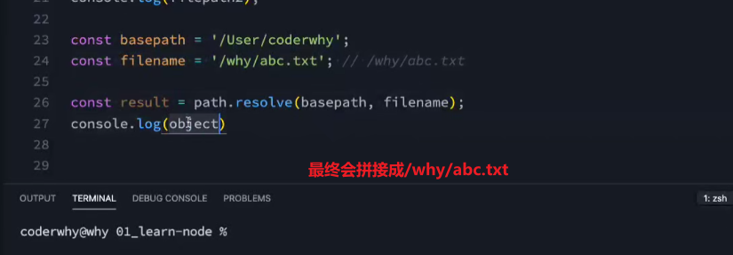

为什么会拼接成/why/abc.txt呢，因为你的why前面有一个/有一个/的话，就会被当成一个绝对路径，它拼接出来的结果就是一个绝对路径，所以如果想获取到正确的路径\why前面是不能加\的

但是如果你的前面是./,就会把你当成一个相对路径，它和why/abc.txt是一样的

但是如果是../ 就会找到上一个路径的

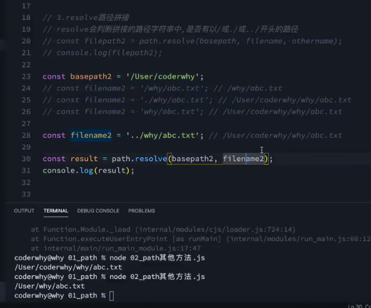


## path常见的API

从路径中获取信息

- dirname：获取文件的父文件夹；

- basename：获取文件名；
- extname：获取文件扩展名；

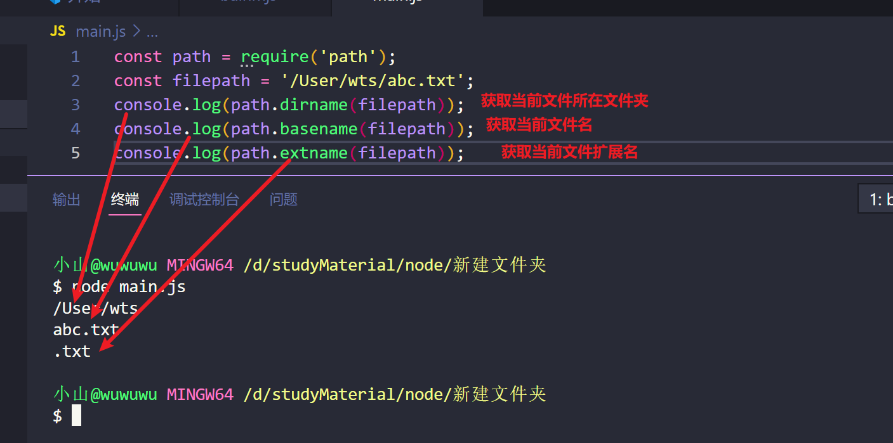

路径的拼接

- 如果我们希望将多个路径进行拼接，但是不同的操作系统可能使用的是不同的分隔符；
- 这个时候我们可以使用path.join函数；

将文件和某个文件夹拼接

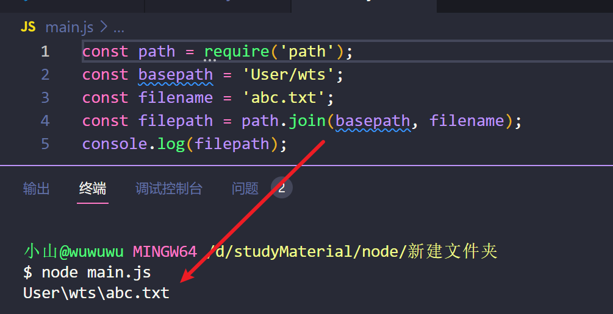

那么它和resolve拼接有什么区别呢？


最主要的区别，path.resolve会帮我们查找拼接的所有的字符串里面，会查找字符串里面最前面这里有没有 / 路径分隔符

resolve会判断拼接的路径字符串中，是否有以/或./或../开头的路径

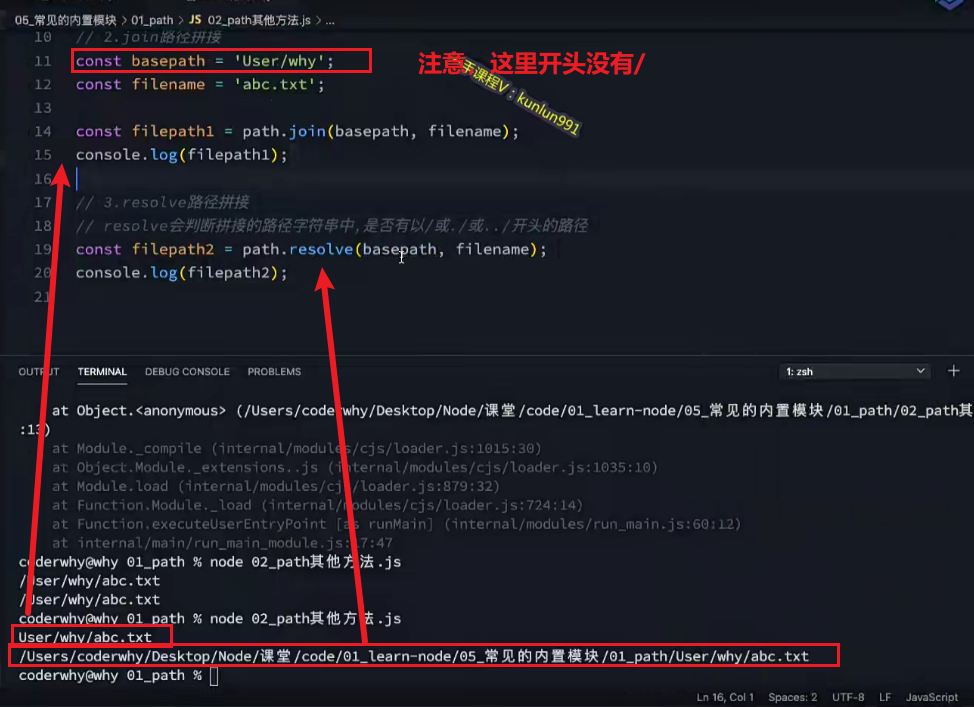

如果，你的User没有加/ ， 那么我会拿到当前文件的所在路径，拼接到这个的前面

如果是./

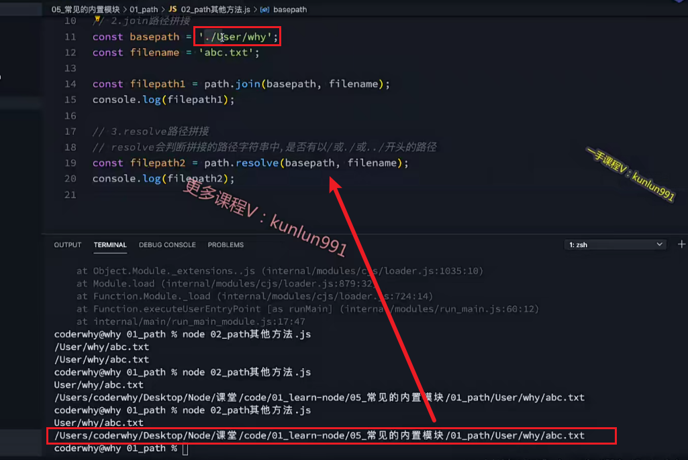

还是这个样子，甚至还把./，还是当前忽略掉了，如果是../呢

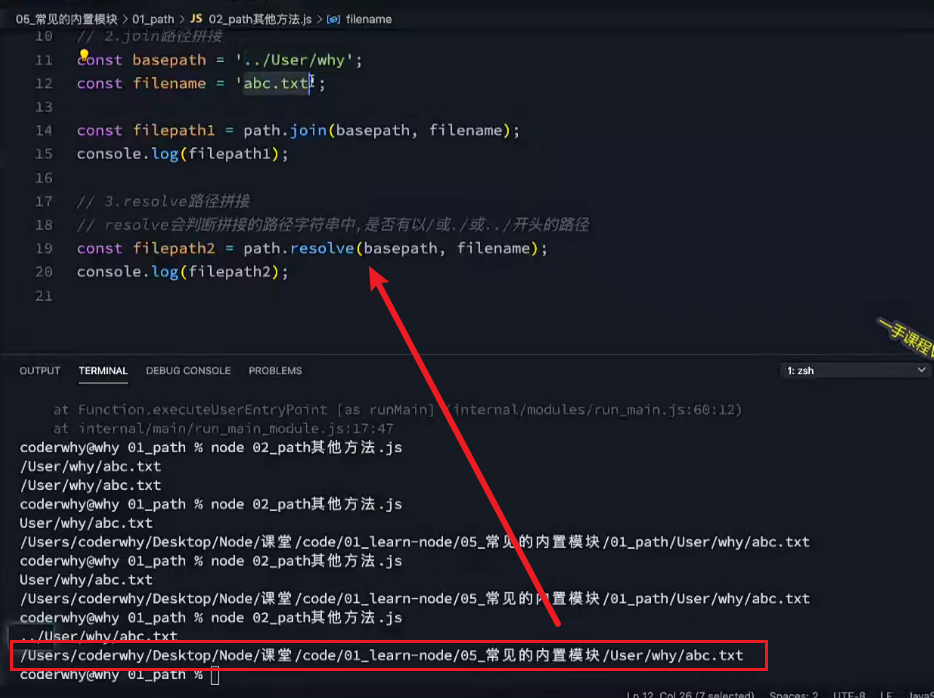

它会先找到当前这个路径的上一个路径，找到这个路径之后拼接上user/why/abc.txt

所以join这个方法是直接拼接上文件名，但是resolve会根据当前路径的不同分隔，来拼接上不同的路径

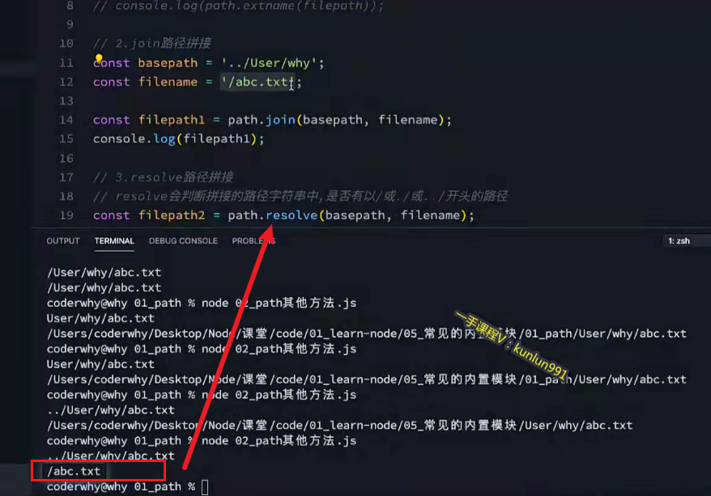

还存在这种文件名前面加上/的话，最终会是拼接成这个样子

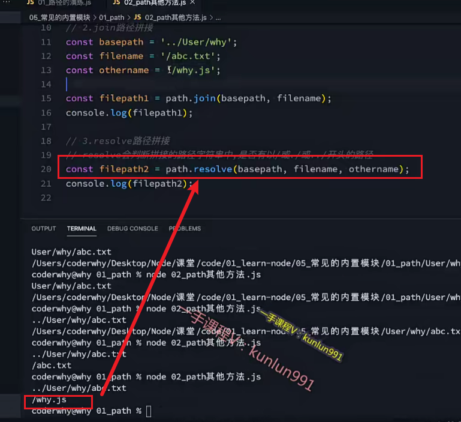

所以resolve会更只能一些，他会根据是拼接的前面有没有 / ,甚至是什么 / 来为你拼上不同的路径

但是join就是一个单纯的拼接

这里是官方文档

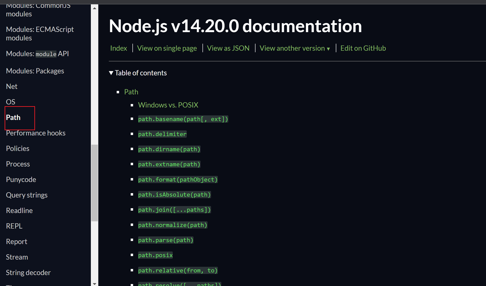

用的最多的是path.resolve

而且在webpack中存在大量的path.resolve


## 在webpack中的使用

在webpack中获取路径或者起 别名的地方也可以使用

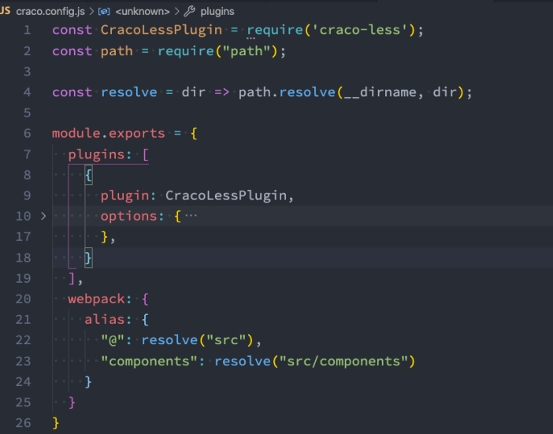

上面的path.resolve,第一个参数__dirname表示当前文件所在的文件夹，第二个参数表示当前文件名，之所以用resolve但是不用字符串相加，就是因为分隔符要动态的，不能硬编码，之后我在调用的时候，我就可以给这个文件起个别名了。

使用import来加载也是可以的

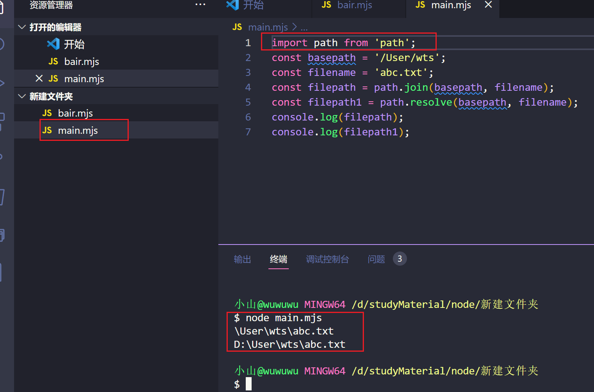

node实现了commojs,也实现了esmodule，所以它可以通过import来导入path，并且使用它


## 内置模块fs

fs是File System的缩写，表示文件系统。

对于任何一个为服务器端服务的语言或者框架通常都会有自己的文件系统：

- 因为服务器需要将各种数据、文件等放置到不同的地方；
- 比如用户数据可能大多数是放到数据库中的（后面我们也会学习）；
- 比如某些配置文件或者用户资源（图片、音视频）都是以文件的形式存在于操作系统上的；
- 这个时候我们就需要对文件进行一些操作

Node也有自己的文件系统操作模块，就是fs：

- 借助于Node帮我们封装的文件系统，我们可以在任何的操作系统（window、Mac OS、Linux）上面直接去 操作文件；
- 这也是Node可以开发服务器的一大原因，也是它可以成为前端自动化脚本等热门工具的原因；


## fs的API介绍

Node文件系统的API非常的多：

- https://nodejs.org/dist/latest-v14.x/docs/api/fs.html
- 我们不可能，也没必要一个个去学习；
- 这个更多的应该是作为一个API查询的手册，等用到的时候查询即可；
- 学习阶段我们只需要学习最常用的即可；

但是这些API大多数都提供三种操作方式：

- 方式一：同步操作文件：代码会被阻塞，不会继续执行；
- 方式二：异步回调函数操作文件：代码不会被阻塞，需要传入回调函数，当获取到结果时，回调函数被执行；'
- 方式三：异步Promise操作文件：代码不会被阻塞，通过 fs.promises 调用方法操作，会返回一个Promise， 可以通过then、catch进行处理；

比如read，大概就给我们提供了两三种的操作方式


读取文件信息，读取的是文件的大小等等信息


1、同步操作 

 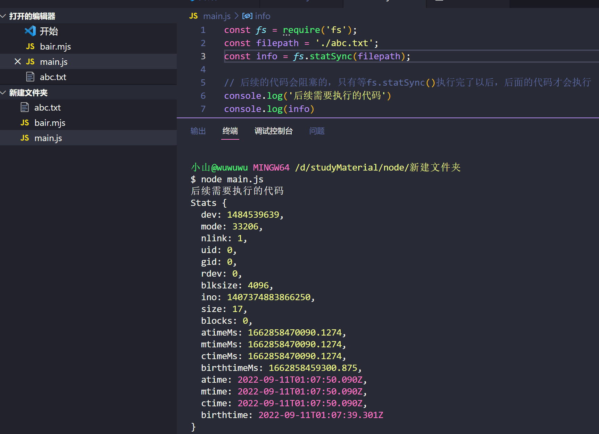

size：大小

下面一些时间就是创建时间，修改时间等，当然并不是当前时区的时间，如果想拿到当前时区的时间，还需要做一个转化


2、异步操作

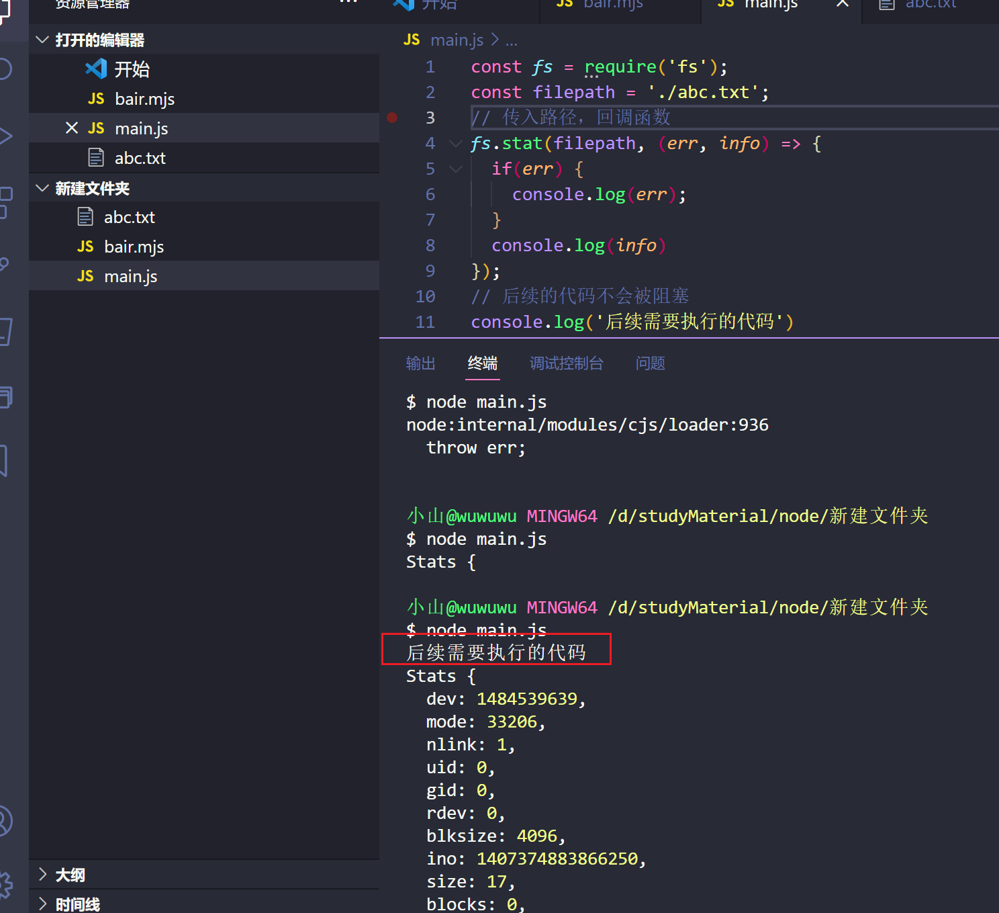

当前这个方法是不会影响主线程的执行

内部的原理是和node底层的异步IO是有关系的，总之这里是不会阻塞的，但是这里非常容易出现回调地狱的


3、promise的方式

现在他支持了promise，但是并不是所有的都是promise，而且可以看一下它是从什么时候开始支持promise的

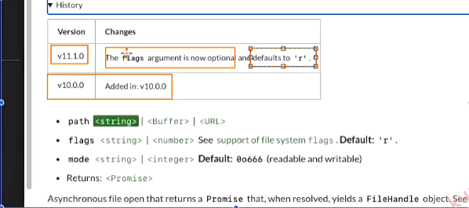

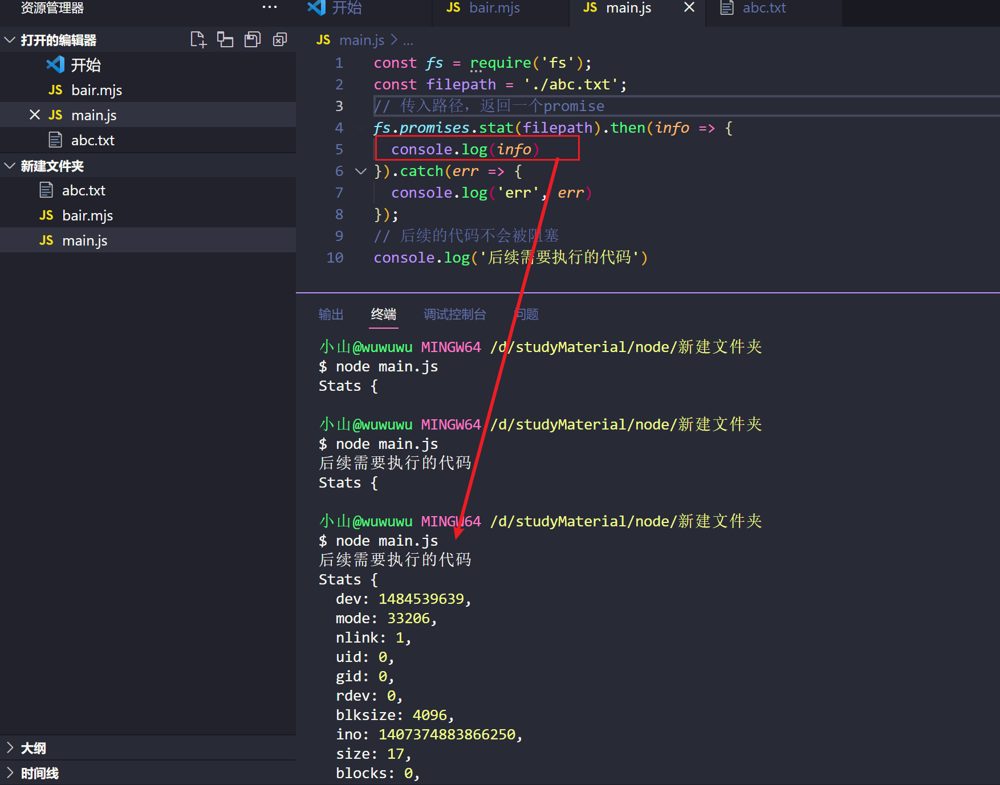

这里很多fs的方法都提供了promise的方式


## 文件描述符

文件描述符（File descriptors）是什么呢？

- 在 POSIX（linux mac都实现了这个接口)系统上，对于每个进程，内核都维护着一张当前打开着的文件和资源的表格。
- 每个打开的文件都分配了一个称为文件描述符的简单的数字标识符。
- 在系统层，所有文件系统操作都使用这些文件描述符来标识和跟踪每个特定的文件。
- Windows 系统使用了一个虽然不同但概念上类似的机制来跟踪资源。
- 前面在获取文件状态的话(fs.stat),其实也是需要文件描述符的，只不过我们可以隔过这个文件描述符直接操作这个文件的
- 如果你想拿到文件描述符，你可以用open
- open也是有三种调用方式的，open的同步调用以及open的两种异步调用

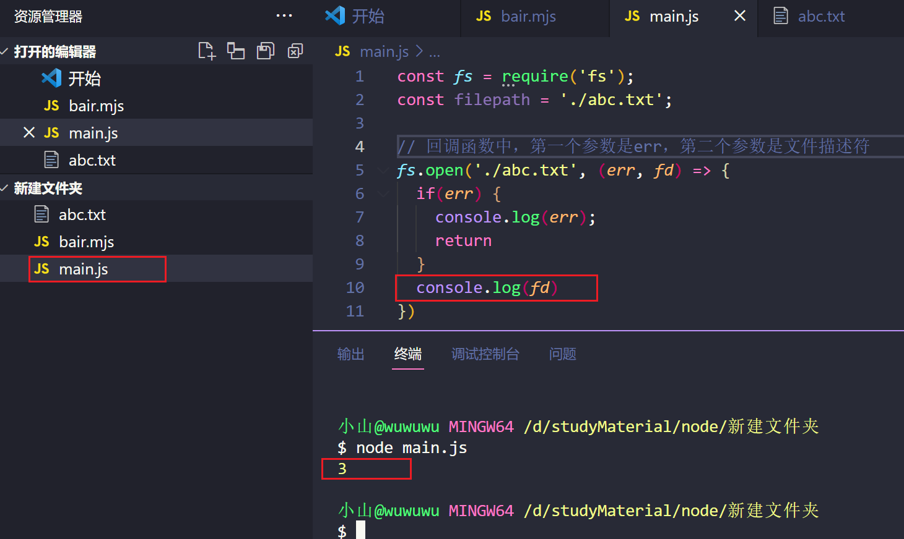

3就是文件的描述符，我们可以通过描述符去操作文件

刚才我们去获取文件信息是通过fs.stat()来获取文件信息的，但是现在我们可以通过文件描述符来获取文件信息

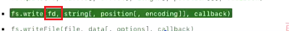

包括文档中有很多fd，表示可以通过文件描述符来查找到文件

这里来通过文件描述符来查看文件的信息

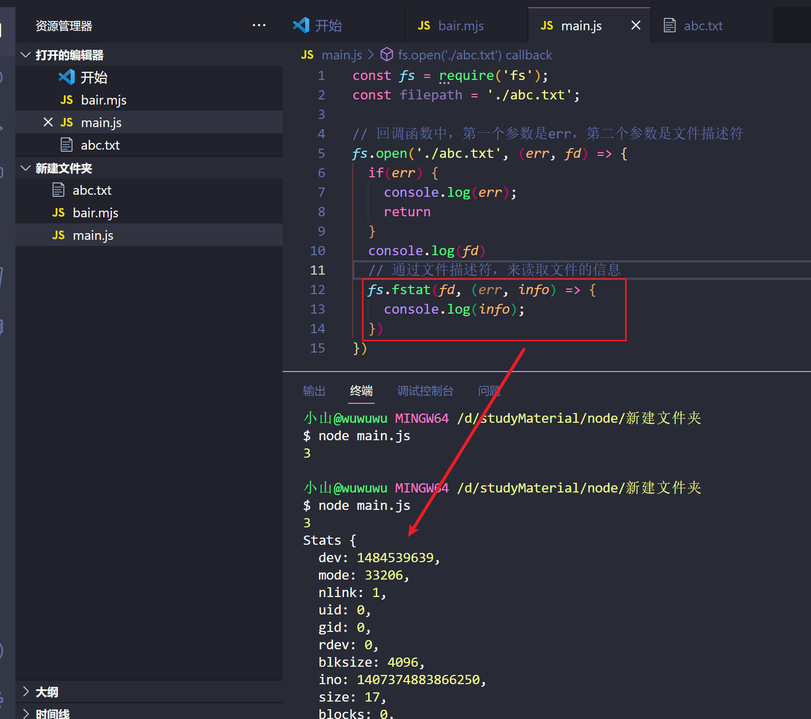

和fs.fstat传入文件路径的查看结果是一样的，可见使用文件描述符也是可以查看文件信息的

文件描述符非常重要，但是从API的层面的话，他把很多使用文件描述符的东西，都给我们屏蔽掉了，

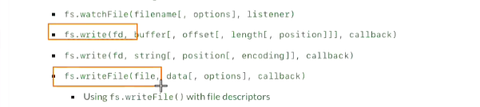

比如这里，write这个方法，是需要传入文件描述符的，但是它还给我们提供了writeFile方法，这个方法就不需要提供文件描述符，直接提供文件路径就行了，所以很多都有屏蔽的API，但是原理还是先调用了文件描述符，再通过文件描述符来查找文件，并对文件做一个操作的 

为了简化用户的工作，Node.js 抽象出操作系统之间的特定差异，并为所有打开的文件分配一个数字型的文件描述符。

- fs.open() 方法用于分配新的文件描述符。
- 一旦被分配，则文件描述符可用于从文件读取数 据、向文件写入数据、或请求关于文件的信息。

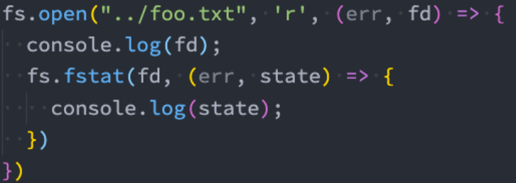


## 文件的读写

如果我们希望对文件的内容进行操作，这个时候可以使用文件的读写：

- fs.readFile(path[, options], callback)：读取文件的内容；
- fs.writeFile(file, data[, options], callback)：在文件中写入内容；

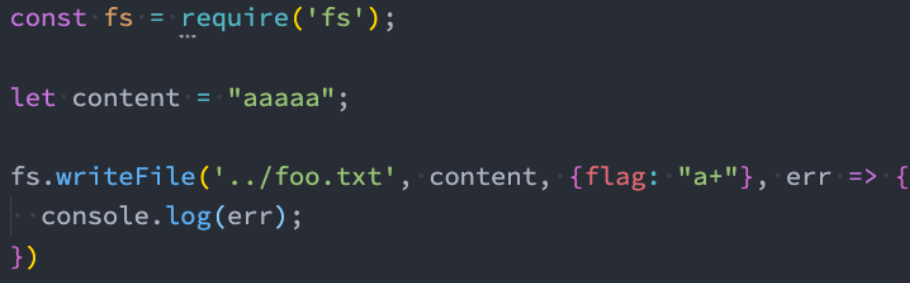

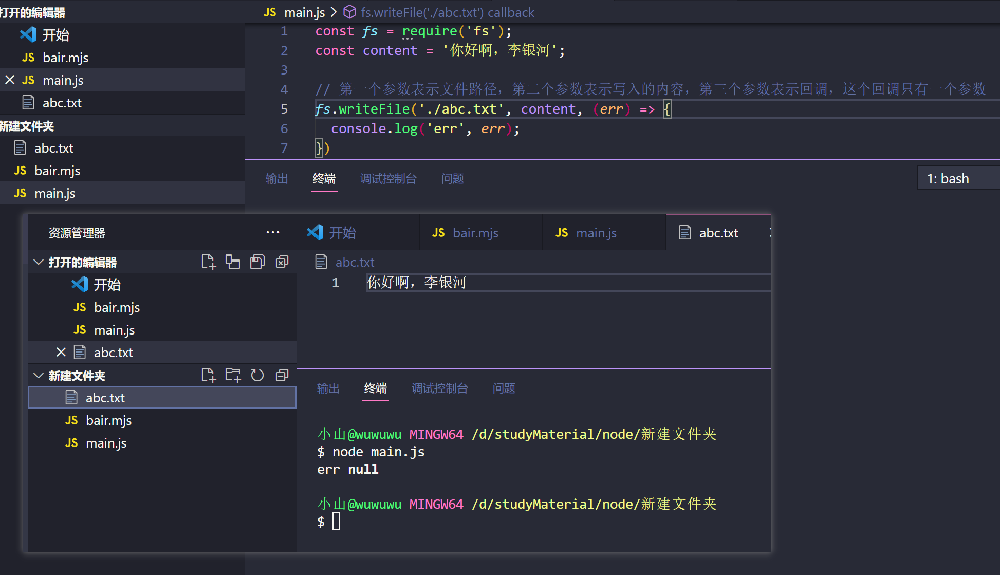

当然在官网中，wirteFile并不是只有三个参数，它还有其他的参数，也就是flag

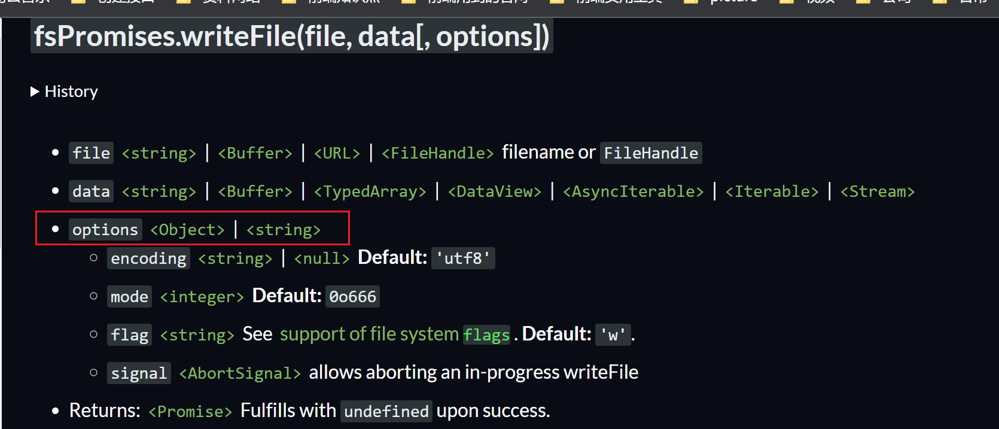

官网中returns之前还有一个参数是options

在上面的代码中，你会发现有一个大括号没有填写任何的内容，这个是写入时填写的option参数：

- flag：写入的方式。
- encoding：字符的编码；


## flag选项

我们先来看flag：

flag的值有很多：https://nodejs.org/dist/latest-v14.x/docs/api/fs.html#fs_file_system_flags

- w 打开文件，并在文件中写入内容，默认值；
- w+打开文件进行读写，如果不存在则创建文件；
- r+ 打开文件进行读写，如果不存在那么抛出异常；
- r打开文件读取，读取时的默认值；
- a打开要写入的文件，将流（写入的内容）放在文件末尾。如果不存在则创建文件；
- a+打开文件以进行读写，将流放在文件末尾。如果不存在则创建文件


a 追加

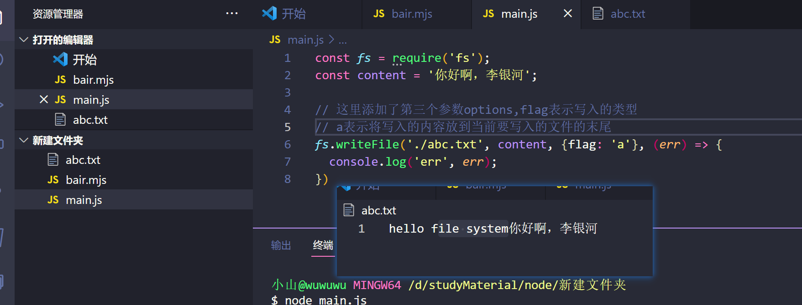


## encoding（编码）选项

我们再来看看编码：

- 我之前在简书上写过一篇关于字符编码的文章：https://www.jianshu.com/p/899e749be47c
- 目前基本用的都是UTF-8编码；

文件读取：

- 如果不填写encoding，返回的结果是Buffer；

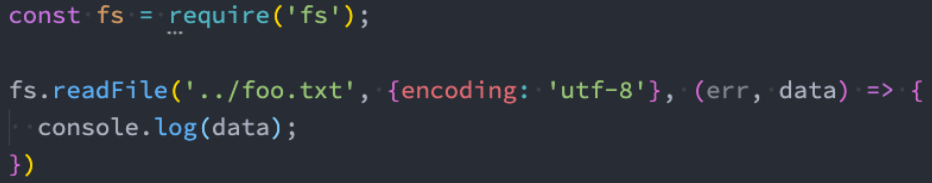

如果不指定的话，就是默认的utf-8

最简单的一种演练

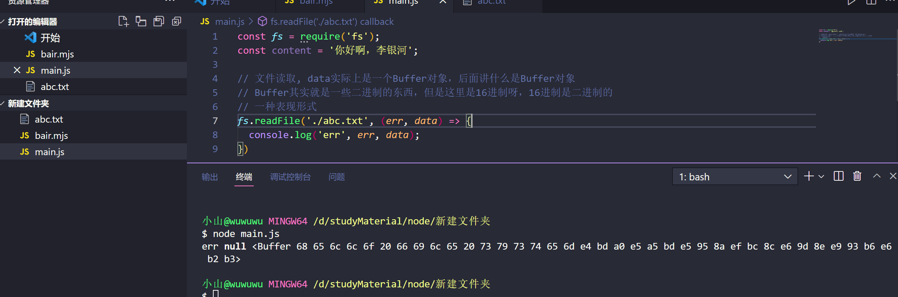

为什么这里是16进制的一种东西呢？因为他不知道要给你什么样的一种表现形式，如果你知道它的编码的话，你可以传入一种参数

不能使用gbk编码，会报错

这样呢？

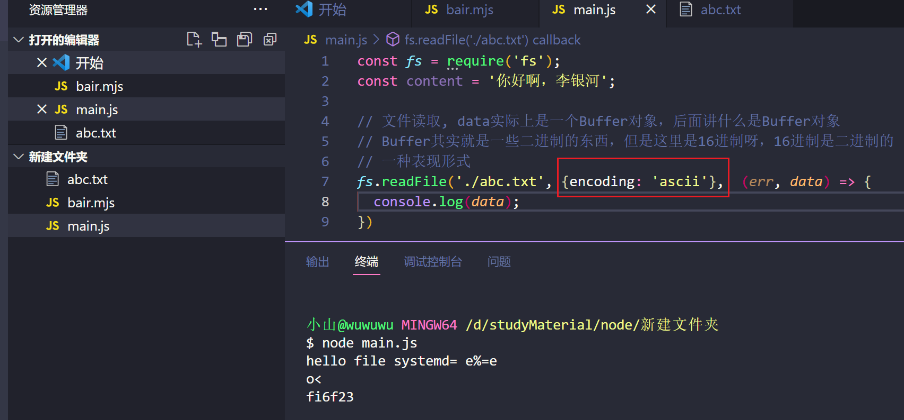

可以发现前面是可以的，但是后面的中文就不行了，本来文件是这样的

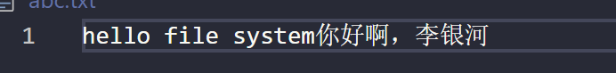

发现英文显示是正常的，但是中文的显示就是有问题的

那我们来使用utf8

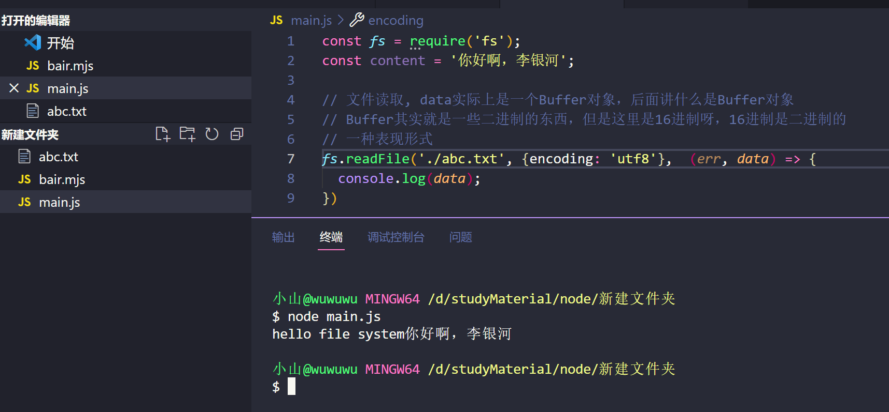

这样显示就是正常的了

所以这样编码就对了，那么显示的也就对了


## 文件夹操作

新建一个文件夹

- 使用fs.mkdir()或fs.mkdirSync()创建一个新文件夹；

 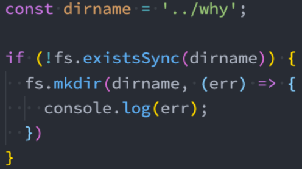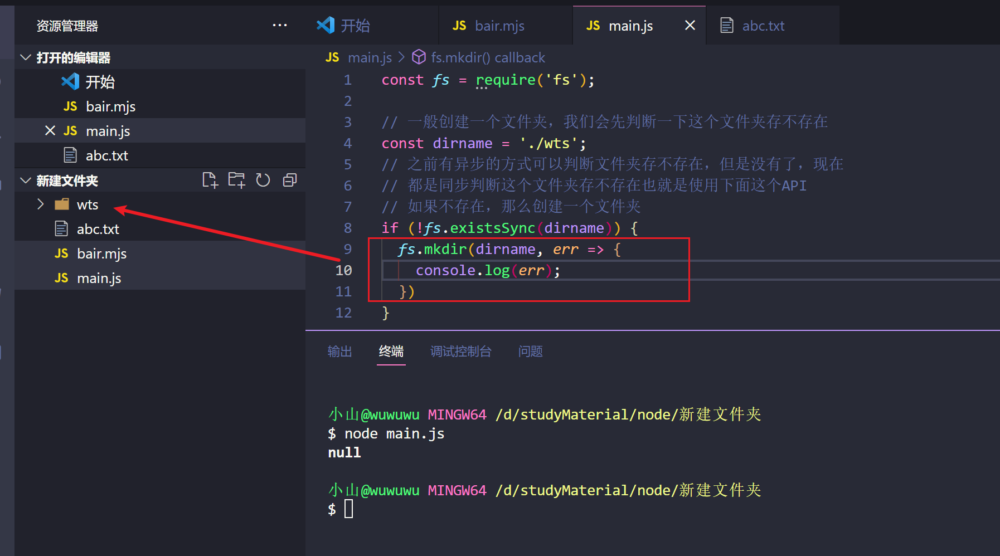

这样就创建了一个文件夹


获取文件夹的内容

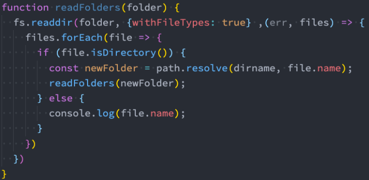

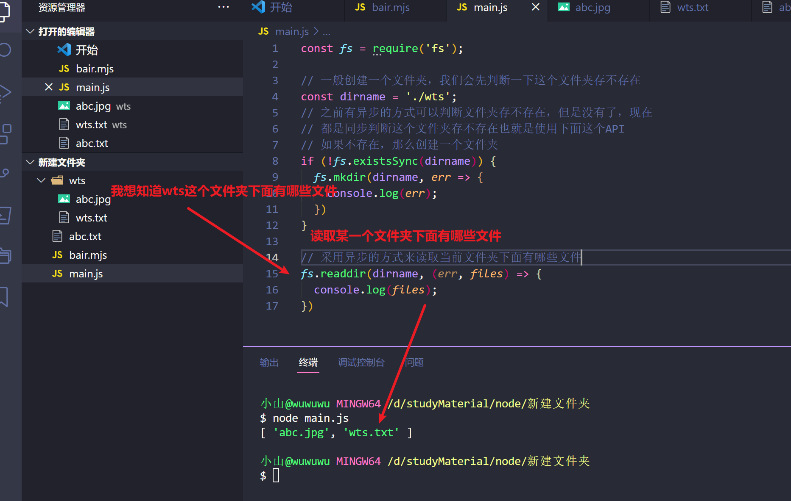

那假如wts这个文件夹下面又有一个文件夹怎么办呢？

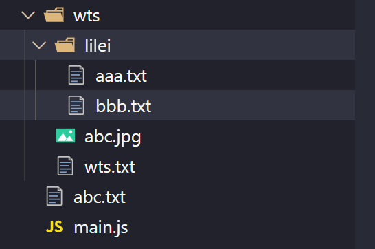

那假如我想读取一个文件夹下面所有的文件，包括lilei下面的文件，不管嵌套，只管文件，那这个时候应该怎么办呢？

如果还是以上面的方法来调用，那么会是这样


这是一个文件夹

那么我们实际上想要的是所有的文件，所以我们需要递归调用

这个东西涉及递归调用

因为我们需要判断这个文件下的内容到底是文件，还是文件夹，所以我们在前面讲过读文件有一个API叫 

fs.stat这个可以获取到读到的是文件的具体信息，但是其实返回的内容还提供了一些方法

这个方法可以获取一大堆的文件信息，包括创建时间啊，大小啊等等

但是他其实还有一个方法，叫info.isFile() 

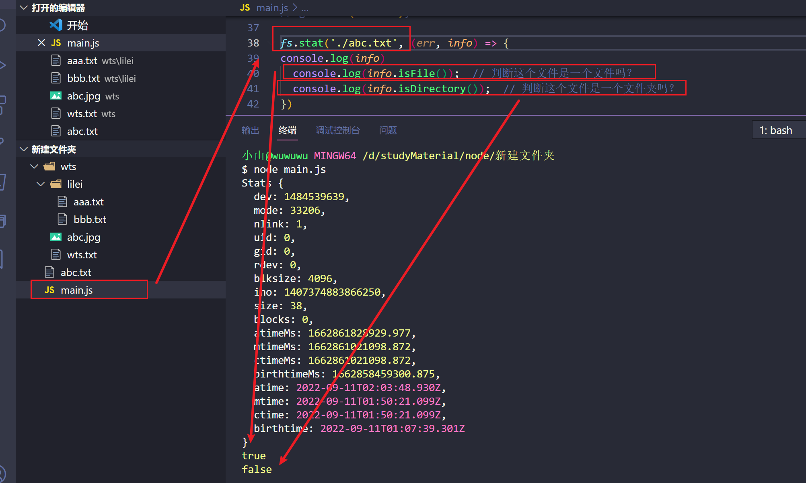

如果通过这种方式的话可能要这样写

```js
function getFiles(dirname) {
  fs.readdir(dirname, (err, files) => {
    console.log(files);
    for(let file of files) {
      // console.log(file);
      // 你如果直接用这种方式来判断，你还需要把前面的路径给拼上，也就是这样
      // 将当前路径，以及打开的文件夹，以及文件进行拼接,获取这个文件的路径（这里获取到的是绝对路径）
      let path1 = path.resolve(__dirname, dirname, file);
      // 拿到这个文件的详细信息
      fs.stat(path1, (err, info) => {
        // 判断这个文件是否是文件夹
        if(info.isDirectory()){
          console.log(info, '是文件夹')
          getFiles(path1);
        }
      })
    }
  })
}
```

上面的方式可以，但是有点麻烦

readdir还可以额外的传递一个参数

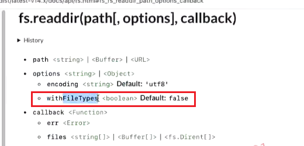

是否把这个文件类型传进来，这个时候打印的就不是一个字符串了，刚才打印的这个是一个字符串，但是现在就不是一个字符串了

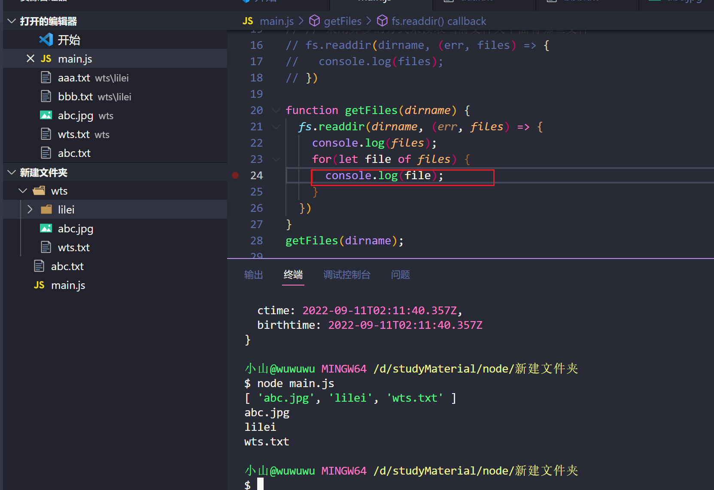

这里是字符串，但是加上这个参数以后就不是一个字符串了

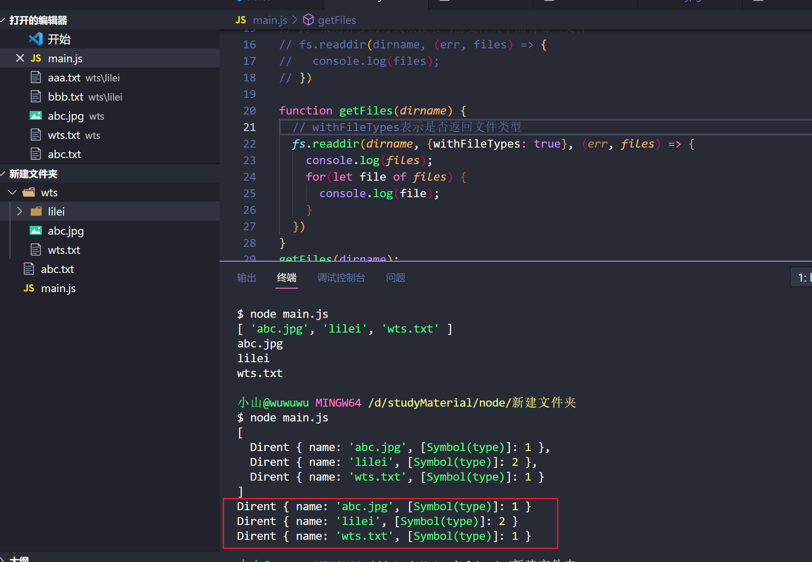

它是一个对象，当你是一个对象的时候实际上你是有一个方法的，叫isDirectory()，判断你是否是一个文件夹，如果你是一个文件夹，那么就会返回true

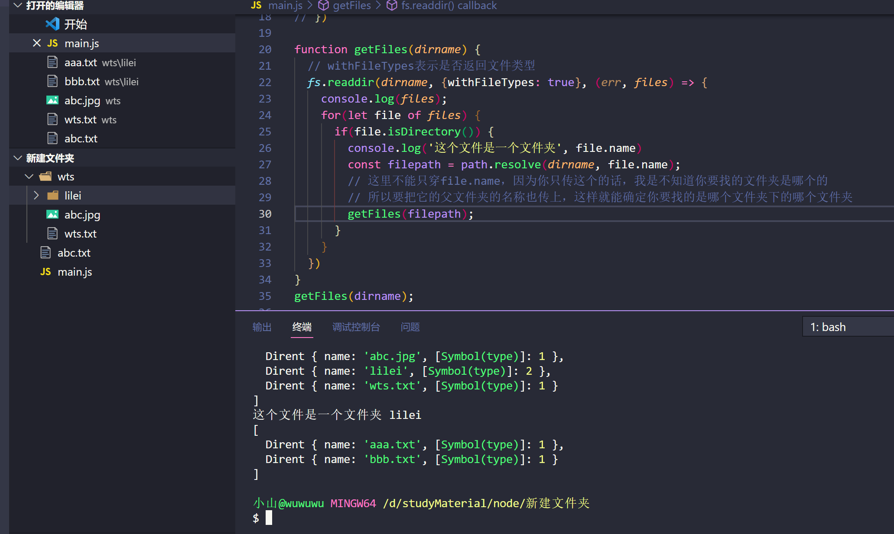

这样，我们就能找到一个文件夹下所有的文件了，包括文件夹下的文件夹


文件重命名

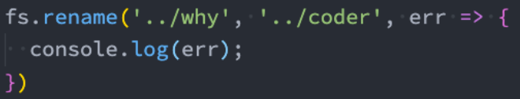

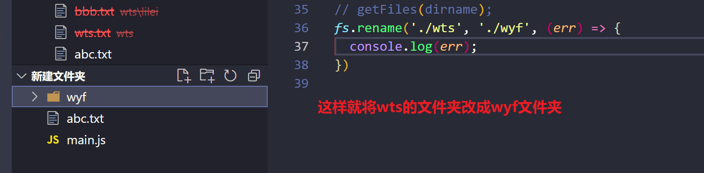


## 文件夹的复制


在操作系统上面，有可能想要做一件事情，就是把一些文件从一个地方复制到另一个地方，但是这个文件可能太多了，而且，由于有些东西是不想复制的，而且在赋值的过程中，可能还想创建一些另外的东西，如果一个一个的赋值，可能太慢了，那么应该怎么做呢？可以写成一个自动化

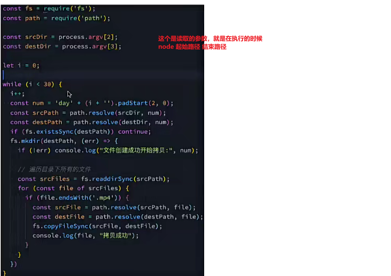

```js
const path = require('path');
const fs = require('fs');

// 拿到输入和输出
let inputDir = process.argv[2];
let outputDir = process.argv[3];

// 读取输出的文件夹，如果没有就创建
console.log('开始创建输出文件夹名称')
fs.readdir(outputDir, {flag: 'w+'}, (err) => {
  console.log('输出文件夹创建成功，名称为', outputDir)
  if (err) {
    fs.mkdir(outputDir, (err) => {
      console.log('文件创建失败', err)
    })
  }
})


// 去输入里面找视频和文件，并且找到后放到一个文件夹里面去
// 遍历输入的文件夹
fs.readdir(inputDir, { withFileTypes: true }, (err, files) => {
  // 遍历每一个文件
  for (let i = 0; i < files.length; i++) {
    // 拿到每一个文件
    let item = files[i];
    let itemArr = item.name.split('.')
    // 拿到文件后缀名
    let suffix = itemArr[itemArr.length - 1];
    // 拿到文件名
    let newItemArrName = itemArr.slice(0, itemArr.length - 1).join('')
    // 如果是视频，在输出的文件夹中创建一个和视频名称相同的文件夹，然后把视频放进去，并创建一个笔记也放进去
    if (suffix === 'mp4') {
      let itemPath = path.join(outputDir, newItemArrName)
      // 创建一个相同名字的文件夹
      console.log('开始创建单个视频的子文件夹')
      if(!fs.existsSync(itemPath)){
        fs.mkdirSync(itemPath)
        console.log('单个视频的子文件夹创建成功')
      }else {
        continue;
      }
      // 拿到新的路径
      let newPath = path.join(itemPath, item.name)
      console.log('开始复制ma4文件，名称为', newPath);
      // 把视频拷贝到新创建的文件夹中
      fs.copyFileSync(item.name, newPath)
      // 创建笔记，并且把笔记放进去
      let content = `${newItemArrName}笔记内容`
      let noteName = item.name + '的笔记.md'
      let noteNamePath = path.join(itemPath, noteName)
      console.log('开始创建笔记', noteNamePath);
      fs.readFileSync(noteNamePath, { flag: 'w+' })
      console.log('笔记创建成功，开始给笔记写入内容');
      fs.writeFileSync(noteNamePath, content)
      console.log('笔记内容写入成功')
    }
  }
})


// 将找到的文件放到一个文件夹里面


// 将所有的文件夹放到输出里面去
```

这里自己搞了一个


## events模块

Node中的核心API都是基于异步事件驱动的：

- 在这个体系中，某些对象（发射器（Emitters））发出某一个 事件；
- 我们可以监听这个事件（监听器 Listeners），并且传入的回 调函数，这个回调函数会在监听到事件时调用；

发出事件和监听事件都是通过EventEmitter类来完成的，它们都属 于events对象。

- emitter.on(eventName, list ener)：监听事件，也可以使用 addListener；
- emitter.off(eventName, listener)：移除事件监听，也可以使用removeListener；
- emitter.emit(eventName[, ...args])：发出事件，可以携带一些参数；

导入的东西是一个类 

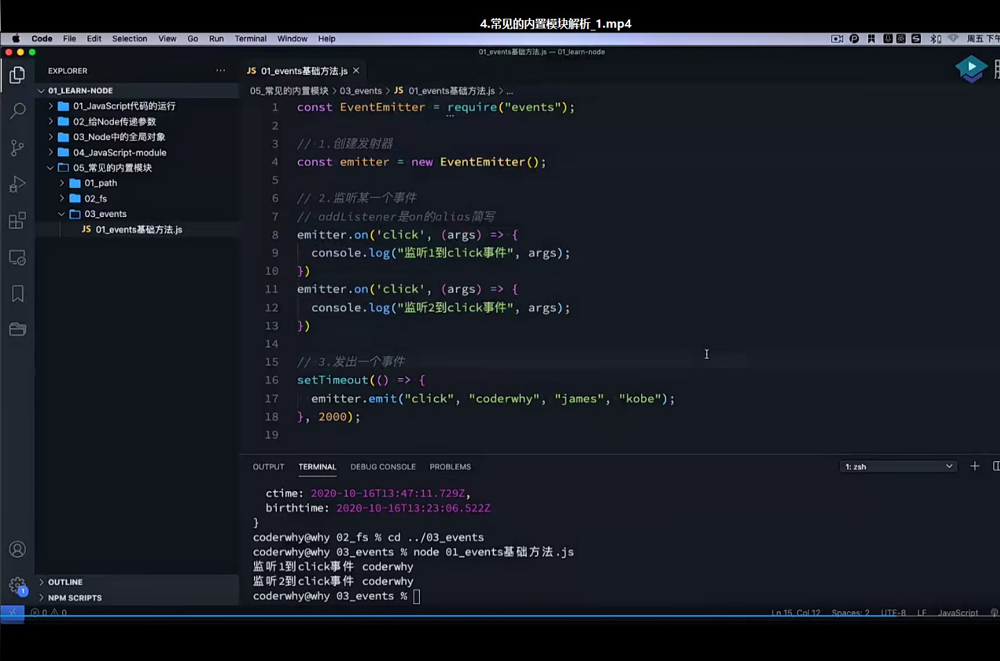

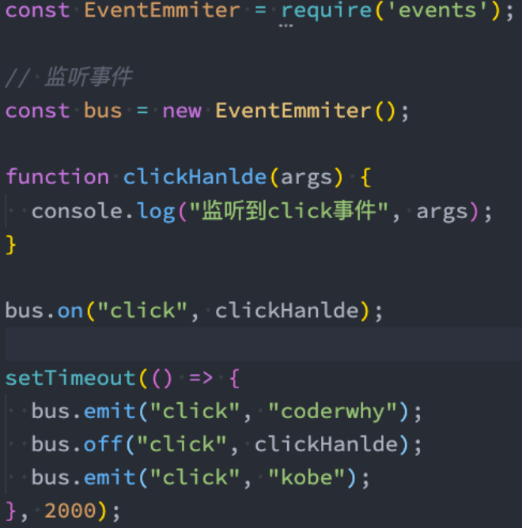

off关闭监听，这里是关闭了其中一个监听


## 常见的属性

EventEmitter的实例有一些属性，可以记录一些信息：

- emitter.eventNames()：返回当前 EventEmitter对象注册的事件字符串数组；

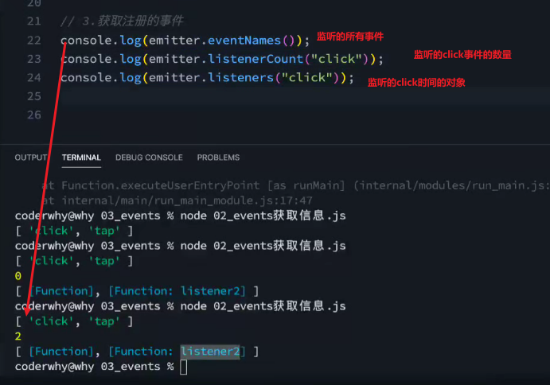

- emitter.getMaxListeners()：返回当前 EventEmitter对象的最大监听器数量，可以通过setMaxListeners() 来修改，默认是10；
- emitter.listenerCount(事件名称)：返回当前 EventEmitter对象某一个事件名称，监听器的个数；
  - 比方说click这个事件有几个监听函数

- emitter.listeners(事件名称)：返回当前 EventEmitter对象某个事件监听器上所有的监听器数组；

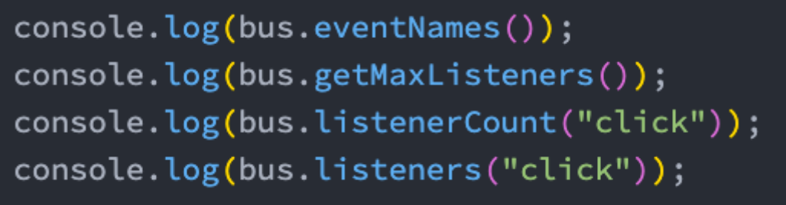


## 方法的补充

emitter.once(eventName, listener)：事件监听一次

emitter.prependListener()：将监听事件添加到最前面

emitter.prependOnceListener()：将监听事件添加到最前面，但是只监听一次

emitter.removeAllListeners([eventName])：移除所有的监听器，如果传入参数的话，表示移除哪些监听器

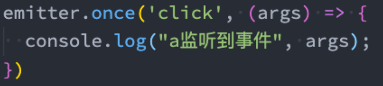

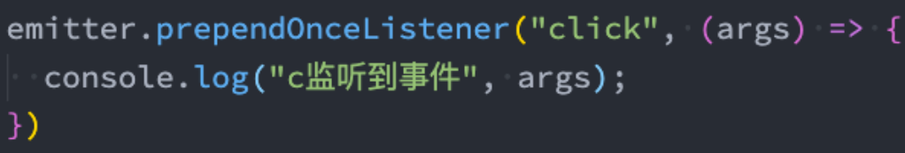

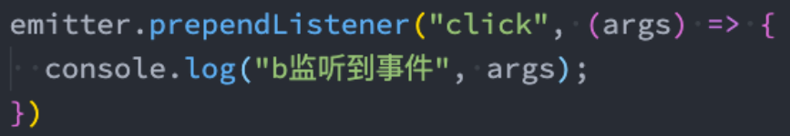

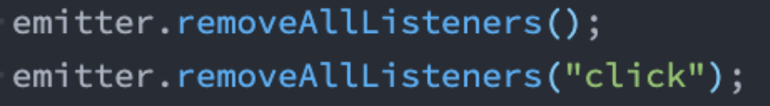


node中的每一个js文件都是一个模块，在运行的时候node会拿到这些模块，然后把他放到一个沙盒中执行，这个沙盒实际上就是一个函数，这个函数不是一个箭头函数，它就是一个普通的函数，所以他也是有绑定arguments的，所以我们在模块中是可以打印arguments，这个auguments理论上来说应该是函数传递进来的参数，而且模块中的最外层this指向的是一个空对象，这是因为node在执行这个函数的时候有绑定this，绑定的是谁呢？

绑定的是exports，并且在初始的时候exports会赋值一个空对象，所以它是一个空对象

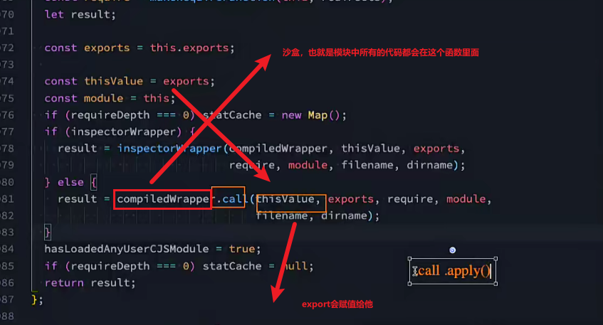


