## Web服务器

什么是Web服务器？

- 当应用程序（客户端）需要某一个资源时，可以向一个台服务器，通过Http请求获取到这个资源；提供资源的这个服务器，就是一个Web服务器；

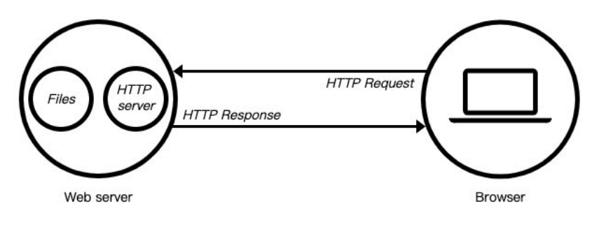

目前有很多开源的Web服务器：Nginx、Apache（静态）、Apache Tomcat（静态、动态）、Node.js


### Web服务器初体验

```js
const http = require('http');
const HTTP_PORT = 8000;

// 启动服务器
const server = http.createServer((req, res) => {
  res.end('hello world');
})

// 启动服务器，参数一：监听的端口号，参数二：主机地址，参数三: 回调函数
server.listen(8000, ‘0.0.0.0’， () => {
  console.log(`服务器在${HTTP_PORT}启动~`);
})
```

> - 一般端口号要写1024以上的，1024以下被系统应用占用了
> - 主机地址可以不传
> - listen是一个异步函数
> - end相当于做了两个操作，一个是write，一个是close


## 创建服务器

创建服务器对象，我们是通过 createServer 来完成的

- http.createServer会返回服务器的对象；
- 底层其实使用直接 new Server 对象。

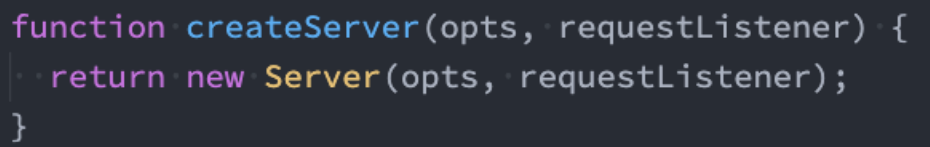

那么，当然，我们也可以自己来创建这个对象：

```js
const http = require('http');
const server = new http.Server((req, res) => {
  res.end('Hello world');
});

server.listen(8888, () => {
  console.log('服务器启动成功')
})
```


上面我们已经看到，创建Server时会 传入一个回调函数，这个回调函数在 被调用时会传入两个参数：

- req：request请求对象，包含请求相关的信息；
- res：response响应对象，包含我们要发送给客户端的信息；


## nodemon

上面其实有一个问题，就是没修改一点代码，就需要重启服务器，也就是需要重新执行这个文件，这样很耗时的，所以可以下载一个库

```js
npm install -g nodemon
```

执行

```js
nodemon 文件名
```

这样修改了就会自动重启服务器

所以我们可以这样

```js
const http = require('http');
const server = new http.Server((req, res) => {
  res.end('Hello world');
});

server.listen(8888, '127.0.0.1', () => {
  console.log('服务器启动成功')
})

// 服务器会监听我们代码的修改了

$ nodemon index.js
[nodemon] 2.0.20
[nodemon] to restart at any time, enter `rs`
[nodemon] watching path(s): *.*
[nodemon] watching extensions: js,mjs,json
[nodemon] starting `node index.js`
服务器启动成功
```


同时启动两个服务器

```js
const http = require('http');

// 服务器1
const server = new http.Server((req, res) => {
  res.end('Hello world');
});
server.listen(8888, '127.0.0.1', () => {
  console.log('服务器启动成功1')
})

// 服务器2
const server1 = new http.Server((req, res) => {
  res.end('Hello world');
});

server1.listen(8889, '127.0.0.1', () => {
  console.log('服务器启动成功2')
})

// 监听服务器
$ nodemon index.js
[nodemon] 2.0.20
[nodemon] to restart at any time, enter `rs`
[nodemon] watching path(s): *.*
[nodemon] watching extensions: js,mjs,json
[nodemon] starting `node index.js`
服务器启动成功1
服务器启动成功2
```

>注意：
>
>- 上面的 new http.Server可以被替换为 http.createServer()
>
>- 并且这种会更简单一些，所以我们一般都会这样写
>
>  ```js
>  const server = http.createServer();
>  server.listen(8000, () => {
>      console.log('服务器启动成功')
>  })
>  ```
>
>这两种的本质是一模一样的，在开发中用两个都是可以的 


## 端口号

可以发现，端口号是可以不写的，如果不写端口号，我们怎么拿到端口号呢？

```js

const http = require('http');
const server = http.createServer();
server.listen(() => {

  // 获取启动的端口号
  console.log('服务器启动成功')
  console.log(server.address().port)	// 53700
})
```

他有一个address里面有端口号，这个端口号是随机生成的


## server详细介绍

**Server通过listen方法来开启服务器**，并且在某一个主机和端口上监听网络请求：

- 也就是当我们通过 ip:port的方式发送到我们监听的Web服务器上时；
- 我们就可以对其进行相关的处理；

listen函数有三个参数：

- 端口port: 可以不传, 系统会默认分配端, 后续项目中我们会写入到环境变量中；

- 主机host: 通常可以传入localhost、ip地址127.0.0.1、或者ip地址0.0.0.0，默认是0.0.0.0；
  - localhost：本质上是一个域名，通常情况下会被解析成127.0.0.1； 
  - 127.0.0.1：回环地址（Loop Back Address），表达的意思其实是我们主机自己发出去的包，直接被自己接收；
    - 正常的数据库包经常 应用层 - 传输层 - 网络层 - 数据链路层 - 物理层 ； 
    - 而回环地址，是在网络层直接就被获取到了，是不会经常数据链路层和物理层的； 
  - 比如我们监听 127.0.0.1时，在同一个网段下的主机中，通过ip地址是不能访问的；
  - 0.0.0.0：
    - 监听IPV4上所有的地址，再根据端口找到不同的应用程序； 
    - 比如我们监听 0.0.0.0时，在同一个网段下的主机中，通过ip地址是可以访问的（127.0.0.1可以访问，通过ipconfig获取的ip也可以访问到）；

- 回调函数：服务器启动成功时的回调函数；

> 如果我们的ip地址写的是127.0.0.1的时候，再在浏览器中通过本机的ip来获取的时候，是获取不到的，例如本机的ip是192.168.1.103，我通过192.168.1.103:8000，通过这个地址是获取不到的，我只能通过127.0.0.1或者localhost来获取到
>
> 但是我如果把ip写成0.0.0.0的时候，他就会经过上面所写的所有层，我本机的ip地址192.168.1.103:8000也是可以访问到它的，当然也是可以通过127.0.0.1来访问到的

## request对象

 request对象中封装了客户端给服务器传过来的所有内容

在向服务器发送请求时，我们会携带很多信息，比如：

- 本次请求的URL，服务器需要根据不同的URL进行不同的处理；
- 本次请求的请求方式，比如GET、POST请求传入的参数和处理的方式是不同的；
- 本次请求的headers中也会携带一些信息，比如客户端信息、接受数据的格式、支持的编码格式等；
- 等等...


### GET请求


```js
const http = require('http');
const server = http.createServer((req, res) => {
  // 获取请求地址
  console.log(req.url);
  // 获取请求方式
  console.log(req.method);
  // 获取请求头
  console.log(req.headers);
  res.end('hello world')
});
server.listen('8000', '127.0.0.1', () => {
  console.log('服务器启动成功')
})


// 打印内容
/xixi
GET
{
  host: 'localhost:8000',
  connection: 'keep-alive',
  pragma: 'no-cache',
  'cache-control': 'no-cache',
  'sec-ch-ua': '"Google Chrome";v="111", "Not(A:Brand";v="8", "Chromium";v="111"',
  'sec-ch-ua-mobile': '?0',
  'sec-ch-ua-platform': '"Windows"',
  'upgrade-insecure-requests': '1',
  'sec-ch-ua-mobile': '?0',  'user-agent': 'Mozilla/5.0 (Windows NT 10.0; Win64; x64) AppleWebKit/537.36 (KHTML, like Gecko) Chrome/111.0.0.0 Safari/537.36',  'sec-ch-ua-platform': '"Windows"',
  accept: 'image/avif,image/webp,image/apng,image/svg+xml,image/*,*/*;q=0.8',
  'sec-fetch-site': 'same-origin',
  'sec-fetch-mode': 'no-cors',
  'sec-fetch-dest': 'image',
  referer: 'http://localhost:8000/xixi',
  'accept-encoding': 'gzip, deflate, br',
  'accept-language': 'zh-CN,zh;q=0.9'
}

```


### POST请求

这些信息，Node会帮助我们封装到一个request的对象中，我们可以直接来处理这个request对象：

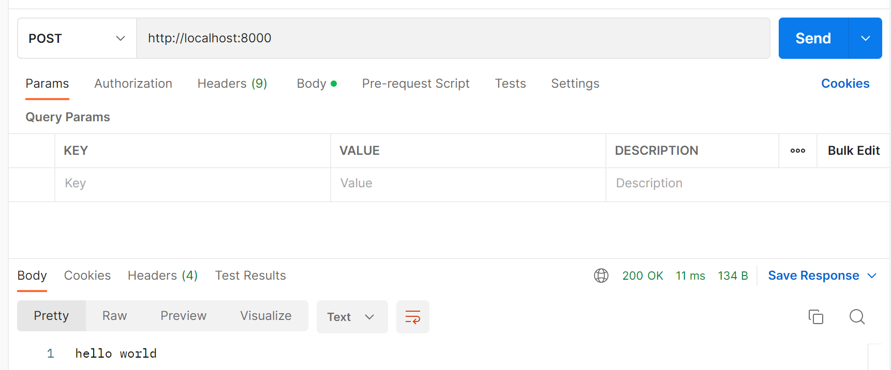

```js
const http = require('http');
const server = http.createServer((req, res) => {
  // 获取请求地址
  console.log(req.url);
  // 获取请求方式
  console.log(req.method);
  // 获取请求头
  console.log(req.headers);
  res.end('hello world')
});
server.listen('8000', '127.0.0.1', () => {
  console.log('服务器启动成功')
})


// 打印内容
/
POST
{
  'content-type': 'application/json',
  'user-agent': 'PostmanRuntime/7.29.2',
  accept: '*/*',
  'cache-control': 'no-cache',
  'postman-token': '5c6154a7-a29a-4624-97a4-fdce499453a4',
  host: 'localhost:8000',
  'accept-encoding': 'gzip, deflate, br',
  connection: 'keep-alive',
  'content-length': '45'
}


```


### request的URL

客户端在发送请求时，会请求不同的数据，那么会传入不同的请求地址：

- 比如 http://localhost:8000/login；
- 比如 http://localhost:8000/products;

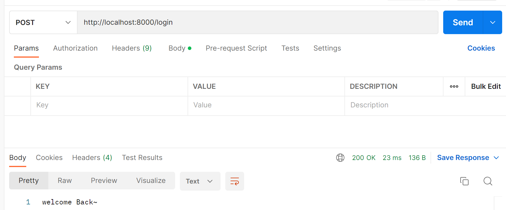

服务器端需要根据不同的请求地址，作出不同的响应：

```js

const http = require('http');
const server = http.createServer((req, res) => {
  const url = req.url;
  console.log(url); // /login  或者  /products
  if (url === '/login') {
    res.end('welcome Back~');
  } else if (url === '/products') {
    res.end('products');
  } else {
    res.end('error message');
  }
});

server.listen('8000', '127.0.0.1', () => {
  console.log('服务器启动成功')
})
```


#### URL的解析

那么如果用户发送的地址中还携带一些额外的参数呢？

- http://localhost:8000/login?name=why&password=123;
- 这个时候，url的值是 /login?name=why&password=123；

我们如何对它进行解析呢？使用内置模块url：

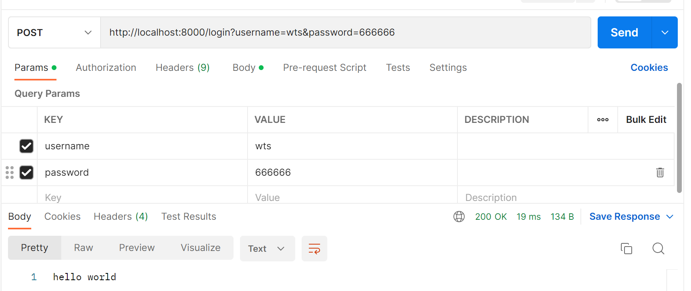

```js
const http = require('http');

// 处理url的模块
const url = require('url');
const server = http.createServer((req, res) => {
  // 取到url相关的信息
  const parseInfo = url.parse(req.url);
  console.log('url信息', parseInfo);
  res.end('hello world')
});

server.listen('8000', '127.0.0.1', () => {
  console.log('服务器启动成功')
})

// 打印信息
url打印信息 Url {
  protocol: null,
  slashes: null,
  auth: null,
  host: null,
  port: null,
  hostname: null,
  hash: null,
  search: '?username=wts&password=666666',
  query: 'username=wts&password=666666',
  pathname: '/login',
  path: '/login?username=wts&password=666666',
  href: '/login?username=wts&password=666666'
}
```

上面的是这个请求中url中所有的信息，那么如何拿到一些特定的信息呢？

比如参数，也就是username/password等


#### qs模块

qs模块的作用是处理get请求的参数

例：

```js
username=wts&password=666
```

我们需要拿到这部分的内容，如果通过js也可以处理，但是会麻烦一些，node提供的qs模块可以直接处理这种类型的数据

1.拿到url

2.拿到query，也就是get的参数

3.用qs模块，拿到每一个数据的值

```js

const http = require('http');
const url = require('url');
const qs = require('querystring');
const server = http.createServer((req, res) => {
  const {pathname, query} = url.parse(req.url);
  // pathname: /login   query: username=wts&password=666666
  console.log('pathname:', pathname, 'query:', query);

  // 通过qs来处理query这种格式的数据，取出来以后直接解构出来
  const {username, password} = qs.parse(query);

  // 这样就可以通过url来判断了
  if (pathname === '/login') {
      // 取出query wts 666666
      console.log('取出query', username, password)
      res.end('hello world')
  }

});

server.listen('8000', '127.0.0.1', () => {
  console.log('服务器启动成功')
})
```

这个就是对url的处理


### method的处理

在Restful规范（设计风格）中，我们对于数据的增删改查应该通过不同的请求方式：

- GET：查询数据；
- POST：新建数据；
- PATCH：更新数据；
- DELETE：删除数据；

所以，我们可以通过判断不同的请求方式进行不同的处理。

- 比如创建一个用户：
- 请求接口为 /users；
- 请求方式为 POST请求；
- 携带数据 username和password；


POST请求

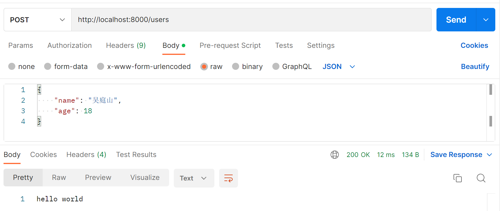

```js
const http = require('http');
const url = require('url');
const qs = require('querystring');
const server = http.createServer((req, res) => {
  const { pathname, query } = url.parse(req.url);
  if (pathname === '/users') {
    if (req.method === 'POST') {
      console.log(req.method);  // POST
    }
  }
  res.end('请求成功')
})

server.listen('8000', '0.0.0.0', () => {
  console.log('服务器启动成功')
})
```


#### 获取body中的数据

请求体中的数据并不是通过req.body来获取的，而是需要通过其他的方式

- 这里我们需要判断接口是 /users，并且请求方式是POST方法去获取传入的数据；
- 获取这种body携带的数据，我们需要通过监听req的 data事件来获取；
- 当所有的数据传输完成的时候，我们通过监听req的 end事件；

```js
const http = require('http');
const url = require('url');
const qs = require('querystring');
const server = http.createServer((req, res) => {
  const { pathname, query } = url.parse(req.url);
  if (pathname === '/users') {
    if (req.method === 'POST') {
      console.log(req.method);  // POST
      // body中的数据是通过数据流的方式写入的
      // 所以我们要监听data事件，当他获取到数据流时，就会回调
      req.on('data', (data) => {
        // <Buffer 7b 0d 0a 20 20 20 20 22 6e 61 6d 65 22 3a 20 22 e5 90 b4 e5 ba ad e5 b1 b1 22 2c 0d 0a 20 20 20 20 22 61 67 65 22 3a 20 31 38 0d 0a 7d>
        console.log(data);
      })
        
       // 当所有数据流获取完成的时候执行这里的回调 
      req.on('end', () => {
	  	console.log('传输完成')
      })
    }
  }
  res.end('请求成功')
})

server.listen('8000', '0.0.0.0', () => {
  console.log('服务器启动成功')
})
```

上面拿到的是buffer格式的数据流，所以我们需要转成字符串

```js
      req.on('data', (data) => {
        /**
         {
            "name": "吴庭山",
            "age": 18
        }
         */
        console.log(data.toString());
      })
```

当然，我们也可以在监听之前就先设置请求编码，这样，我们在监听的时候获取到的监听数据就是指定编码的数据了

```js
      req.setEncoding('utf8')
      req.on('data', (data) => {
        /**
         {
            "name": "吴庭山",
            "age": 18
        }
         */
        console.log(data);
      })
```

注意：

```js
      req.setEncoding('utf8')
      req.on('data', (data) => {
        /**
         {
            "name": "吴庭山",
            "age": 18
        }
         */
        console.log(typeof data);	// string
      })
```

可以发现，这个数据类型是string，这显然我们没办法直接使用，所以我们需要对这个数据进行处理

 ```js
      req.on('data', (data) => {
          const {username, password} = JSON.parse(data);
          console.log(name, age);	// 吴庭山 18
      })
 ```

注意：这里的data因为是JSON格式的字符串，所以我们可以直接对它使用JSON.parse


### headers属性

在request对象的header中也包含很多有用的信息，客户端会默认传递过来一些信息：

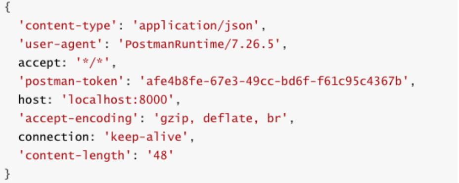

#### content-type 

content-type是这次请求携带的数据的类型：

- application/json表示是一个json类型；
- text/plain表示是文本类型；
- application/xml表示是xml类型；
- multipart/form-data表示是上传文件；

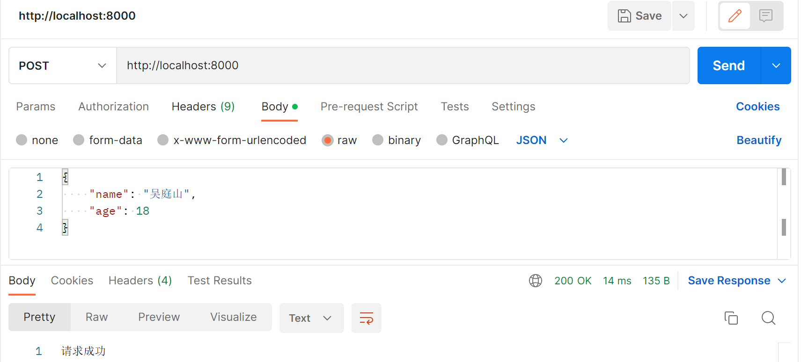

```js
const http = require('http');
const server = http.createServer((req, res) => {

  console.log(req.headers)
  res.end('请求成功')
})

server.listen('8000', '0.0.0.0', () => {
  console.log('服务器启动成功');
})

// 上方打印的header
{
  'content-type': 'application/json',
  'user-agent': 'PostmanRuntime/7.29.2',
  accept: '*/*',
  'cache-control': 'no-cache',
  'postman-token': 'b002cfb8-8ba8-42e3-a71b-579bee76d393',
  host: 'localhost:8000',
  'accept-encoding': 'gzip, deflate, br',
  connection: 'keep-alive',
  'content-length': '45'
}
```

当然还有其他的，比如表单提交等


#### content-length

content-length：文件的大小和长度 （例如可以判断图片上传多少了）


#### connection

##### keep-alive:

- http是基于TCP协议的，但是通常在进行一次请求和响应结束后会立刻中断；
- 在http1.0中，如果想要继续保持连接：
  - 浏览器需要在请求头中添加 connection: keep-alive；
  - 服务器需要在响应头中添加 connection:keep-alive；
  - 当客户端再次放请求时，就会使用同一个连接，直到一方中断连接；
- 在http1.1中，所有连接默认是 connection: keep-alive的；
  - 不同的Web服务器会有不同的保持 keep-alive的时间；
  - Node中默认是5s中；
  - 到了时间之后服务器会中断的


#### accept-encoding

告知服务器，客户端支持的文件压缩格式，比如js文件可以使用gzip编码，对应 .gz文件；


#### accept

告知服务器，客户端可接受文件的格式类型；


#### user-agent

客户端相关的信息；


## 响应对象

### 响应response

如果我们希望给客户端响应的结果数据，可以通过两种方式：

- Write方法：这种方式是直接写出数据，但是并没有关闭流；
- end方法：这种方式是写出最后的数据，并且写出后会关闭流；

```js
const http = require('http');
const server = http.createServer((req, res) => {

  console.log(req.headers)
  res.write('写入中~')
})

server.listen('8000', '0.0.0.0', () => {
  console.log('服务器启动成功');
})
```

这种写法是有问题的

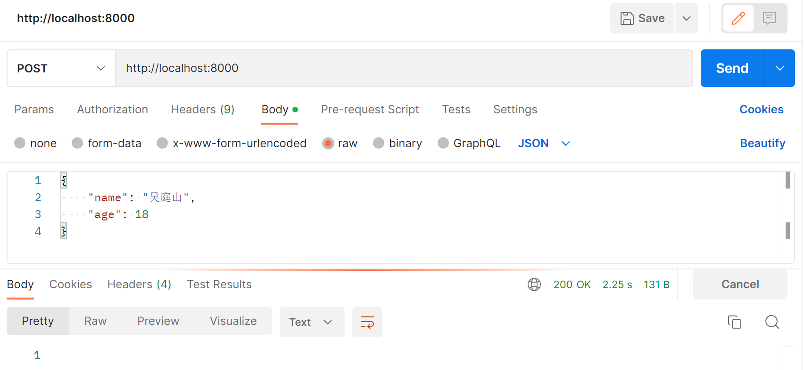

如果我们没有调用 end和close，客户端将会一直等待结果：

虽然res.end做的事是write和close，但是不能这样写，还是要写end的

他一直都在显示请求中，并没有请求完成，所以write需要配合end来完成

```js
const http = require('http');
const server = http.createServer((req, res) => {

  console.log(req.headers)
  res.write('写入中~\n')
  res.end('写入完成')
})

server.listen('8000', '0.0.0.0', () => {
  console.log('服务器启动成功');
})
```

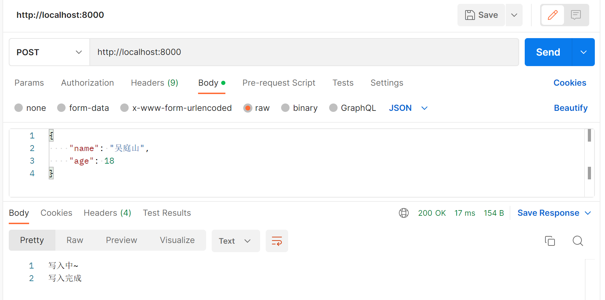

这样就可以

当然为了防止客服端出现一直没有相应结果的情况，客户端一般都会配置一下超时的时间

- 所以客户端在发送网络请求时，都会设置超时时间。


### 返回状态码

Http状态码（Http Status Code）是用来表示Http响应状态的数字代码：

- Http状态码非常多，可以根据不同的情况，给客户端返回不同的状态码；
- 常见的状态码是下面这些（后续项目中，也会用到其中的状态码）；

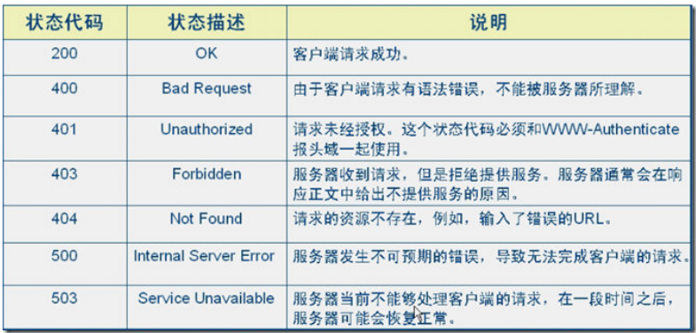

设置状态码常见的有两种方式：

```js
const http = require('http');
const server = http.createServer((req, res) => {
  // 方式一：
  res.statusCode = 402;
  // 方式二：
  res.writeHead(403)
  res.end('写入完成')
})

server.listen('8000', '0.0.0.0', () => {
  console.log('服务器启动成功');
})
```

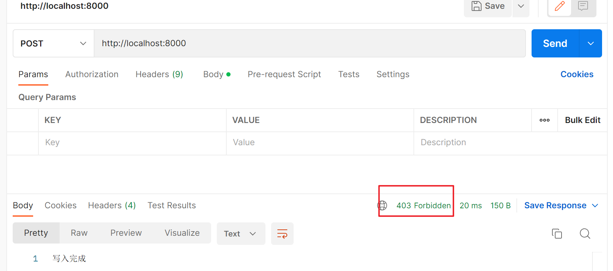


### 响应头文件

返回头部信息，主要有两种方式：

- res.setHeader：一次写入一个头部信息；
- res.writeHead：同时写入header和status；

```js
const http = require('http');
const server = http.createServer((req, res) => {
  // 方式一：
  res.setHeader('Content-Type', 'application/json;charset=utf8');
  // 方式二：
  res.writeHead(200, {
      'Content-Type': 'application/json;charset=utf16le'
  })
  res.end('写入完成')
})

server.listen('8000', '0.0.0.0', () => {
  console.log('服务器启动成功');
})
```

**方式一：**

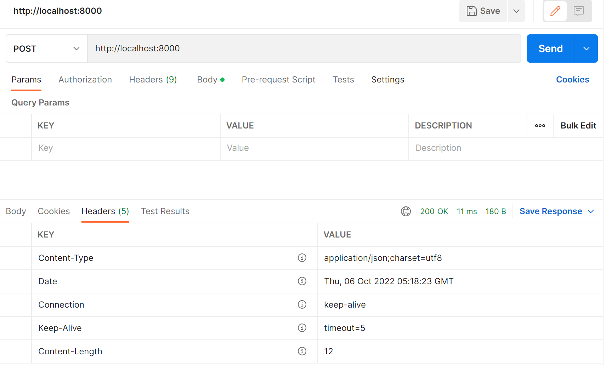

**方式二：**

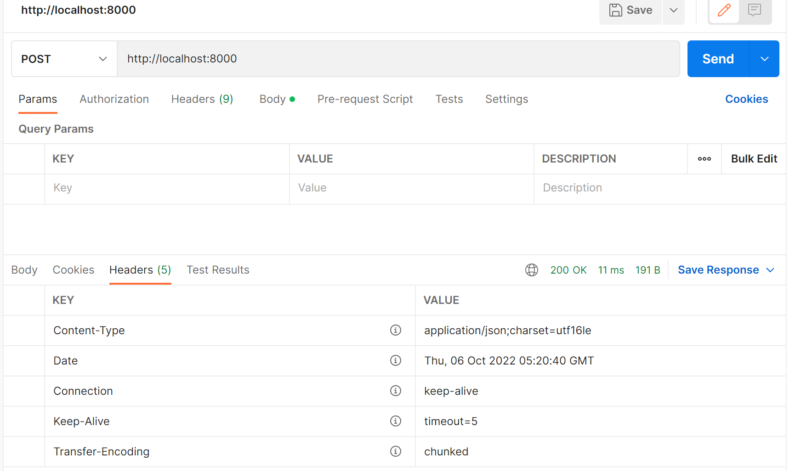


Header设置 Content-Type有什么作用呢？

- 默认客户端接收到的是字符串，客户端会按照自己默认的方式进行处理；

  ```js
  const http = require('http');
  const server = http.createServer((req, res) => {
    res.end('<h2>hello world</h2>')
  })
  
  server.listen('8000', '0.0.0.0', () => {
    console.log('服务器启动成功');
  })
  ```

  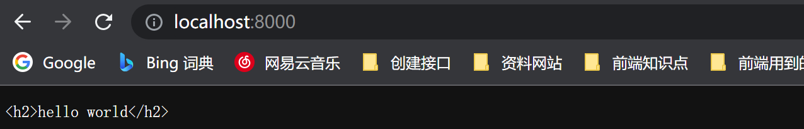

- 默认的方式实际是这样

  ```js
    res.setHeader('Content-Type', 'text/plain');
  ```

  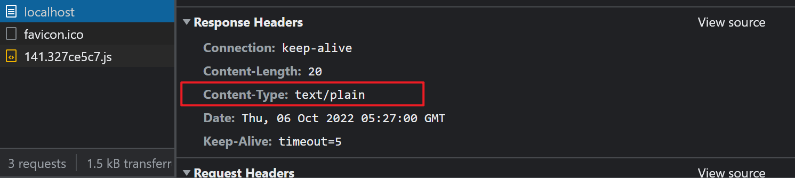

  

如果想让他解析标签，可以这样做

```js
const http = require('http');
const server = http.createServer((req, res) => {
  res.setHeader('Content-Type', 'text/html');
  res.writeHead(200, {
  	'Content-Type': 'text/html;charset=ut·f8'
  })
  res.end('<h2>hello world</h2>')
})

server.listen('8000', '0.0.0.0', () => {
  console.log('服务器启动成功');
})
```

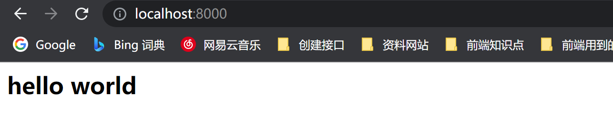


## http

axios库可以在浏览器中使用，也可以在Node中使用：

- 在浏览器中，axios使用的是封装xhr；
- 在Node中，使用的是http内置模块；


### http内置模块发送网络请求

get请求

index.js

```js
const http = require('http');
const server = http.createServer((req, res) => {
  res.write('结果1')
  res.end('结果2')
})

server.listen('8000', '0.0.0.0', () => {
  console.log('服务器启动成功');
})
```

main.js

```js
const http = require('http');

http.get('http://localhost:8000', (res) => {
  res.on('data', (data) => {
    console.log(data);	// <Buffer 3c 68 32 3e 68 65 6c 6c 6f 20 77 6f 72 6c 64 3c 2f 68 32 3e>
  })
  // 监听所有的结果都拿到了
  res.on('end', () => {
      console.log('获取到了所有的结果')
  })
})
```

我们把他转换成utf8

main.js

```js
const http = require('http');

http.get('http://localhost:8000', (res) => {
  res.on('data', (data) => {
    console.log(data.toString());	// <h2>hello world</h2>
  })
})
```


当所有的请求结果都返回了以后，我们监听end

index.js

```js
const http = require('http');
const server = http.createServer((req, res) => {
  res.write('返回结果一')
  res.end('返回结果二')
})

server.listen('8000', '0.0.0.0', () => {
  console.log('服务器启动成功');
})
```

main.js

```js
const http = require('http');

http.get('http://localhost:8000', (res) => {
  res.on('data', (data) => {
    console.log(data.toString());
  })
  res.on('end', () => {
    console.log('所有数据都已经获取到')
  })
})

/**
  $ node main.js
  返回结果一
  返回结果二
  所有数据都已经获取到
 */
```


POST请求

index.js

```js
const http = require('http');
const server = http.createServer((req, res) => {
  res.write('返回结果一')
  res.end('返回结果二')
})

server.listen('8000', '0.0.0.0', () => {
  console.log('服务器启动成功');
})
```


main.js

```js

const http = require('http');

const req = http.request({
  method: 'POST',
  hostname: 'localhost',
  port: 8000
}, (res) => {
  res.on('data', (data) => {
    console.log('监听data', data);
  })
  res.on('end', (data) => {
    console.log('监听end', data);
  })
})

// 请求结束了，必须调用end方法
req.end();

/**
监听data <Buffer e8 bf 94 e5 9b 9e e7 bb 93 e6 9e 9c e4 b8 80>
监听data <Buffer e8 bf 94 e5 9b 9e e7 bb 93 e6 9e 9c e4 ba 8c>
监听end undefined
*/
```

或者这样

index.js

```js
const http = require('http');
const server = http.createServer((req, res) => {
  const obj = {
    name: 'wts',
    age: 18
  }
  const sendData = JSON.stringify(obj);
  res.end(sendData)
})

server.listen('8000', '0.0.0.0', () => {
  console.log('服务器启动成功');
})
```


main.js

```js

const http = require('http');

const req = http.request({
  method: 'POST',
  hostname: 'localhost',
  port: 8000
}, (res) => {
  res.on('data', (data) => {
    console.log('监听data1', data.toString());
    console.log('监听data2', JSON.parse(data.toString()));
  })
  res.on('end', (data) => {
    console.log('监听end', data);
  })
})

// 请求结束了，调用end方法
req.end();

/**
$ node main.js
监听data1 {"name":"wts","age":18}
监听data2 { name: 'wts', age: 18 }
监听end undefined
*/
```


注意：

- 在通过POST请求的时候，你必须告诉它，你的请求需要提交的数据已经结束了；
- 这样才能真正把请求发出去，为什么get不会阻塞，是因为内部帮我们做了这件事；


## 文件上传 


### 错误示范


如果是一个很大的文件需要上传到服务器端，服务器端进行保存应该如何操作呢？

```js
const http = require('http');
const fs = require('fs');
const server = http.createServer((req, res) => {

  // 创建一个jpg格式的文件
  const fileWriter = fs.createWriteStream('./foo.jpg', {flags: 'a+'});
  // 将客户端请求的数据写入到刚才创建的文件中
    
  req.pipe(fileWriter);

  // 获取文件字节长度
  const fileSize = req.headers['content-length'];

  // 当前上传数据流的长度
  let curSize = 0;
  console.log('文件字节长度', fileSize);

  // 监听上传
  req.on('data', (data) => {
    curSize += data.length;
    console.log('当前上传字节长度', curSize);
    res.write(`文件上传进度：${curSize / fileSize * 100}%\n`)
  })
  req.on('end', () => {
    res.end('文件上传成功~')
  })
})

server.listen('8000', '0.0.0.0', () => {
  console.log('服务器启动成功')
})

/**
  当前上传字节长度 3670391
  当前上传字节长度 3735927
  当前上传字节长度 3801463
  当前上传字节长度 3866999
  当前上传字节长度 3932535
  当前上传字节长度 3998071
  当前上传字节长度 4063607
  当前上传字节长度 4129143
  当前上传字节长度 4174490
  ...
 */


```

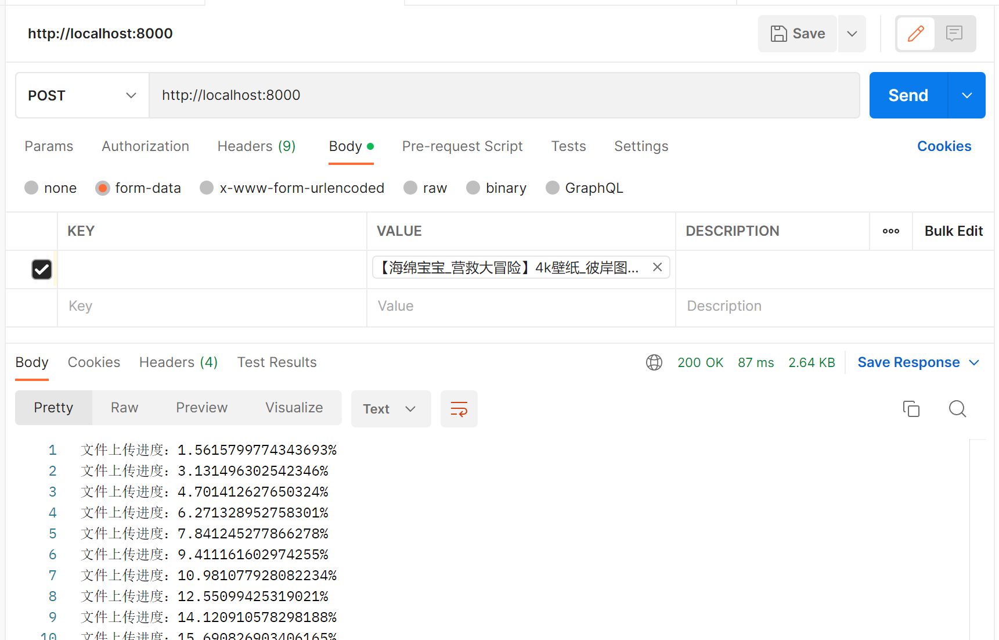

上传了之后，我们可以打开这个文件看一下

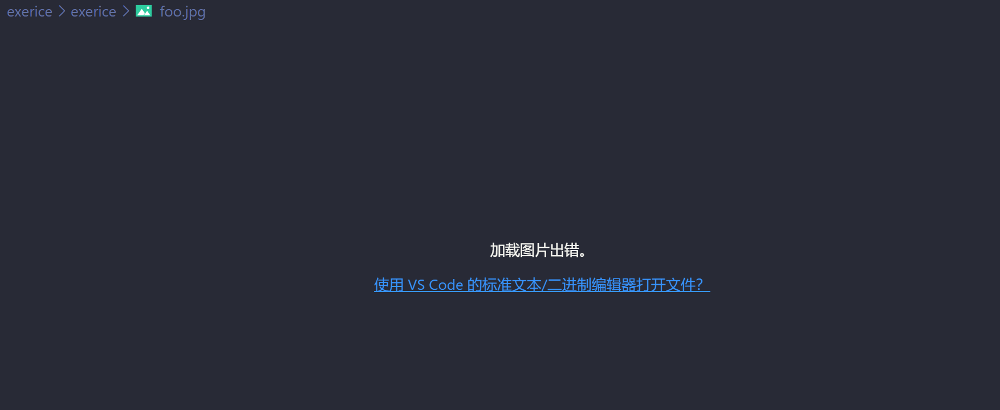

为什么打不开呢，因为写入的字节流是有问题的， 因为不仅仅将图片的信息写入了，body的一些信息也写进去了

通过打断点的方式来获取上传的文件信息

```js
const http = require('http');
const fs = require('fs');
const server = http.createServer((req, res) => {

  // 创建一个jpg格式的文件
  const fileWriter = fs.createWriteStream('./foo.jpg', {flags: 'a+'});
  // 将客户端请求的数据写入到刚才创建的文件中
  req.pipe(fileWriter);

  // 获取文件字节长度
  const fileSize = req.headers['content-length'];

  // 当前上传数据流的长度
  let curSize = 0;
  console.log('文件字节长度', fileSize);
  let body = ''

  // 监听上传
  req.on('data', (data) => {
    curSize += data.length;
    body += data;
    console.log('当前上传字节长度', curSize);
    res.write(`文件上传进度：${curSize / fileSize * 100}%\n`)
  })
  req.on('end', () => {
    console.log('此次文件上传的内容', body)
    res.end('文件上传成功~')
  })
})

server.listen('8000', '0.0.0.0', () => {
  console.log('服务器启动成功')
})

/**
  当前上传字节长度 3670391
  当前上传字节长度 3735927
  当前上传字节长度 3801463
  当前上传字节长度 3866999
  当前上传字节长度 3932535
  当前上传字节长度 3998071
  当前上传字节长度 4063607
  当前上传字节长度 4129143
  当前上传字节长度 4174490
  ...
 */
```

以下就是我们通过打断点获取到的body的信息

```js
'----------------------------634442378233295363485578\r\nContent-Disposition: form-data; name=""; filename="【海绵宝宝_营救大冒险】4k壁纸_彼岸图网.jpg"; filename*=UTF-8''%E3%80%90%E6%B5%B7%E7%BB%B5%E5%AE%9D%E5%AE%9D_%E8%90%A5%E6%95%91%E5%A4%A7%E5%86%92%E9%99%A9%E3%80%914k%E5%A3%81%E7%BA%B8_%E5%BD%BC%E5%B2%B8%E5%9B%BE%E7%BD%91.jpg\r\nContent-Type: image/jpeg\r\n\r\n����MExifII*bj(1r2�i�����\n'��\n'Adobe Photoshop CS5 Windows2020…M�i�\rLxQʹw;ت}7���:1��5�i1h����|N����3zfא,\rc�����=���A�J��W�~|�ܶW|Eq�'ArH��>u��ŒB�y�\t�یqE�qo����4�A���F�`>����S\rmc��f+$�R��z���7?����H���0����r*�a�I��>��%]�[}V�t�4{�^+c������#��/3��`�J��I�yO��{�'T�[p���4��'l����7��Af ���<E˓����)��^����9��r@8��P:����<�|H���!��1�J\rd����)�c8�\\�4b5kI\nl�ػu�`}���K�M~�.U�16�*Az�����(��v�;����=?/�g�6p@LH,���@��L���C��&<I�Re߃�+z*�N���Y�_3�bT˱ع���>u��v~��D۩�̄�Oƿ��\r\n----------------------------634442378233295363485578--\r\n'
```

观察这个信息，我们可以发现，除了信息的内容还有很多内容，比如Content-Disposition,name,filename等等内容，这些内容都要写入到foo.jpg这个文件中去，这显然是会报错的

多个数据进行分隔的 boundary， 也就是634442378233295363485578这样一串数据

所以不能把所有信息写入到文件中，而是要仅仅将图片信息写入到

那我们要自己处理body


###  正确做法

req.headers

```js
{
  'user-agent': 'PostmanRuntime/7.29.2',
  accept: '*/*',
  'cache-control': 'no-cache',
  'postman-token': 'ff9b3dd0-d5f1-4fa9-9bf6-ba15359b1f2f',  
  host: 'localhost:8000',
  'accept-encoding': 'gzip, deflate, br',
  connection: 'keep-alive',
  'content-type': 'multipart/form-data; boundary=--------------------------571749842185008640629154',
  'content-length': '4174490'
}
```


```js
const http = require('http');
const fs = require('fs');
const qs = require('querystring');
const server = http.createServer((req, res) => {

  // 1.创建一个jpg格式的文件
  const fileWriter = fs.createWriteStream('./foo.jpg', {flags: 'a+'});
  // 2.将客户端请求的数据写入到刚才创建的文件中
  req.pipe(fileWriter);

  // 3.获取文件字节长度
  const fileSize = req.headers['content-length'];

  // 4.当前上传数据流的长度
  let curSize = 0;
  console.log('文件字节长度', fileSize);  // 文件字节长度 4174490
  let body = ''

  // 设置为图片的格式，这种才能图片编码，设置为二进制的
  req.setEncoding('binary');

// req.headers打印的内容
// {
//   'user-agent': 'PostmanRuntime/7.53.0',
//   accept: '*/*',
//   'postman-token': 'a7a8e5f0-c08d-4ad3-87cb-a90b7efe5d28',
//   host: 'localhost:9999',
//   'accept-encoding': 'gzip, deflate, br',
//   connection: 'keep-alive',
//   'content-type': 'multipart/form-data; boundary=--------------------------705039934823053886468411',
//   'content-length': '259500'
// }
    
  // 5.获取content-type中的boundary的值
  let boundary = req.headers['content-type'].split('; ')[1].replace('boundary=', '');
  console.log(boundary) // --------------------------112535538592657107454427

  // 6.监听上传
  req.on('data', (data) => {
    curSize += data.length;
    body += data;
    res.write(`文件上传进度：${curSize / fileSize * 100}%\n`)
  })
  req.on('end', () => {
    // 切割数据,先用\r\n来切割，再用：来切割，拿到请求的所有数据，改成对象
    const payload = qs.parse(body, '\r\n', ':');

    // 获取最后的类型(image/png/jpg);
    const fileType = payload['Content-Type'].substring(1);  // image/jpeg

    // 获取要截取的长度
    const fileTypePosition = body.indexOf(fileType) + fileType.length;
    let binaryData = body.substring(fileTypePosition);
    binaryData = binaryData.replace(/^\s\s*/, ''); // 将第一个\r\n这些都改成''

    // boundary是分隔用的，但是左右两边都有--，所以要加上
    const finalData = binaryData.substring(0, binaryData.indexOf('--' + boundary + '--'));

    // 此时的boundary就是完整的图片的数据流，写入到文件中
    fs.writeFile('./foo.jpg', finalData, 'binary', (err) => {
      console.log('err', err);
    })

    res.end('文件上传成功~')
  })
})

server.listen('8000', '0.0.0.0', () => {
  console.log('服务器启动成功')
})


```


最终代码和上面差不多

```js
const http = require('http');
const fs = require('fs');
const qs = require('querystring');
const server = http.createServer((req, res) => {
  if(req.url === '/upload') {
    if(req.method === 'POST') {
      // 图片编码，设置为二进制的
      req.setEncoding('binary');
      let body = '';
      const boundary= req.headers['content-type'].split(';')[1].replace(' boundary=', '');
      console.log(req.headers['content-length'])
      let arrLength = req.headers['content-length'];
      let showLength = 0;
      req.on('data', (data) => {
        showLength += data.length;
        // console.log(data.length)
        body += data; // 这里的data是buffer，但是在和字符串相加的时候会转成字符串
        res.write(`文件上传进度: ${showLength/arrLength * 100}%\n`)
      })
      req.on('end', () => {
        // 1、获取image/png的位置
        const payload = qs.parse(body, '\r\n', ': ')
        const type = payload["Content-Type"];

        // 2、开始在image/png的位置进行截取
        const typeIndex = body.indexOf(type);
        const typeLength = type.length;
        let imageData = body.substring(typeIndex + typeLength);

        // 3、将中间的两个空格也去掉
        imageData = imageData.replace(/^\s\s*/, '');

        // 4、将最后的boundary去掉
        imageData = imageData.substring(0, imageData.indexOf(`--${boundary}--`))
        // 将imageData转成buffer,二进制
        fs.writeFile('./foo.png', imageData, {encoding: 'binary'}, (err) => {
          res.end('文件上传成功');
        });
      })
    }
  }
})
server.listen('8000', () => {
  console.log('文件上传服务器开启成功')
})
```

这样就实现了上传图片的功能

